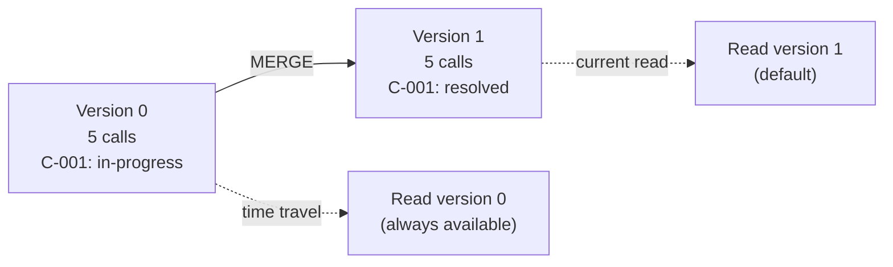

# Lakehouse Formats - Hello World

**Write a Delta table, update a record, and time-travel to the previous version. All in PySpark, no cluster needed.**

> Hands-on notebook: [Delta Lake Hello World](../../../../implementation/notebooks/Delta_Lake_Hello_World.ipynb) | [](https://colab.research.google.com/github/sunilmogadati/systems-in-production/blob/main/implementation/notebooks/Delta_Lake_Hello_World.ipynb)

---

## What We're Building

Four operations in order:

1. Write call center data as a Delta table
2. Read it back and verify
3. Update a record (call status changed)
4. Time travel to see the data before the update

All of this runs in PySpark local mode. No Dataproc cluster, no BigQuery — just PySpark on your laptop or in Google Colab.

---

## Setup

```python
# Install delta-spark (run once)
# pip install delta-spark pyspark

from pyspark.sql import SparkSession
from delta import configure_spark_with_delta_pip

# WHY: Delta Lake needs specific Spark configurations.
# configure_spark_with_delta_pip handles the JAR dependencies.
builder = (
    SparkSession.builder
    .appName("delta-hello-world")
    .config("spark.sql.extensions", "io.delta.sql.DeltaSparkSessionExtension")
    .config("spark.sql.catalog.spark_catalog", "org.apache.spark.sql.delta.catalog.DeltaCatalog")
)

spark = configure_spark_with_delta_pip(builder).getOrCreate()
print("Spark + Delta Lake ready")
```

**You Should See:** `Spark + Delta Lake ready` with no errors.

---

## Step 1: Write a Delta Table

```python
from pyspark.sql import Row
from datetime import datetime

# Create sample call center data
calls_data = [
    Row(call_id="C-001", customer_id="CUST-100", status="in-progress", 
        duration=0, created_at=datetime(2026, 4, 13, 9, 0)),
    Row(call_id="C-002", customer_id="CUST-101", status="resolved", 
        duration=340, created_at=datetime(2026, 4, 13, 9, 15)),
    Row(call_id="C-003", customer_id="CUST-102", status="missed", 
        duration=0, created_at=datetime(2026, 4, 13, 9, 22)),
    Row(call_id="C-004", customer_id="CUST-103", status="resolved", 
        duration=180, created_at=datetime(2026, 4, 13, 9, 30)),
    Row(call_id="C-005", customer_id="CUST-104", status="voicemail", 
        duration=60, created_at=datetime(2026, 4, 13, 9, 45)),
]

calls_df = spark.createDataFrame(calls_data)

# Write as Delta (not Parquet!)
DELTA_PATH = "/tmp/delta-calls"
calls_df.write.format("delta").mode("overwrite").save(DELTA_PATH)

print(f"Delta table written to {DELTA_PATH}")
```

**You Should See:** A directory at `/tmp/delta-calls/` containing:
- Parquet data files (`part-00000-*.parquet`)
- A `_delta_log/` directory with `00000000000000000000.json`

```python
# Verify the structure
import os
for item in os.listdir(DELTA_PATH):
    print(f"  {item}")
```

**You Should See:**
```
  _delta_log
  part-00000-xxxxx.snappy.parquet
```

---

## Step 2: Read the Delta Table

```python
# Read it back
df = spark.read.format("delta").load(DELTA_PATH)
df.show()
```

**You Should See:**

```
+-------+-----------+-----------+--------+-------------------+
|call_id|customer_id|     status|duration|         created_at|
+-------+-----------+-----------+--------+-------------------+
|  C-001|   CUST-100|in-progress|       0|2026-04-13 09:00:00|
|  C-002|   CUST-101|   resolved|     340|2026-04-13 09:15:00|
|  C-003|   CUST-102|     missed|       0|2026-04-13 09:22:00|
|  C-004|   CUST-103|   resolved|     180|2026-04-13 09:30:00|
|  C-005|   CUST-104|  voicemail|      60|2026-04-13 09:45:00|
+-------+-----------+-----------+--------+-------------------+
```

This is **Version 0** of the table.

---

## Step 3: Update a Record (MERGE)

Call C-001 was "in-progress" — the agent just resolved it. Duration is now 480 seconds.

```python
from delta.tables import DeltaTable
from pyspark.sql import functions as F

# Load the Delta table for updates
delta_table = DeltaTable.forPath(spark, DELTA_PATH)

# Create the update (one record with new values)
update_df = spark.createDataFrame([
    Row(call_id="C-001", customer_id="CUST-100", status="resolved", 
        duration=480, created_at=datetime(2026, 4, 13, 9, 0)),
])

# MERGE: update if call_id matches, insert if new
delta_table.alias("target").merge(
    update_df.alias("source"),
    "target.call_id = source.call_id"
).whenMatchedUpdateAll(
).whenNotMatchedInsertAll(
).execute()

print("MERGE complete")

# Verify the update
spark.read.format("delta").load(DELTA_PATH).show()
```

**You Should See:** Call C-001 now shows `status=resolved` and `duration=480`. All other records unchanged.

```
+-------+-----------+--------+--------+-------------------+
|call_id|customer_id|  status|duration|         created_at|
+-------+-----------+--------+--------+-------------------+
|  C-001|   CUST-100|resolved|     480|2026-04-13 09:00:00|  <-- UPDATED
|  C-002|   CUST-101|resolved|     340|2026-04-13 09:15:00|
|  C-003|   CUST-102|  missed|       0|2026-04-13 09:22:00|
|  C-004|   CUST-103|resolved|     180|2026-04-13 09:30:00|
|  C-005|   CUST-104|voicemail|     60|2026-04-13 09:45:00|
+-------+-----------+--------+--------+-------------------+
```

This is **Version 1** of the table.

---

## Step 4: Time Travel

The magic of Delta Lake: you can read any previous version.

```python
# Read Version 0 (before the update)
v0 = spark.read.format("delta").option("versionAsOf", 0).load(DELTA_PATH)
print("Version 0 (before MERGE):")
v0.filter("call_id = 'C-001'").show()

# Read Version 1 (after the update) 
v1 = spark.read.format("delta").option("versionAsOf", 1).load(DELTA_PATH)
print("Version 1 (after MERGE):")
v1.filter("call_id = 'C-001'").show()
```

**You Should See:**

```
Version 0 (before MERGE):
+-------+-----------+-----------+--------+-------------------+
|call_id|customer_id|     status|duration|         created_at|
+-------+-----------+-----------+--------+-------------------+
|  C-001|   CUST-100|in-progress|       0|2026-04-13 09:00:00|
+-------+-----------+-----------+--------+-------------------+

Version 1 (after MERGE):
+-------+-----------+--------+--------+-------------------+
|call_id|customer_id|  status|duration|         created_at|
+-------+-----------+--------+--------+-------------------+
|  C-001|   CUST-100|resolved|     480|2026-04-13 09:00:00|
+-------+-----------+--------+--------+-------------------+
```

**Version 0 still exists.** The MERGE didn't delete the old data — it wrote new files and updated the transaction log. Both versions are accessible.

---

## Step 5: View the History

```python
# See all commits
delta_table = DeltaTable.forPath(spark, DELTA_PATH)
delta_table.history().select(
    "version", "timestamp", "operation", "operationMetrics"
).show(truncate=False)
```

**You Should See:**

```
+-------+-------------------+---------+--------------------------------------------+
|version|timestamp          |operation|operationMetrics                            |
+-------+-------------------+---------+--------------------------------------------+
|1      |2026-04-13 10:05:00|MERGE    |{numTargetRowsUpdated: 1, numOutputRows: 5} |
|0      |2026-04-13 10:00:00|WRITE    |{numFiles: 1, numOutputRows: 5}             |
+-------+-------------------+---------+--------------------------------------------+
```

Every operation is logged. You know exactly what changed, when, and how many rows were affected.

---

## BigQuery Parallel

BigQuery provides similar functionality natively. Here's how the same operations look in BigQuery SQL:

```sql
-- Time travel in BigQuery (read data from 1 hour ago)
SELECT * FROM silver.calls
FOR SYSTEM_TIME AS OF TIMESTAMP_SUB(CURRENT_TIMESTAMP(), INTERVAL 1 HOUR)
WHERE call_id = 'C-001';

-- MERGE in BigQuery
MERGE INTO silver.calls AS target
USING staging.incoming_calls AS source
ON target.call_id = source.call_id
WHEN MATCHED THEN UPDATE SET
    target.status = source.status,
    target.duration = source.duration
WHEN NOT MATCHED THEN INSERT ROW;
```

**Key difference:** BigQuery time travel is limited to 7 days. Delta Lake time travel is limited only by your VACUUM retention policy (default 7 days, configurable to any length).

---

## What Just Happened



You now have a table that supports:
- **Insert** — add new records
- **Update** — modify existing records (MERGE)
- **Versioning** — read any historical version
- **Audit trail** — see every operation in the history

The next chapters show how to build production pipelines with these capabilities and handle the operational challenges (compaction, VACUUM, concurrent writes).

---

## Quick Links

| Chapter | Topic |
|---|---|
| [02 - Concepts](02_Concepts.md) | Delta, Iceberg, Hudi in plain English |
| [03 - Hello World](03_Hello_World.md) | This page |
| [04 - How It Works](04_How_It_Works.md) | Transaction logs and metadata internals |
| [05 - Building It](05_Building_It.md) | Full pipeline with Delta Lake |
