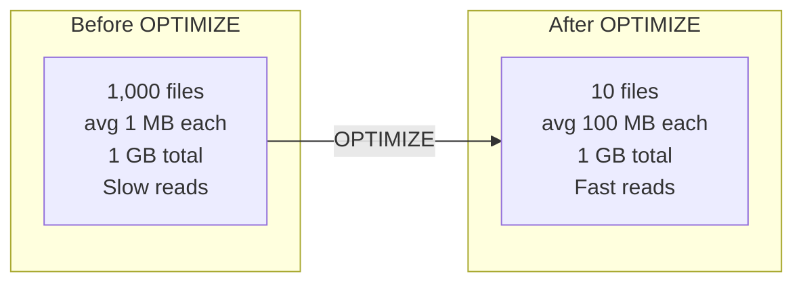
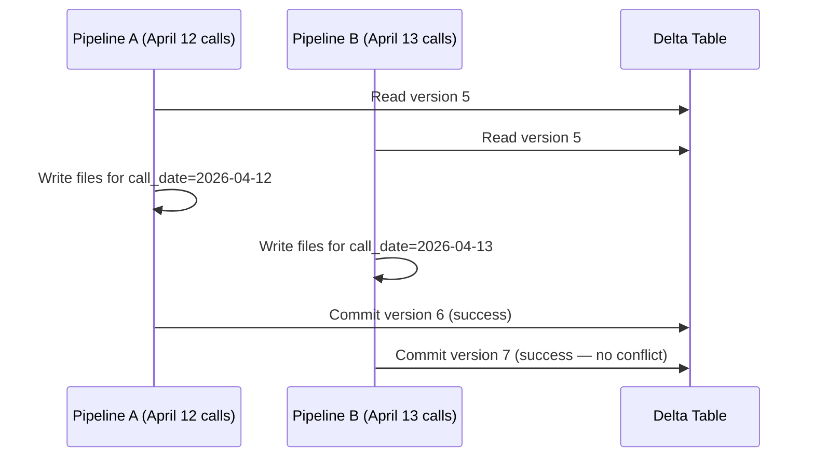
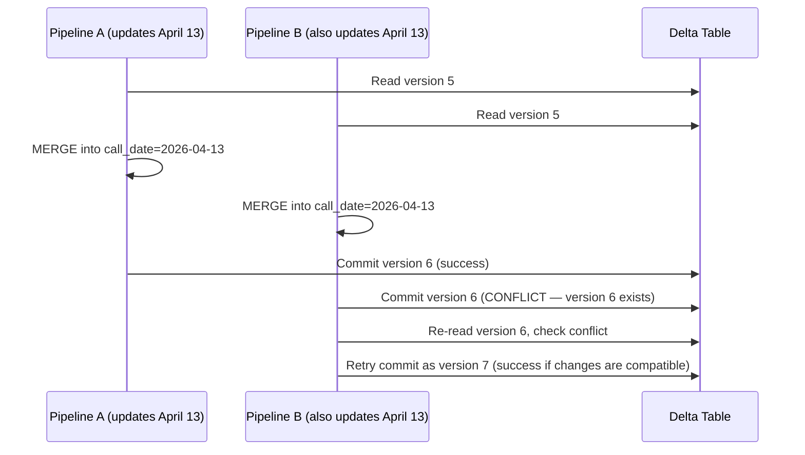

# Lakehouse Formats - Production Patterns

**Compaction, Z-ORDER, concurrent writes, and unifying batch and streaming on the same table.**

---

## The Small Files Problem

Every MERGE, every append, every streaming micro-batch creates new Parquet files. After a week of hourly appends, your Delta table might have 168 tiny files instead of a few large ones.

**Why small files hurt:**
- Each file has overhead: open, read header, decompress, close
- A query that reads 1,000 small files is far slower than reading 10 large files
- Cloud storage charges per API call — more files = more cost

**Analogy:** Moving apartments. Carrying 1,000 small boxes takes far longer than carrying 50 large boxes, even if the total weight is the same. The overhead of opening and closing each box dominates.



### Fix: OPTIMIZE (Compaction)

```python
from delta.tables import DeltaTable

delta_table = DeltaTable.forPath(spark, DELTA_PATH)

# Compact small files into larger ones
delta_table.optimize().executeCompaction()

# Check the result
detail = spark.sql(f"DESCRIBE DETAIL delta.`{DELTA_PATH}`")
detail.select("numFiles", "sizeInBytes").show()
```

**When to run OPTIMIZE:**
- After a batch of MERGE operations (daily or weekly)
- When query performance degrades
- As a scheduled maintenance job (e.g., every Sunday at 3 AM)

**OPTIMIZE does NOT delete old files.** It creates new, larger files and marks the old small files as "removed." You still need VACUUM to delete the old files from storage.

---

## Z-ORDER: Co-Locate Related Data

OPTIMIZE makes files bigger. Z-ORDER makes queries faster by putting related data close together within those files.

**Without Z-ORDER:** Data for `campaign_id = "CAMP-001"` is scattered across 50 files. A query filtering on `campaign_id` must read all 50.

**With Z-ORDER on `campaign_id`:** Data for `CAMP-001` is concentrated in 2-3 files. The query reads only those files.

```python
# OPTIMIZE with Z-ORDER on frequently filtered columns
delta_table.optimize().executeZOrderBy("campaign_id", "status")
```

### When to Z-ORDER

| Column | Z-ORDER? | Why |
|---|---|---|
| `call_date` | No — already the partition column | Partition pruning handles this |
| `campaign_id` | Yes — frequently filtered | "Show me all calls for campaign X" |
| `status` | Yes — frequently filtered | "Show me all resolved calls" |
| `customer_id` | Maybe — depends on query patterns | Only if you often query by customer |
| `duration` | No — rarely filtered exactly | Range queries don't benefit as much |

**Rule of thumb:** Z-ORDER on columns that appear in WHERE clauses. Maximum 2-3 columns — more than that dilutes the benefit.

---

## Concurrent Writes

Two pipelines writing to the same Delta table at the same time. What happens?

### Scenario: No Conflict (Different Partitions)



Both succeed because they touch different partitions. Delta detects this automatically.

### Scenario: Conflict (Same Partition)



**When retries fail:** If both pipelines updated the same rows with different values, the conflict can't be resolved automatically. The second pipeline fails and surfaces an error.

### Prevention

Design your pipelines so they don't write to the same partition at the same time:

| Strategy | How |
|---|---|
| **Time-based separation** | Pipeline A runs at midnight, Pipeline B runs at 6 AM |
| **Partition-based separation** | Pipeline A handles `call_date < today`, Pipeline B handles `call_date = today` |
| **Single writer** | Only one pipeline writes to each table (simplest, most reliable) |

---

## Streaming + Batch on the Same Table

Delta Lake supports both batch and streaming writes to the same table. This is the "unified batch and streaming" pattern.

```python
# Batch write (nightly): full day's data
(
    daily_df.write
    .format("delta")
    .mode("append")
    .save(DELTA_PATH)
)

# Streaming write (continuous): real-time events
(
    streaming_df.writeStream
    .format("delta")
    .outputMode("append")
    .option("checkpointLocation", "/tmp/checkpoints/calls")
    .start(DELTA_PATH)
)
```

**How it works:** Both batch and streaming writes create new commits in the transaction log. Readers always see a consistent snapshot — either the streaming micro-batch is fully committed or it's not visible.

**When to use this:**
- High-priority data streams in real-time (fraud alerts, live call monitoring)
- Historical data backfills run as batch jobs
- Both write to the same table — readers see a unified view

---

## Partition Evolution (Iceberg Only)

Iceberg's standout feature: change the partition strategy without rewriting data.

**Scenario:** You partitioned your calls table by `month(call_date)`. After six months, the monthly partitions are too large. You want daily partitions.

In Delta Lake or Hudi:
```
# Must rewrite all existing data into new daily partition directories
# Hours of compute, risk of errors
```

In Iceberg:
```sql
-- Just change the partition spec. No data rewrite.
ALTER TABLE calls SET PARTITION SPEC (day(call_date));
-- Old data stays in monthly partitions
-- New data goes into daily partitions  
-- The query engine handles both transparently
```

This is possible because Iceberg uses hidden partitioning — the partition structure is metadata, not directory layout. The query engine reads the manifest to determine which files belong to which partition, regardless of how they're physically stored.

---

## Summary

| Pattern | What It Solves | When to Run |
|---|---|---|
| **OPTIMIZE** | Small files → large files | After batch loads (daily or weekly) |
| **Z-ORDER** | Queries on specific columns are slow | After OPTIMIZE, on frequently filtered columns |
| **VACUUM** | Old files consuming storage | Weekly, with appropriate retention |
| **Partition isolation** | Concurrent write conflicts | Design-time — structure pipelines to avoid overlap |
| **Unified batch/streaming** | Need both real-time and historical | When business needs real-time + batch on same table |
| **Partition evolution** | Partition strategy needs to change | When data volume outgrows current partitioning (Iceberg only) |

---

## Quick Links

| Chapter | Topic |
|---|---|
| [05 - Building It](05_Building_It.md) | Full pipeline with Delta Lake |
| [06 - Production Patterns](06_Production_Patterns.md) | This page |
| [07 - System Design](07_System_Design.md) | Lakehouse architecture on GCP and AWS |
| [08 - Quality Security Governance](08_Quality_Security_Governance.md) | Schema enforcement, data retention, GDPR |
