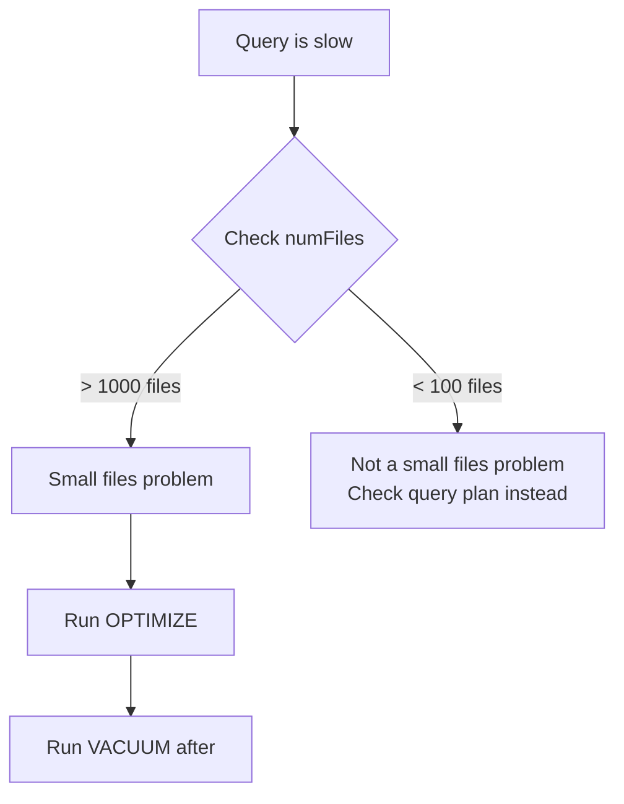

# Lakehouse Formats - Observability & Troubleshooting

**Five common problems with Delta Lake and Iceberg tables. How to diagnose each one and fix it.**

---

## Problem 1: Small Files (Read Performance Degraded)

**Symptom:** Queries that used to take 10 seconds now take 3 minutes. No data growth — same table size.

**Root cause:** Streaming micro-batches or frequent MERGEs created thousands of tiny Parquet files. Each file has overhead to open, read, and close.

**Diagnose:**

```python
# Check file count and sizes
detail = spark.sql(f"DESCRIBE DETAIL delta.`{DELTA_PATH}`")
detail.select("numFiles", "sizeInBytes").show()

# If numFiles > 1000 and average file size < 10 MB, you have a small files problem
# Target: 100-500 files, each 100 MB - 1 GB
```



**Fix:**

```python
from delta.tables import DeltaTable

delta_table = DeltaTable.forPath(spark, DELTA_PATH)

# Step 1: Compact small files into larger ones
delta_table.optimize().executeCompaction()

# Step 2: Clean up old small files
delta_table.vacuum(retentionHours=168)  # 7 days

# Verify
detail = spark.sql(f"DESCRIBE DETAIL delta.`{DELTA_PATH}`")
detail.select("numFiles", "sizeInBytes").show()
```

**Prevention:** Schedule OPTIMIZE as a weekly maintenance job. If using streaming, increase the micro-batch trigger interval to produce fewer, larger files.

---

## Problem 2: Version Explosion (Storage Cost Increasing)

**Symptom:** Cloud storage bill is growing faster than data volume. GCS bucket usage is 5x the logical table size.

**Root cause:** Every MERGE, UPDATE, or DELETE creates new Parquet files but leaves old ones behind. Without VACUUM, old files accumulate indefinitely.

**Diagnose:**

```python
# Check history depth
history = delta_table.history()
print(f"Total versions: {history.count()}")
print(f"Oldest version: {history.select('timestamp').orderBy('version').first()[0]}")

# Check actual storage vs logical size
detail = spark.sql(f"DESCRIBE DETAIL delta.`{DELTA_PATH}`")
detail.select("sizeInBytes").show()  # This is the LOGICAL size

# Compare with actual GCS storage (use gsutil)
# gsutil du -s gs://bucket/silver/calls_delta/
```

**Fix:**

```python
# VACUUM removes files not referenced by any version within retention
delta_table.vacuum(retentionHours=168)

# For aggressive cleanup (when storage is critical):
delta_table.vacuum(retentionHours=24)
# WARNING: This limits time travel to 24 hours
```

**Prevention:** Schedule VACUUM weekly with 7-day retention. Monitor storage-to-logical-size ratio.

---

## Problem 3: Merge Conflict (Concurrent Write Failed)

**Symptom:** Pipeline fails with `ConcurrentModificationException` or `CommitFailedException`.

**Root cause:** Two processes tried to commit to the same Delta table at the same time, and both modified the same partition.

**Diagnose:**

```python
# Check recent history for failed or retried operations
history = delta_table.history(20)
history.select("version", "timestamp", "operation", "isolationLevel").show()

# Look for:
# - Two operations at nearly the same timestamp
# - Same partition being modified by both
```

**Fix (immediate):** Re-run the failed pipeline. The first writer's commit is already in the table, so the second writer will see the updated version and succeed.

**Fix (permanent):**

```python
# Add retry logic to MERGE operations
from tenacity import retry, stop_after_attempt, wait_exponential

@retry(stop=stop_after_attempt(3), wait=wait_exponential(multiplier=1, max=30))
def merge_with_retry(delta_table, incoming_df):
    """MERGE with automatic retry on conflict."""
    (
        delta_table.alias("target")
        .merge(incoming_df.alias("source"), "target.call_id = source.call_id")
        .whenMatchedUpdateAll()
        .whenNotMatchedInsertAll()
        .execute()
    )
```

**Prevention:** Design pipelines to write to different partitions at different times. Use the single-writer pattern where possible.

---

## Problem 4: Schema Drift (Write Fails Unexpectedly)

**Symptom:** Pipeline fails with `AnalysisException: A schema mismatch detected`.

**Root cause:** The source system added, removed, or changed a column. Delta's schema enforcement (the default) rejects the write.

**Diagnose:**

```python
# Compare schemas
incoming_df = spark.read.json(BRONZE_PATH)
existing_df = spark.read.format("delta").load(DELTA_PATH)

print("Incoming schema:")
incoming_df.printSchema()

print("Existing schema:")
existing_df.printSchema()
```

**Fix options:**

| Scenario | Fix |
|---|---|
| New column added (safe) | Add `mergeSchema=true` for this write, then review |
| Column removed | Fix upstream (get the column back) or update pipeline to handle its absence |
| Type changed (e.g., INT → STRING) | Fix upstream or add explicit cast in transform |

```python
# For a safe column addition:
incoming_df.write \
    .format("delta") \
    .option("mergeSchema", "true") \
    .mode("append") \
    .save(DELTA_PATH)

# Then verify the new schema
spark.read.format("delta").load(DELTA_PATH).printSchema()
```

**Prevention:** Add schema drift detection before processing (see [ETL Patterns - Chapter 8](../etl-elt/08_Quality_Security_Governance.md)). Log warnings for additions, halt for removals or type changes.

---

## Problem 5: Time Travel Fails (FileNotFoundException)

**Symptom:** `spark.read.format("delta").option("versionAsOf", 0).load(path)` throws `FileNotFoundException`.

**Root cause:** VACUUM deleted the Parquet files for that version. The log entry still references the files, but they no longer exist on disk.

**Diagnose:**

```python
# Check which versions are still accessible
history = delta_table.history()
history.select("version", "timestamp").show()

# The version exists in history but the files are gone
# Check VACUUM history
history.filter("operation = 'VACUUM'").select(
    "version", "timestamp", "operationMetrics"
).show(truncate=False)
```

**Fix:** There is no fix. The files are deleted. This is by design — VACUUM permanently removes old data.

**Prevention:** 
- Set VACUUM retention to match your time travel needs
- Never run `vacuum(retentionHours=0)` unless you're certain you don't need any history
- Document the retention policy so the team knows the time travel window

---

## Diagnostic Commands Reference

### Delta Lake

| Command | What It Shows |
|---|---|
| `DESCRIBE HISTORY delta.\`path\`` | All operations: version, timestamp, operation, metrics |
| `DESCRIBE DETAIL delta.\`path\`` | Table metadata: numFiles, sizeInBytes, partitionColumns |
| `SHOW CREATE TABLE delta.\`path\`` | Table DDL: schema, properties, partition columns |
| `delta_table.detail()` | Same as DESCRIBE DETAIL, as a DataFrame |
| `delta_table.history(n)` | Last n operations |

### Iceberg

| Command | What It Shows |
|---|---|
| `SELECT * FROM table.snapshots` | All snapshots with timestamp and operation |
| `SELECT * FROM table.history` | Table history |
| `SELECT * FROM table.manifests` | Manifest files and their status |
| `SELECT * FROM table.files` | Data files in the current snapshot |
| `SELECT * FROM table.metadata_log_entries` | Metadata file changes |

---

## Monitoring Checklist

Run these checks after every pipeline run:

```sql
-- 1. File count (should stay reasonable)
SELECT numFiles FROM table_detail;
-- Alert if > 5000

-- 2. Table size growth (should match data growth)
SELECT sizeInBytes FROM table_detail;
-- Alert if growing > 2x faster than data volume

-- 3. Latest version age (should be recent)
SELECT MAX(timestamp) FROM table_history;
-- Alert if > 4 hours old

-- 4. Failed operations (should be rare)
SELECT COUNT(*) FROM table_history WHERE operation = 'MERGE' 
AND operationMetrics.numTargetRowsUpdated = 0;
-- Alert if MERGE ran but updated 0 rows (possible watermark issue)
```

---

## Quick Links

| Chapter | Topic |
|---|---|
| [08 - Quality Security Governance](08_Quality_Security_Governance.md) | Schema enforcement, GDPR |
| [09 - Observability Troubleshooting](09_Observability_Troubleshooting.md) | This page |
| [10 - Decision Guide](10_Decision_Guide.md) | Delta vs Iceberg vs Hudi |
