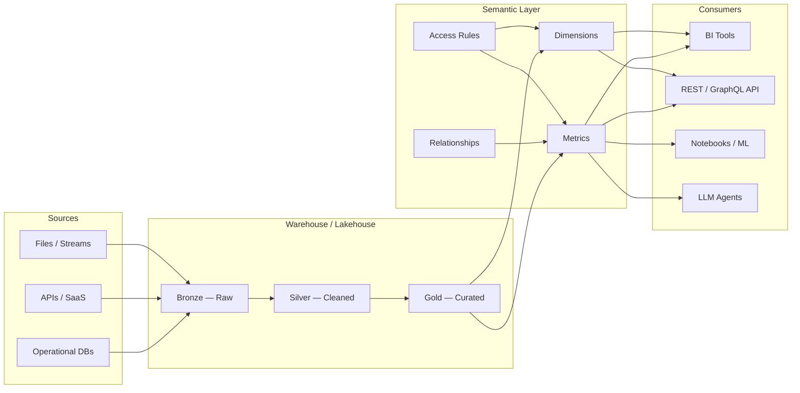

# 01 — Why You Need a Semantic Layer

## The Story

It was the Thursday before earnings. The Chief Financial Officer (CFO) pulled up the quarterly revenue slide: $47.2 million. The Vice President (VP) of Sales had already shared his number with the board pre-read: $51.8 million. Both executives queried the same warehouse. Both wrote SQL. Both were confident.

The difference was not a bug. It was an interpretation gap.

The CFO's query excluded returns and used the payment settlement date. The VP's query included gross bookings and used the order date. Neither was wrong. There was simply no single, governed definition of "revenue" that both teams were bound to use.

The data engineering team spent the next 72 hours reconciling the numbers instead of shipping the pipeline they had promised for next quarter. Three analysts wrote three more queries to "prove" which number was right. The board received a corrected deck the following Monday with an asterisk and a footnote nobody read.

This is not a data quality problem. The data was clean. This is a **definition problem** — and it is the most expensive class of data problem in any organization, because it erodes trust in every number that follows.

---

## Why Metrics Diverge

In most data platforms, the business logic that defines a metric lives in one of three places — or all three at once:

| Location | Who Owns It | Problem |
|----------|-------------|---------|
| SQL queries in BI dashboards | Analysts | Definitions drift per dashboard, per author |
| dbt models (views/tables) | Data engineers | Metrics are baked into table structures, hard to reuse across tools |
| Spreadsheet formulas | Business users | Completely ungoverned, no audit trail |

When "monthly active users" is defined in a Tableau calculated field, a Looker explore, a PowerBI DAX measure, and a Python notebook — you do not have one metric. You have four. They will diverge. It is not a question of whether, but when.

The root cause is that **business definitions are being encoded at the consumption layer** instead of being declared once and consumed everywhere.

---

## What a Semantic Layer Actually Does

A semantic layer is a formal declaration of business concepts — metrics, dimensions, relationships, and access rules — that sits between your warehouse and every tool or application that consumes data.

It does three things:

1. **Defines once.** "Revenue" is declared in one place with one formula, one set of filters, one grain. Not in SQL. Not in a dashboard. In the semantic layer.
2. **Translates to many.** That single definition is queryable from Tableau, PowerBI, a REST Application Programming Interface (API), a Python notebook, or a Large Language Model (LLM) agent — without any consumer needing to know the underlying SQL.
3. **Governs access.** The semantic layer enforces who can see which metrics, which dimensions, and which rows — regardless of the consuming tool.

This is not a new concept. Online Analytical Processing (OLAP) cubes in the early 2000s served this purpose. What is new is that modern semantic layers operate on top of cloud warehouses and lakehouses without requiring a separate data copy.

---

## Where It Sits in the Stack

The semantic layer occupies a precise position in the data platform architecture. It does not replace your warehouse. It does not replace your BI tool. It sits between them.

Key observations from this architecture:

- **The semantic layer reads from Gold/Curated tables.** It does not process raw data. That is the job of your ingestion and transformation layers.
- **Consumers never query the warehouse directly.** They query the semantic layer, which translates their request into optimized SQL against the warehouse.
- **Access control lives here, not in the BI tool.** If a metric is restricted, it is restricted everywhere — not just in one dashboard.

---

## What Happens Without One

| Symptom | Cost |
|---------|------|
| Two executives present different numbers for the same metric | Trust collapse; board-level escalation |
| Analysts spend 40% of time validating instead of analyzing | Opportunity cost; attrition of senior analysts |
| New BI tool adoption requires re-implementing all business logic | 3-6 month migration instead of weeks |
| Row-level security (RLS) is configured per tool, per dashboard | Compliance risk; audit findings |
| "Which number is right?" becomes the default question in every meeting | Decision velocity drops to zero |

---

## When You Do Not Need One

Not every data platform needs a formal semantic layer. If your organization has:

- A single BI tool with fewer than 20 governed metrics
- One data team that owns all definitions in dbt models
- No API consumers, no embedded analytics, no ML pipelines reading metrics

Then the cost of introducing and maintaining a semantic layer may exceed the benefit. The trigger for adopting one is usually the moment a **second consumer** (a second BI tool, an API, or an ML pipeline) needs the same metric definition — and you realize you are about to duplicate logic.

---

## Quick Links

| Resource | Link |
|----------|------|
| dbt Semantic Layer docs | https://docs.getdbt.com/docs/build/about-metricflow |
| Cube.dev overview | https://cube.dev/docs/product/introduction |
| Starburst (Trino) semantic layer | https://docs.starburst.io/latest/ |
| AtScale documentation | https://docs.atscale.com/ |
| Next chapter: Tools Compared | [02_Tools_Compared.md](02_Tools_Compared.md) |
