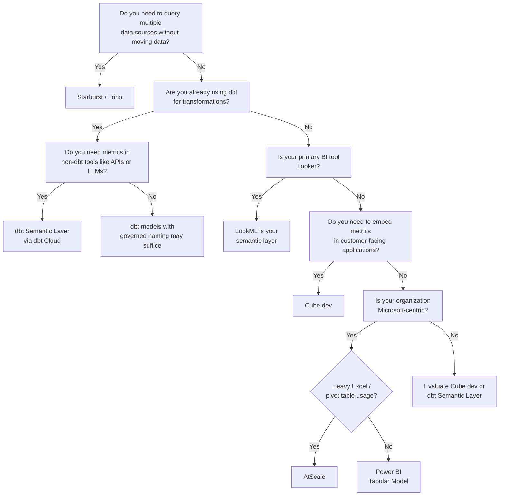
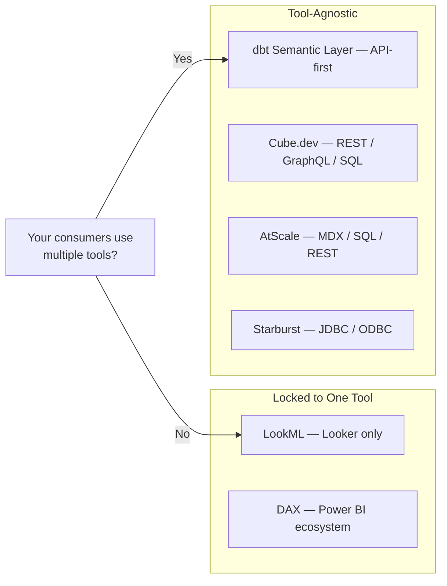

# 02 — Tools Compared

## The Story

A healthcare analytics company ran Looker for five years. Every metric was defined in LookML (Looker Modeling Language). Then the company acquired a subsidiary that ran PowerBI. Then the data science team started pulling metrics directly from BigQuery into Jupyter notebooks.

Within six months, the "paid claims" metric had three definitions: one in LookML, one in a DAX (Data Analysis Expressions) measure, and one in a Python function. The Looker definition excluded denied claims. The PowerBI definition included them with a status filter. The Python function used a completely different date column.

The problem was not Looker. The problem was that Looker's semantic layer was locked inside Looker. The moment a second tool entered the picture, the single source of truth fractured.

Choosing the right semantic layer tool is not about features. It is about where your definitions need to travel.

---

## The Tools

### Starburst / Trino

Starburst is the commercial distribution of Trino (formerly PrestoSQL), a federated Structured Query Language (SQL) engine. It queries multiple data sources — BigQuery, PostgreSQL, Amazon Simple Storage Service (S3), Snowflake — from a single SQL interface without moving data.

As a semantic layer, Starburst operates through **federated views and access control policies**. You define virtual tables that join across sources, apply row-level and column-level security, and expose a unified SQL endpoint to any consumer that speaks Java Database Connectivity (JDBC) or Open Database Connectivity (ODBC).

**Strengths:** True federation across heterogeneous sources. No data movement. Enterprise governance through Starburst Galaxy or Starburst Enterprise. Strong when your data lives in multiple systems and you cannot consolidate it.

**Limitations:** The semantic definitions are SQL views — there is no declarative metric layer. You define "revenue" as a view, not as a metric object with dimensions and time grains. This means metric metadata (descriptions, ownership, lineage) must be managed externally.

### dbt Semantic Layer (MetricFlow)

The dbt Semantic Layer uses MetricFlow, an open-source metric framework acquired by dbt Labs. Metrics are defined declaratively in YAML (YAML Ain't Markup Language) files alongside your dbt models. Consumers query metrics through the dbt Cloud Semantic Layer Application Programming Interface (API), which translates metric requests into optimized SQL against your warehouse.

**Strengths:** Tight integration with dbt's transformation layer. Metrics are versioned in Git alongside models. The YAML-based definition format is readable by non-engineers. Supports derived metrics, cumulative metrics, and conversion metrics out of the box.

**Limitations:** Requires dbt Cloud (Team or Enterprise tier) for the Semantic Layer API. Open-source dbt Core users can define metrics but cannot serve them to BI tools through the API. Currently supports Snowflake, BigQuery, Databricks, and Redshift as warehouses.

### Looker (LookML)

Looker is Google Cloud's Business Intelligence (BI) platform. Its semantic layer is LookML — a declarative modeling language that defines dimensions, measures, relationships, and access controls in version-controlled files.

**Strengths:** Mature modeling language with strong relationship handling (joins, fan-out protection, symmetric aggregates). Tight integration with BigQuery. Embedded analytics support through Looker's API. The "Explore" interface lets business users compose queries without writing SQL.

**Limitations:** LookML definitions are only consumable through Looker. If you also run Tableau or PowerBI, those tools cannot read LookML. The semantic layer is locked inside the BI tool. Looker pricing is enterprise-tier and requires annual contracts.

### Cube.dev

Cube is an open-source semantic layer with a headless architecture. You define metrics and dimensions in JavaScript or YAML schema files. Consumers query through REST API, GraphQL API, or SQL API. Cube handles caching, pre-aggregation, and access control.

**Strengths:** Tool-agnostic — any application that can call an API can consume metrics. Strong pre-aggregation engine that materializes rollups automatically. Open-source core with a managed cloud option. Excellent for embedded analytics where metrics are served to customer-facing applications.

**Limitations:** Requires hosting and operating the Cube server (unless using Cube Cloud). The schema language, while flexible, is less standardized than LookML or MetricFlow. Smaller ecosystem and community compared to dbt or Looker.

### AtScale

AtScale is an enterprise semantic layer that creates an OLAP (Online Analytical Processing) cube abstraction on top of your lakehouse or warehouse. It exposes metrics through standard protocols — Multidimensional Expressions (MDX), SQL, and REST — so tools like Excel, Tableau, and PowerBI can query it natively.

**Strengths:** Designed for organizations with heavy Excel and PowerBI usage. The MDX interface means Excel pivot tables connect directly to governed metrics. Autonomous performance optimization through machine learning-driven aggregation. Strong enterprise governance features.

**Limitations:** Enterprise pricing with no free tier. Heavier operational footprint than Cube or dbt. Strongest in Microsoft-centric environments; less commonly adopted in Google Cloud Platform (GCP)-primary architectures.

### Power BI (DAX + Tabular Model)

Power BI's semantic layer is the Tabular Model, built on Analysis Services technology. Metrics are defined as DAX measures. Relationships between tables are modeled visually or in code. The semantic model is published to the Power BI Service and can be consumed by Excel, Reporting Services (SSRS), and third-party tools via XMLA (XML for Analysis) endpoints.

**Strengths:** Deep integration with the Microsoft ecosystem. DAX is a powerful calculation language for complex business logic. DirectQuery mode avoids data duplication. XMLA endpoints allow external tools to query the model. Large installed base and extensive documentation.

**Limitations:** DAX has a steep learning curve. The semantic model is tightly coupled to Power BI — while XMLA endpoints exist, most organizations only consume from within Microsoft tools. Performance tuning requires specialized knowledge of the VertiPaq engine and storage modes.

---

## Comparison Table

| Dimension | Starburst / Trino | dbt Semantic Layer | Looker (LookML) | Cube.dev | AtScale | Power BI |
|-----------|-------------------|-------------------|-----------------|----------|---------|----------|
| **Query language** | SQL | MetricFlow API | LookML Explore | REST / GraphQL / SQL | MDX / SQL / REST | DAX |
| **Definition format** | SQL views | YAML | LookML | JS / YAML | Visual + code | DAX + visual model |
| **Deployment** | Self-hosted / Galaxy | dbt Cloud | Google Cloud | Self-hosted / Cloud | Self-hosted / Cloud | Power BI Service |
| **Multi-tool support** | Any JDBC/ODBC client | dbt Cloud integrations | Looker only | Any API client | Excel, Tableau, PowerBI | Microsoft ecosystem |
| **Federation** | Native (core strength) | No (single warehouse) | No (BigQuery primary) | No (single warehouse) | No (single source) | No (single source) |
| **Caching / pre-agg** | Limited (relies on warehouse) | dbt Cloud manages | PDTs (Persistent Derived Tables) | Built-in pre-aggregation | Autonomous aggregation | VertiPaq in-memory |
| **Access control** | Row/column-level | Warehouse-level | Row-level (LookML) | Schema-level | Row/column-level | Row-level (RLS) |
| **Cost model** | Per-node or consumption | dbt Cloud subscription | Per-user license | Open-source + Cloud tiers | Enterprise license | Per-user license |
| **Best for** | Multi-source federation | dbt-native teams | Google Cloud + BI | Embedded analytics / APIs | Enterprise Excel/PowerBI | Microsoft-centric orgs |

---

## Cloud Mapping

| Capability | GCP | AWS | Azure |
|------------|-----|-----|-------|
| Native BI semantic layer | Looker (LookML) | QuickSight (SPICE) | Power BI (DAX) |
| Federated query | BigQuery Omni / Starburst | Athena / Starburst | Synapse Serverless / Starburst |
| dbt Semantic Layer warehouse | BigQuery | Redshift, Athena | Synapse (limited) |
| Cube.dev warehouse support | BigQuery | Redshift, Athena, S3 | Synapse |
| Catalog / governance | Dataplex | Glue Data Catalog | Microsoft Purview |

---

## Decision Flowchart

---

## The Real Decision

The question is not "which tool has the best features." The question is: **how many consumers need the same metric definition?**

- **One BI tool, one team:** Use that tool's native semantic layer (LookML, DAX). Do not over-engineer.
- **Multiple BI tools or API consumers:** You need a tool-agnostic layer (dbt Semantic Layer, Cube.dev, AtScale, or Starburst).
- **Data lives in multiple systems:** Starburst/Trino is the only option that federates at query time without Extract, Transform, Load (ETL).

Every other consideration — cost, team skills, cloud provider — is secondary to this.

---

## Quick Links

| Resource | Link |
|----------|------|
| Starburst Galaxy | https://www.starburst.io/platform/starburst-galaxy/ |
| dbt MetricFlow | https://docs.getdbt.com/docs/build/about-metricflow |
| LookML reference | https://cloud.google.com/looker/docs/lookml-terms-and-concepts |
| Cube.dev documentation | https://cube.dev/docs |
| AtScale documentation | https://docs.atscale.com/ |
| Power BI semantic model | https://learn.microsoft.com/en-us/power-bi/transform-model/ |
| Previous chapter: Why | [01_Why.md](01_Why.md) |
| Next chapter: Building It | [03_Building_It.md](03_Building_It.md) |
