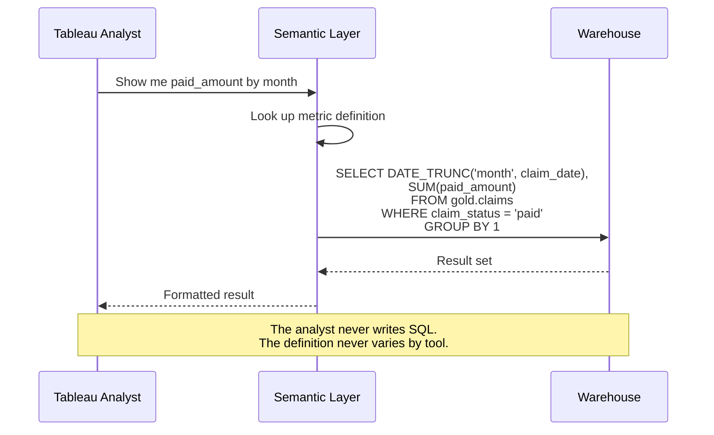

# 03 — Building It

## The Story

An insurance company's call center analytics team had a metric called "call-to-order conversion rate." The analysts defined it as orders divided by calls. Simple enough — until the product team pointed out that some calls were follow-ups on existing orders, not new sales opportunities. The support team argued that transferred calls should count as one call, not two. The finance team wanted only calls that resulted in paid orders, not pending ones.

Four teams. Four definitions. One metric name. The conversion rate ranged from 8% to 23% depending on who you asked.

Building a semantic layer is not about installing a tool. It is about forcing the organization to agree on definitions — and then encoding those agreements in a format that machines enforce.

---

## The Dataset

This chapter uses an insurance / call center dataset with the following Gold-layer tables:

| Table | Grain | Key Columns |
|-------|-------|-------------|
| `gold.calls` | One row per call | `call_id`, `agent_id`, `member_id`, `call_start_utc`, `call_end_utc`, `channel`, `disposition` |
| `gold.members` | One row per member | `member_id`, `plan_type`, `enrollment_date`, `status` |
| `gold.orders` | One row per order | `order_id`, `call_id`, `member_id`, `order_date`, `total_amount`, `payment_status` |
| `gold.claims` | One row per claim | `claim_id`, `member_id`, `claim_date`, `paid_amount`, `claim_status` |
| `gold.products` | One row per product | `product_id`, `product_name`, `category`, `price` |

---

## Core Metric Definitions

Before writing any code, the definitions must be agreed upon in plain language:

| Metric | Business Definition | Formula | Filters |
|--------|---------------------|---------|---------|
| Active Member Count | Members with status = 'active' as of the reporting date | `COUNT(DISTINCT member_id)` | `status = 'active'` |
| Claims Per Member | Average number of paid claims per active member in the period | `COUNT(claim_id) / COUNT(DISTINCT member_id)` | `claim_status = 'paid'`, `status = 'active'` |
| Paid Amount | Total dollars paid on approved claims | `SUM(paid_amount)` | `claim_status = 'paid'` |
| Call-to-Order Conversion | Percentage of inbound sales calls that result in a paid order | `COUNT(DISTINCT orders.call_id) / COUNT(DISTINCT calls.call_id)` | `channel = 'inbound'`, `disposition = 'sale'`, `payment_status = 'paid'` |

These definitions are the contract. Everything below is an implementation of this contract in different tools.

---

## dbt Semantic Layer (MetricFlow)

MetricFlow defines metrics in YAML (YAML Ain't Markup Language) alongside your dbt models. Each metric references a semantic model (a dbt model annotated with entities, dimensions, and measures).

**Semantic model** (`models/semantic/sem_claims.yml`):

```yaml
semantic_models:
  - name: claims
    defaults:
      agg_time_dimension: claim_date
    model: ref('gold_claims')
    entities:
      - name: claim
        type: primary
        expr: claim_id
      - name: member
        type: foreign
        expr: member_id
    dimensions:
      - name: claim_date
        type: time
        type_params:
          time_granularity: day
      - name: claim_status
        type: categorical
    measures:
      - name: paid_amount_total
        agg: sum
        expr: paid_amount
        description: "Total dollars paid on approved claims"
      - name: claim_count
        agg: count
        expr: claim_id
        description: "Count of individual claims"
```

**Metric definition** (`models/semantic/metrics_claims.yml`):

```yaml
metrics:
  - name: paid_amount
    label: "Paid Amount"
    description: "Total dollars paid on approved claims. Excludes denied and pending."
    type: simple
    type_params:
      measure: paid_amount_total
    filter: |
      {{ Dimension('claim__claim_status') }} = 'paid'

  - name: claims_per_member
    label: "Claims Per Member"
    description: "Average paid claims per active member in the reporting period."
    type: derived
    type_params:
      expr: claim_count / active_member_count
      metrics:
        - name: claim_count
          filter: |
            {{ Dimension('claim__claim_status') }} = 'paid'
        - name: active_member_count
```

**Querying from any tool** (via dbt Cloud Semantic Layer API):

```python
# Python SDK example
from dbtsl import SemanticLayerClient

client = SemanticLayerClient(
    environment_id=12345,
    auth_token="dbt_cloud_token"
)

result = client.query(
    metrics=["paid_amount"],
    group_by=["claim__claim_date"],
    time_granularity="month",
    limit=12
)
```

---

## Starburst / Trino

Starburst defines semantic concepts as federated views with governance policies. There is no declarative metric format — the semantic layer is built from SQL views, role-based access, and a catalog layer.

**Federated view joining BigQuery claims with an external member system:**

```sql
-- Starburst catalog: analytics.semantic
CREATE OR REPLACE VIEW analytics.semantic.paid_claims AS
SELECT
    c.claim_id,
    c.member_id,
    c.claim_date,
    c.paid_amount,
    m.plan_type,
    m.status AS member_status
FROM bigquery.gold.claims c
JOIN postgresql.members.members m
    ON c.member_id = m.member_id
WHERE c.claim_status = 'paid';

-- Metric as a view
CREATE OR REPLACE VIEW analytics.semantic.metric_paid_amount AS
SELECT
    DATE_TRUNC('month', claim_date) AS period,
    SUM(paid_amount)                AS paid_amount,
    COUNT(DISTINCT member_id)       AS member_count
FROM analytics.semantic.paid_claims
WHERE member_status = 'active'
GROUP BY DATE_TRUNC('month', claim_date);
```

**Access control (Starburst Galaxy / Ranger):**

```sql
-- Row-level filter: regional managers see only their region
ALTER TABLE analytics.semantic.paid_claims
SET AUTHORIZATION FILTER
WHERE region = current_user_attribute('region');
```

The federation capability is Starburst's differentiator. The BigQuery claims table and the PostgreSQL member table are queried in place — no ETL (Extract, Transform, Load) pipeline copies data between them.

---

## Looker (LookML)

LookML defines dimensions, measures, and relationships in version-controlled files. The semantic layer is the LookML model itself.

**Model file** (`models/call_center.model.lkml`):

```lookml
connection: "bigquery_production"

explore: claims {
  label: "Claims Analysis"
  description: "Paid claims with member attributes. Source of truth for paid_amount and claims_per_member."

  join: members {
    type: left_outer
    relationship: many_to_one
    sql_on: ${claims.member_id} = ${members.member_id} ;;
  }
}
```

**View file** (`views/claims.view.lkml`):

```lookml
view: claims {
  sql_table_name: gold.claims ;;

  dimension: claim_id {
    primary_key: yes
    type: number
    sql: ${TABLE}.claim_id ;;
  }

  dimension: claim_status {
    type: string
    sql: ${TABLE}.claim_status ;;
  }

  dimension_group: claim_date {
    type: time
    timeframes: [date, week, month, quarter, year]
    sql: ${TABLE}.claim_date ;;
  }

  measure: paid_amount {
    label: "Paid Amount"
    description: "Total dollars paid on approved claims. Excludes denied and pending."
    type: sum
    sql: ${TABLE}.paid_amount ;;
    filters: [claim_status: "paid"]
    value_format_name: usd
  }

  measure: claim_count {
    type: count_distinct
    sql: ${TABLE}.claim_id ;;
    filters: [claim_status: "paid"]
  }
}
```

---

## Cube.dev

Cube defines metrics and dimensions in schema files (JavaScript or YAML). Consumers query through REST, GraphQL, or SQL APIs (Application Programming Interfaces).

**Schema file** (`schema/Claims.js`):

```javascript
cube('Claims', {
  sql_table: 'gold.claims',

  joins: {
    Members: {
      relationship: 'many_to_one',
      sql: `${CUBE}.member_id = ${Members}.member_id`
    }
  },

  measures: {
    paidAmount: {
      type: 'sum',
      sql: 'paid_amount',
      title: 'Paid Amount',
      description: 'Total dollars paid on approved claims. Excludes denied and pending.',
      filters: [{ sql: `${CUBE}.claim_status = 'paid'` }],
      format: 'currency'
    },

    claimCount: {
      type: 'count',
      sql: 'claim_id',
      title: 'Claim Count',
      filters: [{ sql: `${CUBE}.claim_status = 'paid'` }]
    },

    claimsPerMember: {
      type: 'number',
      sql: `${claimCount} / NULLIF(${Members.activeMemberCount}, 0)`,
      title: 'Claims Per Member',
      description: 'Average paid claims per active member in the reporting period.'
    }
  },

  dimensions: {
    claimId: {
      sql: 'claim_id',
      type: 'number',
      primary_key: true
    },

    claimDate: {
      sql: 'claim_date',
      type: 'time'
    },

    claimStatus: {
      sql: 'claim_status',
      type: 'string'
    }
  },

  pre_aggregations: {
    monthlyPaidAmount: {
      measures: [paidAmount, claimCount],
      time_dimension: claimDate,
      granularity: 'month',
      refresh_key: {
        every: '1 hour'
      }
    }
  }
});
```

**Querying via REST:**

```bash
curl -X POST https://cube.example.com/cubejs-api/v1/load \
  -H "Authorization: Bearer TOKEN" \
  -d '{
    "measures": ["Claims.paidAmount"],
    "timeDimensions": [{
      "dimension": "Claims.claimDate",
      "granularity": "month",
      "dateRange": ["2025-01-01", "2025-12-31"]
    }]
  }'
```

---

## One Definition, Multiple Consumers

This is the entire point. The same metric definition — regardless of which tool hosts it — serves every consumer without rewriting logic.

```mermaid
graph TD
    subgraph Semantic Layer
        M1[paid_amount<br/>SUM of paid_amount<br/>WHERE status = paid]
        M2[claims_per_member<br/>claim_count / active_members]
        M3[call_to_order_conversion<br/>orders with paid status / inbound calls]
    end

    subgraph Consumers — Same Numbers Everywhere
        C1[Tableau Dashboard]
        C2[Power BI Report]
        C3[REST API — Mobile App]
        C4[Python Notebook — Data Science]
        C5[LLM Agent — Natural Language Query]
    end

    M1 --> C1
    M1 --> C2
    M1 --> C3
    M2 --> C4
    M2 --> C1
    M3 --> C5
    M3 --> C2
```



The analyst in Tableau and the data scientist in a notebook get the same number because neither of them defined the metric. The semantic layer did.

---

## Quick Links

| Resource | Link |
|----------|------|
| MetricFlow YAML reference | https://docs.getdbt.com/docs/build/semantic-models |
| LookML field reference | https://cloud.google.com/looker/docs/reference/param-field |
| Cube.dev schema reference | https://cube.dev/docs/product/data-modeling/overview |
| Starburst views | https://docs.starburst.io/latest/sql/sql-statement-create-view.html |
| Previous chapter: Tools Compared | [02_Tools_Compared.md](02_Tools_Compared.md) |
| Next chapter: Production Patterns | [04_Production_Patterns.md](04_Production_Patterns.md) |
