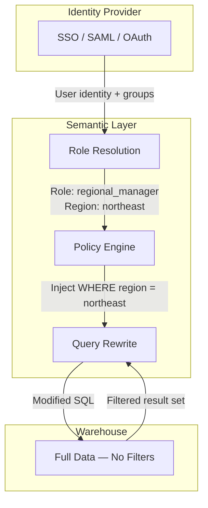
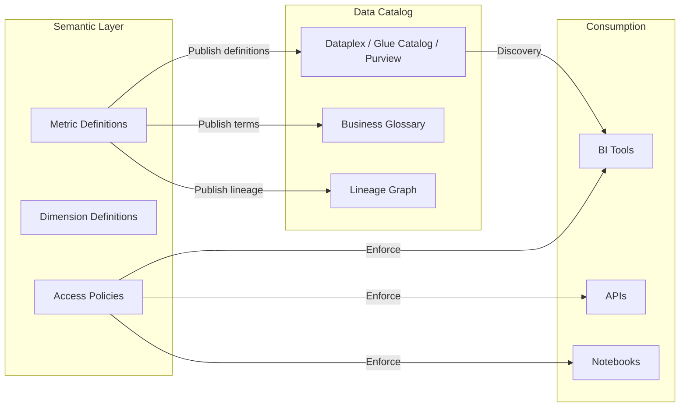

# 04 — Production Patterns

## The Story

A fintech company launched their semantic layer on a Tuesday. By Thursday, the Customer Success (CS) team reported that the "monthly active users" metric in their embedded dashboard was 40% lower than what the internal Looker dashboard showed. The engineering team investigated for two days before finding the cause: the embedded dashboard was hitting the semantic layer's cache, which had been populated at 2 AM when a batch job was still running. The internal dashboard queried the warehouse directly, bypassing the semantic layer entirely.

The semantic layer was correctly configured. The metric definition was correct. But two production concerns — caching and access routing — turned a correct definition into a wrong number. Building the semantic layer is the easy part. Operating it is where the real engineering happens.

---

## Caching

Every semantic layer that sits between consumers and the warehouse introduces a caching decision. The question is never whether to cache. The question is **what to cache, for how long, and how to invalidate.**

### Cache Strategies by Tool

| Tool | Cache Mechanism | Default Behavior | Invalidation |
|------|----------------|-------------------|--------------|
| Cube.dev | Pre-aggregation tables + in-memory | Pre-aggregations refreshed on schedule | `refresh_key` config per cube (time-based or query-based) |
| dbt Semantic Layer | dbt Cloud managed cache | Transparent to consumer | Refreshed on dbt Cloud job completion |
| Looker | Persistent Derived Tables (PDTs) | PDTs rebuilt on schedule or trigger | `persist_for`, `sql_trigger_value`, datagroup |
| AtScale | Autonomous aggregates | ML-driven materialization | Automatic based on query patterns |
| Power BI | VertiPaq in-memory engine | Full import or DirectQuery | Dataset refresh schedule or incremental |
| Starburst | Limited (connector-level) | Relies on source caching | Source-dependent |

### Rules for Production Caching

1. **Cache at the grain your consumers actually query.** If 90% of queries are monthly aggregates, pre-aggregate monthly. Do not cache at the daily grain and force runtime rollup.
2. **Tie invalidation to your pipeline, not the clock.** A cache that refreshes every hour is wrong 59 minutes out of 60 if your pipeline runs once at 4 AM. Invalidate when the upstream data changes.
3. **Never cache partial loads.** If your cache refreshes while a batch job is mid-run, you serve incomplete data with full confidence. Gate cache refresh behind pipeline completion signals.

```yaml
# Cube.dev — refresh only after the pipeline marks data as ready
pre_aggregations:
  monthly_paid_amount:
    measures: [paidAmount]
    time_dimension: claimDate
    granularity: month
    refresh_key:
      sql: "SELECT MAX(pipeline_completed_at) FROM gold.pipeline_runs WHERE status = 'success'"
```

---

## Access Control

The semantic layer is the correct place to enforce access control for analytical queries. If security is configured per BI tool, it will be configured inconsistently.

### Levels of Access Control

| Level | What It Controls | Example |
|-------|-----------------|---------|
| **Metric-level** | Who can see which metrics | Finance sees "revenue"; Marketing does not |
| **Dimension-level** | Who can group by which attributes | Only HR (Human Resources) sees "salary_band" dimension |
| **Row-level** | Which rows a user sees within an allowed metric | Regional manager sees only their region's claims |
| **Column-level** | Which columns are visible or masked | PII (Personally Identifiable Information) columns masked for non-privileged roles |

### Implementation Pattern



The warehouse stores all data without access filters. The semantic layer intercepts every query, resolves the user's role from the identity provider, and injects row/column filters before the query reaches the warehouse. The consumer never sees the filter — they simply get "their" data.

```python
# Cube.dev — row-level security via query rewrite
cube('Claims', {
  sql_table: 'gold.claims',

  # Security context injected per request
  query_rewrite: (query, { security_context }) => {
    if (security_context.role !== 'admin') {
      query.filters.push({
        member: 'Claims.region',
        operator: 'equals',
        values: [security_context.region]
      });
    }
    return query;
  }
});
```

---

## Versioning

Metric definitions change. "Active member" might exclude a new status category starting Q3. "Revenue" might shift from gross to net after an accounting policy change.

### The Versioning Problem

When a metric definition changes, every downstream consumer — dashboards, reports, API consumers, ML models — is affected. If the change is silent, consumers do not know their numbers shifted. If the change is breaking, consumers fail.

### Versioning Strategies

| Strategy | How It Works | When to Use |
|----------|-------------|-------------|
| **Additive versioning** | Create `revenue_v2` alongside `revenue_v1`. Deprecate v1 after migration. | Breaking changes to metric logic |
| **Changelog-driven** | Metric definition changes are logged with effective dates. Consumers query by version or date. | Auditable environments (finance, healthcare) |
| **Git-native** | Metric definitions live in Git (dbt, LookML, Cube). Every change is a Pull Request (PR) with review. | Teams already using Git-based workflows |
| **Semantic versioning** | Major version = breaking change, minor = additive, patch = fix. Consumers pin to a version. | API-first semantic layers (Cube, dbt Cloud) |

### Minimum Viable Versioning

At a minimum, every metric change should produce:

1. **A Git commit** with the before/after definition
2. **A changelog entry** visible to consumers (not buried in a commit message)
3. **A deprecation window** for the old definition (30 days is standard)

```yaml
# dbt — metric with version metadata
metrics:
  - name: revenue
    label: "Net Revenue"
    description: |
      Net revenue after returns and refunds.
      Changed from gross to net effective 2025-07-01.
      Previous definition available as revenue_gross (deprecated 2025-10-01).
    type: simple
    type_params:
      measure: net_revenue_total
```

---

## Governance

The semantic layer is not just a query engine. In mature organizations, it becomes the **system of record for business definitions** — the place where "what does this metric mean?" is answered authoritatively.

### Governance Integration



| Governance Capability | GCP | AWS | Azure |
|----------------------|-----|-----|-------|
| Data catalog | Dataplex | Glue Data Catalog | Microsoft Purview |
| Business glossary | Dataplex (Data Catalog tags) | DataZone (business glossary) | Purview (business glossary) |
| Lineage | Dataplex lineage / OpenLineage | DataZone lineage | Purview lineage |
| Policy enforcement | BigQuery IAM (Identity and Access Management) + column-level | Lake Formation | Purview policies |

The semantic layer should **publish** its definitions to the data catalog, not replace it. The catalog is the discovery layer ("what metrics exist?"). The semantic layer is the execution layer ("give me this metric's value").

---

## Performance

A semantic layer that adds 10 seconds to every query will be bypassed. Analysts will go back to writing SQL directly against the warehouse, and your single source of truth becomes a single source of latency.

### Performance Levers

| Lever | What It Does | When to Use |
|-------|-------------|-------------|
| **Pre-aggregation** | Materialize rollups at common grains (daily, monthly, by region) | High-traffic metrics with predictable query patterns |
| **Materialized views** | Warehouse-native pre-computation | Metrics queried frequently with stable definitions |
| **Query pushdown** | Semantic layer pushes filters and aggregations to the warehouse engine | Always — this should be the default, not an optimization |
| **Result caching** | Cache query results for identical requests | Dashboards with many concurrent viewers |
| **Partition pruning** | Ensure semantic layer queries include partition keys | Large tables partitioned by date or region |

### Anti-Patterns

| Anti-Pattern | Why It Hurts |
|-------------|-------------|
| Caching everything at the finest grain | Storage cost explodes; cache hit rate stays low |
| Pre-aggregating before query patterns stabilize | You materialize rollups nobody queries |
| Skipping query pushdown (pulling raw data into the semantic layer) | Network transfer dominates latency; warehouse optimization is wasted |
| No partition pruning in metric filters | Full table scans on multi-TB tables |

---

## Multi-Tool Consistency

The entire purpose of the semantic layer is to ensure that Tableau and Power BI show the same number. But this guarantee only holds if every tool routes through the semantic layer.

### Common Failure Modes

| Failure Mode | Cause | Fix |
|-------------|-------|-----|
| BI tool queries warehouse directly | Analyst connected to warehouse instead of semantic layer endpoint | Restrict direct warehouse access for BI service accounts |
| Tool applies its own aggregation on top of semantic layer results | Double-aggregation (e.g., Tableau SUMs a pre-aggregated result) | Ensure tools receive row-level data and aggregate themselves, OR receive pre-aggregated data and display without further aggregation |
| Date/timezone handling differs between tools | One tool uses UTC (Coordinated Universal Time), another uses local time | Standardize on UTC in the semantic layer; let tools handle display timezone |
| Rounding differences | One tool rounds at the row level, another at the aggregate level | Define rounding rules in the semantic layer, not in the tool |

### Enforcement Architecture

The strongest guarantee is architectural: **remove direct warehouse access for analytical consumers.** If the only way to query data is through the semantic layer, consistency is enforced by design.

| Consumer Type | Connection Target | Direct Warehouse Access |
|--------------|-------------------|------------------------|
| BI tools (Tableau, Power BI, Looker) | Semantic layer endpoint | Blocked |
| API consumers | Semantic layer REST/GraphQL | Blocked |
| Data science notebooks | Semantic layer Python SDK (Software Development Kit) | Allowed for exploration; governed metrics must use SDK |
| Data engineers (pipeline development) | Warehouse directly | Allowed (they build the Gold layer the semantic layer reads) |

---

## Quick Links

| Resource | Link |
|----------|------|
| Cube.dev pre-aggregations | https://cube.dev/docs/product/caching/using-pre-aggregations |
| Looker PDT reference | https://cloud.google.com/looker/docs/derived-tables |
| dbt Cloud Semantic Layer security | https://docs.getdbt.com/docs/use-dbt-semantic-layer/setup-sl |
| AtScale performance tuning | https://docs.atscale.com/ |
| GCP Dataplex | https://cloud.google.com/dataplex |
| AWS DataZone | https://aws.amazon.com/datazone/ |
| Microsoft Purview | https://learn.microsoft.com/en-us/purview/ |
| Previous chapter: Building It | [03_Building_It.md](03_Building_It.md) |
| Playbook index | [README.md](README.md) |
