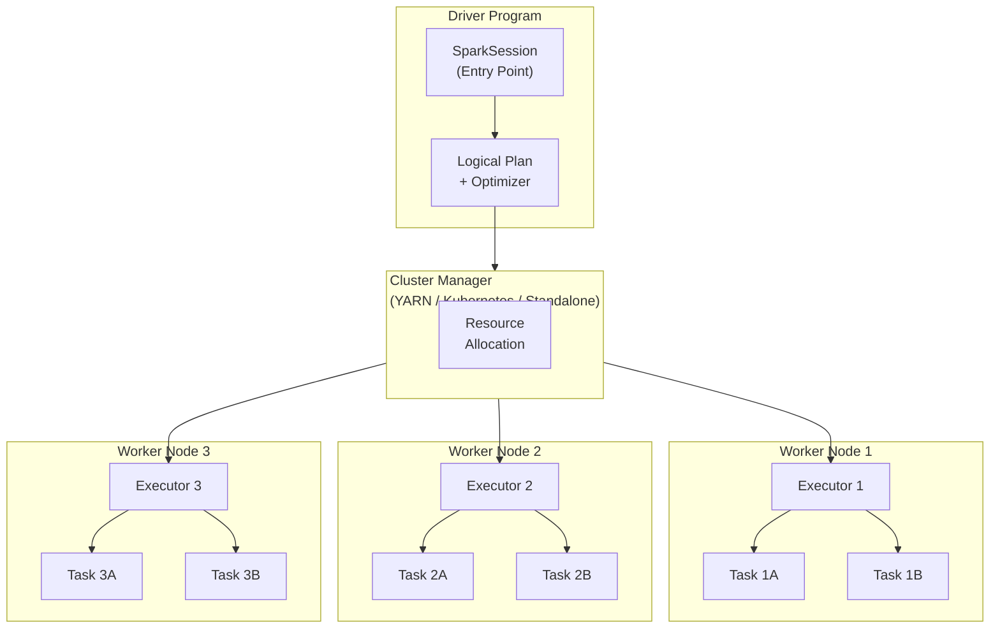
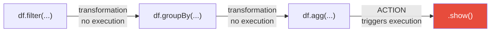
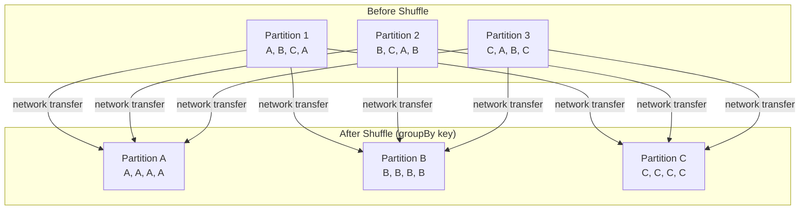

# PySpark - Concepts

**Series:** PySpark Concept Chapters (2 of 10)
**Notebook:** [Python for DE on Colab](https://colab.research.google.com/github/sunilmogadati/systems-in-production/blob/main/implementation/notebooks/Python_NumPy_Pandas.ipynb) (PySpark sections 18-22)

---

## The Restaurant Kitchen Analogy

Before looking at architecture diagrams, think of a large restaurant kitchen:

- **Head Chef** (the Driver): Does not cook food directly. Reads the order tickets, decides which dishes go to which station, coordinates timing so everything comes out together. If the head chef goes down, the whole kitchen stops.
- **Line Cooks** (the Executors): Do the actual cooking. Each line cook handles a portion of the work -- one grills, one sautes, one plates. They work in parallel. More line cooks means more food prepared simultaneously.
- **Restaurant Manager** (the Cluster Manager): Decides how many line cooks to put on shift, assigns them to stations, and handles hiring/firing if demand changes. The head chef requests resources; the manager provides them.

This is exactly how Apache Spark works.

---

## Spark Architecture

### Component Breakdown

| Component | Role | Analogy |
|---|---|---|
| **SparkSession** | Entry point to all Spark functionality. You create one per application. | The kitchen's front door -- everything starts here. |
| **Driver** | Runs your main program. Builds the execution plan. Coordinates executors. | Head chef reading tickets and calling orders. |
| **Cluster Manager** | Allocates resources (CPU, memory) across the cluster. Options: YARN (Yet Another Resource Negotiator), Kubernetes, Standalone. On GCP Dataproc, this is YARN. | Restaurant manager assigning staff. |
| **Executor** | A process on a worker node that runs tasks and stores data. Each executor gets a fixed amount of memory and CPU cores. | A line cook at a station with a set number of burners. |
| **Task** | The smallest unit of work. One task processes one partition of data. | Cooking one plate of food. |
| **Worker Node** | A physical or virtual machine in the cluster that hosts executors. | A kitchen station (grill, saute, pastry). |

---

## DataFrames: Like Pandas, but Distributed

A PySpark DataFrame looks and feels like a pandas DataFrame. You have rows and columns. You filter, group, join, and aggregate. The critical difference: a PySpark DataFrame is split across multiple machines.

Think of it this way:

- A **pandas DataFrame** is a single spreadsheet on your laptop.
- A **PySpark DataFrame** is that same spreadsheet torn into pieces, with each piece on a different computer. When you run a query, all computers process their piece simultaneously.

You interact with it as if it were one table. Spark handles the distribution behind the scenes.

---

## Transformations vs Actions: Lazy Evaluation

This is the concept that surprises people coming from pandas. In PySpark, there are two kinds of operations:

**Transformations** -- define WHAT to do, but do NOT execute yet.

Examples: `filter()`, `select()`, `groupBy()`, `join()`, `withColumn()`

**Actions** -- trigger execution. Spark looks at all the transformations you queued up, optimizes them, and runs the whole plan.

Examples: `show()`, `count()`, `collect()`, `write()`

Analogy: Writing a grocery list (transformations) versus actually going to the store (action). You can add items to the list all day without leaving the house. The trip only happens when you decide to go.

**Why does this matter?** Because Spark can optimize the entire chain of transformations before running anything. If you filter 90% of rows out and then join, Spark pushes the filter before the join -- processing far less data. Pandas cannot do this because it executes each line immediately.

---

## Partitions: How Data Is Split Across Machines

A partition is a chunk of data that lives on one machine and gets processed by one task. If your DataFrame has 200 partitions, Spark can run up to 200 tasks in parallel (if you have enough cores).

Analogy: Dealing cards. If you have a deck of 200 cards and 10 players, each player gets 20 cards. Each player (executor) processes their cards independently. The deck is your data. The cards in each hand are a partition.

**Key rules:**

- Too few partitions = some machines sit idle while others are overloaded.
- Too many partitions = overhead from managing thousands of tiny tasks.
- Default partition count: 200 for shuffle operations (`spark.sql.shuffle.partitions`).
- Good starting point: 2 to 4 partitions per CPU core in your cluster.

---

## Shuffle: The Most Expensive Operation

A shuffle happens when data needs to move between machines. This occurs during operations like `groupBy()`, `join()`, `distinct()`, and `orderBy()`.

Analogy: Imagine 10 line cooks each have a random mix of appetizers, entrees, and desserts. The head chef says "group everything by course." Every cook must send their appetizers to Cook 1, their entrees to Cook 2, and their desserts to Cook 3. Food is physically moving between stations. That movement is expensive -- it takes time and uses network bandwidth.

**Why it matters:** Shuffles involve disk Input/Output (I/O), network transfer, and serialization. A single shuffle can take longer than all other operations combined. Reducing shuffles is the number one way to make PySpark jobs faster.

---

## Key Terms Glossary

| Term | Pronunciation | Definition |
|---|---|---|
| **DataFrame** | "data frame" | A distributed collection of data organized into named columns. The primary data structure in PySpark. |
| **Transformation** | -- | An operation that defines a new DataFrame from an existing one. Does not execute immediately (lazy). |
| **Action** | -- | An operation that triggers execution of the plan and returns a result or writes output. |
| **Partition** | "par-TISH-un" | A chunk of data that resides on one node. One task processes one partition. |
| **Shuffle** | -- | The redistribution of data across partitions, typically across the network. Triggered by wide transformations. |
| **Driver** | -- | The process that runs the main Spark application, creates the SparkSession, and coordinates executors. |
| **Executor** | -- | A process on a worker node that executes tasks and caches data. |
| **SparkSession** | -- | The unified entry point to Spark functionality. Created once per application. Replaces the older SparkContext and SQLContext. |
| **Lazy Evaluation** | -- | The strategy of recording transformations without executing them until an action is called. |
| **DAG** | "dag" (rhymes with "tag") | Directed Acyclic Graph. The execution plan Spark builds from your transformations. Directed = has order. Acyclic = no loops. |
| **Stage** | -- | A set of tasks that can run in parallel without a shuffle. A new stage begins after every shuffle boundary. |
| **Task** | -- | The smallest unit of work. One task processes one partition within one stage. |
| **RDD** | "R-D-D" | Resilient Distributed Dataset. The low-level data structure underneath DataFrames. You rarely use RDDs (Resilient Distributed Datasets) directly in modern PySpark, but they power everything. |

---

## PySpark vs Pandas: API (Application Programming Interface) Comparison

If you know pandas, you already know most of PySpark. The syntax is close but not identical:

| Operation | Pandas | PySpark |
|---|---|---|
| **Create session** | (not needed) | `spark = SparkSession.builder.getOrCreate()` |
| **Read CSV** | `pd.read_csv("file.csv")` | `spark.read.csv("file.csv", header=True, inferSchema=True)` |
| **Show first rows** | `df.head()` | `df.show()` |
| **Select columns** | `df[["col1", "col2"]]` | `df.select("col1", "col2")` |
| **Filter rows** | `df[df["age"] > 30]` | `df.filter(col("age") > 30)` |
| **Add column** | `df["new"] = df["a"] + df["b"]` | `df.withColumn("new", col("a") + col("b"))` |
| **Group and aggregate** | `df.groupby("dept").agg({"salary": "mean"})` | `df.groupBy("dept").agg(avg("salary"))` |
| **Join** | `pd.merge(df1, df2, on="id")` | `df1.join(df2, on="id", how="inner")` |
| **Sort** | `df.sort_values("col")` | `df.orderBy("col")` |
| **Count rows** | `len(df)` | `df.count()` |
| **Write Parquet** | `df.to_parquet("out.parquet")` | `df.write.parquet("gs://bucket/out/")` |
| **Schema / dtypes** | `df.dtypes` | `df.printSchema()` |

**Key differences to watch:**

1. PySpark column references use `col("name")` from `pyspark.sql.functions`, not bracket notation.
2. PySpark DataFrames are immutable -- `withColumn` returns a NEW DataFrame, it does not modify in place.
3. PySpark uses `show()` (prints to console) and `collect()` (returns to Driver as Python list). Calling `collect()` on a large DataFrame will crash your Driver -- it pulls ALL data to one machine.

---

## Quick Links: PySpark Chapter Series

| Chapter | Title |
|---|---|
| 01 | [Why It Matters](01_Why.md) |
| **02** | [Concepts](02_Concepts.md) |
| 03 | [Hello World](03_Hello_World.md) |
| 04 | [How It Works](04_How_It_Works.md) |
| 05 | [Building It](05_Building_It.md) |
| 06 | [Production Patterns](06_Production_Patterns.md) |
| 07 | [System Design](07_System_Design.md) |
| 08 | [Quality, Security, and Governance](08_Quality_Security_Governance.md) |
| 09 | [Observability and Troubleshooting](09_Observability_Troubleshooting.md) |
| 10 | [Decision Guide](10_Decision_Guide.md) |
