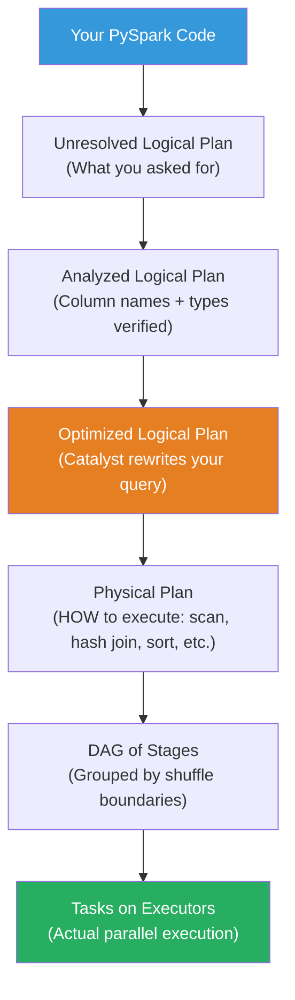
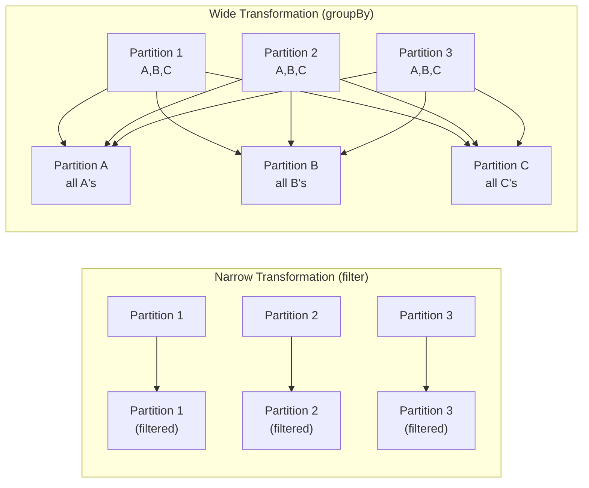
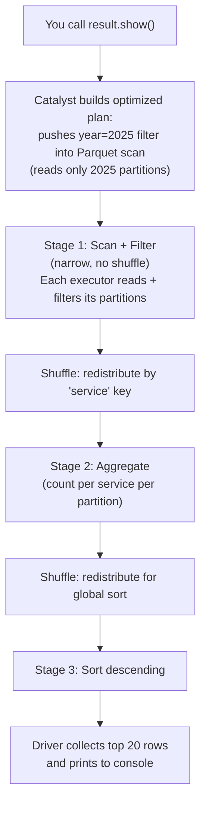

# PySpark - How It Works

**Series:** PySpark Concept Chapters (4 of 10)
**Notebook:** [Python for DE on Colab](https://colab.research.google.com/github/sunilmogadati/systems-in-production/blob/main/implementation/notebooks/Python_NumPy_Pandas.ipynb) (PySpark sections 18-22)

---

## What Happens When You Hit Run

When you write PySpark code like this:

```python
df = spark.read.csv("gs://bucket/logs/", header=True, inferSchema=True)
errors = df.filter(col("status") == "ERROR")
by_service = errors.groupBy("service").count()
by_service.show()
```

Lines 1-3 do NOT execute. They build a plan. Line 4 (`.show()`) is the action that triggers everything.

This chapter explains what Spark does between your code and the result.

---

## Lazy Evaluation: Build the Plan, Then Execute

Analogy: You are planning a road trip. You do not drive to the gas station, then decide where to go next, then drive to the restaurant, then figure out the highway. You plan the entire route first, optimize it (avoid backtracking, combine stops), and THEN drive.

Spark works the same way. Transformations (filter, groupBy, join) are waypoints on the route. Actions (show, count, write) are "start driving."

**Why this matters in practice:**

```python
# Pandas: executes EACH line immediately
df = pd.read_csv("huge_file.csv")       # Reads entire file into memory NOW
filtered = df[df["status"] == "ERROR"]    # Scans all rows NOW
result = filtered.groupby("service").count()  # Groups NOW
```

```python
# PySpark: builds a plan, executes ONCE at the action
df = spark.read.csv("gs://bucket/logs/")           # Plan: "I will read this"
filtered = df.filter(col("status") == "ERROR")      # Plan: "I will filter"
result = filtered.groupBy("service").count()         # Plan: "I will group"
result.show()  # NOW Spark executes everything, optimized as one pipeline
```

Because Spark sees the entire plan before executing, it can make optimizations that are impossible when executing line by line.

---

## The Execution Pipeline

Your code goes through four stages before any data moves:



### Stage 1: Logical Plan

Spark translates your code into a tree of operations. This is "what you asked for" without any optimization.

Example: "Read CSV, then filter status = ERROR, then group by service, then count."

### Stage 2: Analyzed Plan

Spark verifies that all column names exist, types are compatible, and functions are valid. If you misspell a column name, this is where you get the `AnalysisException`.

### Stage 3: Optimized Plan (Catalyst Optimizer)

This is where the magic happens. The Catalyst optimizer rewrites your plan to be faster. See the next section for details.

### Stage 4: Physical Plan

Spark chooses concrete algorithms: hash join vs sort-merge join, full scan vs partition pruning, etc. You can see this plan:

```python
result.explain(True)
```

### Stage 5: DAG (Directed Acyclic Graph) of Stages

The physical plan is split into stages. A new stage begins at every shuffle boundary (typically after `groupBy`, `join`, `orderBy`). Within a stage, all operations run as a pipeline on each partition without moving data.

### Stage 6: Tasks on Executors

Each stage is split into tasks (one per partition). Tasks are sent to executors for parallel execution.

---

## The Catalyst Optimizer: Spark Rewrites Your Query

The Catalyst optimizer is an automatic query rewriter built into Spark. It applies rules to your logical plan to produce a faster equivalent.

### Example: Predicate Pushdown

You write:

```python
df = spark.read.parquet("gs://bucket/events/")
joined = df.join(users, "user_id")
filtered = joined.filter(col("country") == "US")
```

Spark rewrites it to:

```python
# Catalyst pushes the filter BEFORE the join
# Fewer rows to join = much faster
df = spark.read.parquet("gs://bucket/events/")
filtered_df = df.filter(col("country") == "US")   # Filter first
joined = filtered_df.join(users, "user_id")         # Join smaller dataset
```

You did not ask for this. Spark did it automatically.

### Common Catalyst Optimizations

| Optimization | What It Does | Analogy |
|---|---|---|
| **Predicate Pushdown** | Moves filters as early as possible, even into the file scan (reads less data from disk). | Checking IDs at the door instead of letting everyone in and then checking. |
| **Column Pruning** | Only reads the columns you actually use, ignoring the rest. | Only packing clothes you will wear, not the whole closet. |
| **Constant Folding** | Pre-computes constant expressions at plan time (`1 + 2` becomes `3`). | Doing math on paper before going to the store. |
| **Join Reordering** | Puts the smaller table on the build side of a join. | Having the shorter guest list at the door, not the longer one. |
| **Broadcast Join** | If one table is small enough, sends it to all executors to avoid a shuffle. | Photocopying a short reference sheet for everyone instead of passing one copy around. |

---

## Shuffle: Why GroupBy and Join Are Expensive

Recall from Chapter 02: a shuffle moves data between machines over the network. Here is exactly when and why it happens.

### Narrow vs Wide Transformations

| Type | Shuffle? | What Happens | Examples |
|---|---|---|---|
| **Narrow** | No | Each output partition depends on exactly one input partition. Data stays on the same machine. | `filter()`, `select()`, `withColumn()`, `map()` |
| **Wide** | Yes | Each output partition may depend on data from ALL input partitions. Data must move across the network. | `groupBy()`, `join()`, `distinct()`, `orderBy()`, `repartition()` |



**Narrow transformations** are fast because data does not leave the machine. You can chain as many narrow transformations as you want with almost no overhead -- Spark pipelines them together.

**Wide transformations** are expensive because:
1. Data is serialized (converted to bytes).
2. Written to local disk (spill).
3. Sent over the network to other executors.
4. Deserialized on the receiving end.
5. Aggregated or joined.

This is why a `groupBy().count()` on a terabyte of data can take minutes -- most of that time is the shuffle, not the count.

---

## The Spark UI: How to Read It

When a Spark application runs, it serves a web UI (User Interface) on port 4040 (by default). On Dataproc, you access it through the cluster's web interfaces.

The Spark UI has four tabs that matter most:

### Jobs Tab

Shows one row per action (each `.show()`, `.count()`, `.write()` creates a job). Each job shows:
- Duration
- Number of stages
- Number of tasks (succeeded/failed)

### Stages Tab

Each job is broken into stages. A stage boundary occurs at every shuffle. Look for:
- **Shuffle Read / Shuffle Write** -- how much data moved between stages. High shuffle = expensive.
- **Task Duration Distribution** -- if some tasks take much longer than others, you have data skew (uneven partition sizes).

### Storage Tab

Shows cached DataFrames (if you used `.cache()` or `.persist()`). Tells you how much memory and disk they consume.

### SQL (Structured Query Language) / DataFrame Tab

Shows the physical plan as a visual tree for each query. This is the most useful tab for understanding what Spark actually did:
- Green nodes = scans (reading data)
- Blue nodes = transformations
- Orange nodes = shuffles (exchanges)

### What to Look For

| Symptom in UI | Likely Cause | Action |
|---|---|---|
| One stage takes 10 times longer than others | Shuffle bottleneck or data skew | Check shuffle read/write sizes. Repartition or salt the join key. |
| One task in a stage takes 100 times longer than others | Data skew (one partition much larger) | Use `repartition()` or add a salt column to distribute keys evenly. |
| Many stages with tiny task counts | Too few partitions | Increase `spark.sql.shuffle.partitions`. |
| Spill to disk (shown in stage details) | Executors running out of memory | Increase executor memory or reduce partition size. |
| Tasks failing and retrying | Executor out of memory (OOM -- Out of Memory) | Increase `spark.executor.memory` or reduce data per partition. |

---

## Putting It Together: A Query's Journey

Here is the complete path for this code:

```python
df = spark.read.parquet("gs://bucket/events/")
result = df.filter(col("year") == 2025) \
           .groupBy("service") \
           .agg(count("*").alias("event_count")) \
           .orderBy(col("event_count").desc())
result.show()
```



Three stages. Two shuffles. The filter was pushed into the Parquet scan (predicate pushdown), so Spark never reads data from years other than 2025. The Catalyst optimizer did this automatically.

---

## Key Takeaways

1. **Lazy evaluation** lets Spark see the whole plan and optimize it. This is why PySpark is faster than "just running pandas on a bigger machine."
2. **The Catalyst optimizer** rewrites your query automatically. You get predicate pushdown, column pruning, and join reordering for free.
3. **Shuffles are the enemy.** Every `groupBy`, `join`, and `orderBy` triggers a shuffle. Minimize them.
4. **Narrow transformations are free (almost).** Chain as many filters and column operations as you want.
5. **The Spark UI tells you everything.** When a job is slow, the UI shows you exactly where time is spent.

---

## Quick Links: PySpark Chapter Series

| Chapter | Title |
|---|---|
| 01 | [Why It Matters](01_Why.md) |
| 02 | [Concepts](02_Concepts.md) |
| 03 | [Hello World](03_Hello_World.md) |
| **04** | [How It Works](04_How_It_Works.md) |
| 05 | [Building It](05_Building_It.md) |
| 06 | [Production Patterns](06_Production_Patterns.md) |
| 07 | [System Design](07_System_Design.md) |
| 08 | [Quality, Security, and Governance](08_Quality_Security_Governance.md) |
| 09 | [Observability and Troubleshooting](09_Observability_Troubleshooting.md) |
| 10 | [Decision Guide](10_Decision_Guide.md) |
