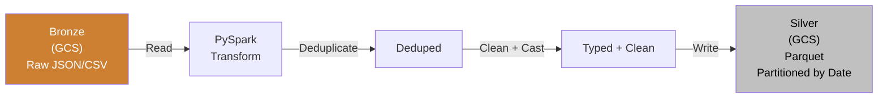

# PySpark - Building It

**Series:** PySpark Concept Chapters (5 of 10)
**Notebook:** [Python for DE on Colab](https://colab.research.google.com/github/sunilmogadati/systems-in-production/blob/main/implementation/notebooks/Python_NumPy_Pandas.ipynb) (PySpark sections 18-22)

---

## What We Are Building

A complete Silver-layer transform in PySpark that takes raw Bronze data and produces clean, typed, deduplicated Parquet files. This is the bread and butter of a data engineer's daily work.

The pipeline:



See [Cloud Pipeline Concepts](../cloud-pipeline/02_Concepts.md) for how this fits into the full Bronze-Silver-Gold architecture.

---

## Step 1: Read Bronze Data from GCS (Google Cloud Storage)

Bronze data arrives in whatever format the source system produces. You need to handle all of them.

### Reading CSV

```python
from pyspark.sql import SparkSession
from pyspark.sql.types import StructType, StructField, StringType, IntegerType, TimestampType, DoubleType

spark = SparkSession.builder \
    .appName("SilverTransform") \
    .getOrCreate()

# WHY define schema explicitly? Because inferSchema=True:
# 1. Scans the entire file (slow on large data)
# 2. Can guess wrong (e.g., "01234" as integer, dropping the leading zero)
# 3. May change between runs if data changes

schema = StructType([
    StructField("call_id", StringType(), nullable=False),
    StructField("agent_id", StringType(), nullable=True),
    StructField("customer_id", StringType(), nullable=True),
    StructField("call_start", StringType(), nullable=True),  # Read as string, cast later
    StructField("call_end", StringType(), nullable=True),
    StructField("duration_seconds", IntegerType(), nullable=True),
    StructField("disposition", StringType(), nullable=True),
    StructField("channel", StringType(), nullable=True),
])

df_bronze = spark.read.csv(
    "gs://my-bucket/bronze/calls/",
    header=True,
    schema=schema        # Explicit schema, not inferSchema
)
```

### Reading JSON (JavaScript Object Notation)

```python
df_bronze = spark.read.json(
    "gs://my-bucket/bronze/events/",
    schema=schema
)
```

### Reading Parquet (already typed, already columnar)

```python
# Parquet embeds its own schema, so you do not need to define one
df_bronze = spark.read.parquet("gs://my-bucket/bronze/transactions/")
```

### Schema Enforcement vs Schema Inference

| Approach | When to Use | Tradeoffs |
|---|---|---|
| **Explicit schema** (`schema=...`) | Production jobs. Always. | You control types. Fails fast on schema drift. Faster reads (no scan). |
| **Schema inference** (`inferSchema=True`) | Exploration and prototyping only. | Convenient but slow, fragile, and may guess wrong. |
| **Schema on read** (Parquet/Delta) | When source is already Parquet or Delta Lake. | Schema is embedded in the file. Most reliable. |

**Rule: In production, always define your schema explicitly.** Schema inference is for notebooks and one-off exploration.

---

## Step 2: Deduplicate with Window Functions

Bronze data frequently contains duplicates. Sources send the same record twice, pipelines retry on failure, or upstream systems replay events. You must deduplicate before any downstream use.

The standard pattern uses a window function with `row_number()`:

```python
from pyspark.sql.window import Window
from pyspark.sql.functions import row_number, col

# WHY row_number? Because it assigns 1, 2, 3... to each row within a group.
# Keeping only row_number == 1 gives you exactly one row per group.

# Define the window: partition by the business key, order by timestamp descending
# (most recent record wins)
dedup_window = Window.partitionBy("call_id").orderBy(col("call_start").desc())

df_deduped = df_bronze \
    .withColumn("row_num", row_number().over(dedup_window)) \
    .filter(col("row_num") == 1) \
    .drop("row_num")
```

Analogy: You have a stack of mail with duplicate letters. You sort each person's letters by date (newest on top), then keep only the top letter. That is `partitionBy("call_id").orderBy(desc).row_number == 1`.

**How it works under the hood:**
1. `partitionBy("call_id")` -- groups all rows with the same `call_id` together (this triggers a shuffle).
2. `orderBy(col("call_start").desc())` -- within each group, sorts by timestamp (newest first).
3. `row_number()` -- assigns 1 to the first row, 2 to the second, etc.
4. `filter(row_num == 1)` -- keeps only the latest version of each record.

---

## Step 3: Clean, Cast, and Normalize

Bronze data is messy. Types are wrong, nulls are inconsistent, and timestamps are in random timezones. The Silver layer fixes all of this.

```python
from pyspark.sql.functions import (
    col, to_timestamp, when, lit, trim, lower, 
    from_utc_timestamp, coalesce
)

df_cleaned = df_deduped \
    .withColumn(
        # WHY cast timestamps explicitly? Because Bronze data often stores
        # timestamps as strings in inconsistent formats.
        "call_start_ts",
        to_timestamp(col("call_start"), "yyyy-MM-dd'T'HH:mm:ss'Z'")
    ) \
    .withColumn(
        "call_end_ts",
        to_timestamp(col("call_end"), "yyyy-MM-dd'T'HH:mm:ss'Z'")
    ) \
    .withColumn(
        # WHY normalize timezones? Because sources may send UTC (Coordinated
        # Universal Time), local time, or a mix. Silver should standardize.
        "call_start_utc",
        from_utc_timestamp(col("call_start_ts"), "UTC")
    ) \
    .withColumn(
        # WHY handle nulls? Because downstream joins and aggregations
        # behave unpredictably with nulls.
        "disposition_clean",
        when(col("disposition").isNull(), lit("UNKNOWN"))
        .otherwise(trim(lower(col("disposition"))))
    ) \
    .withColumn(
        # WHY coalesce? duration_seconds might be null if the call dropped.
        # Default to 0 so aggregations work correctly.
        "duration_seconds",
        coalesce(col("duration_seconds"), lit(0))
    ) \
    .withColumn(
        # WHY cast? Ensuring the column is the correct type for downstream consumers.
        "duration_seconds",
        col("duration_seconds").cast(IntegerType())
    ) \
    .drop("call_start", "call_end", "disposition")  # Drop raw columns, keep clean ones
```

### Common Cleaning Operations

| Problem | PySpark Solution |
|---|---|
| String timestamps | `to_timestamp(col, format)` |
| Mixed timezones | `from_utc_timestamp()` / `to_utc_timestamp()` |
| Null values | `coalesce(col, default)` or `when().otherwise()` |
| Leading/trailing whitespace | `trim(col)` |
| Inconsistent casing | `lower(col)` or `upper(col)` |
| Wrong types | `col.cast(IntegerType())` |
| Invalid values (e.g., negative duration) | `when(col > 0, col).otherwise(lit(0))` |

---

## Step 4: Write Silver to GCS (Google Cloud Storage) as Parquet

```python
# WHY Parquet? Because:
# 1. Columnar format: reads only the columns you query (fast)
# 2. Compressed: 5-10x smaller than CSV
# 3. Typed: schema is embedded in the file (no inference needed)
# 4. Predicate pushdown: Spark can skip entire row groups based on filters

df_cleaned.write \
    .mode("overwrite") \
    .partitionBy("channel") \
    .parquet("gs://my-bucket/silver/calls/")
```

This writes the data as Parquet files, partitioned by the `channel` column. The output on GCS (Google Cloud Storage) looks like:

```
gs://my-bucket/silver/calls/
    channel=phone/
        part-00000.snappy.parquet
        part-00001.snappy.parquet
    channel=chat/
        part-00000.snappy.parquet
    channel=email/
        part-00000.snappy.parquet
```

### Partitioning by Date (the most common pattern)

For time-series data, partition by date so queries that filter by date only read relevant files:

```python
from pyspark.sql.functions import to_date

df_with_date = df_cleaned.withColumn("call_date", to_date(col("call_start_utc")))

df_with_date.write \
    .mode("overwrite") \
    .partitionBy("call_date") \
    .parquet("gs://my-bucket/silver/calls/")
```

Output:

```
gs://my-bucket/silver/calls/
    call_date=2025-01-15/
        part-00000.snappy.parquet
    call_date=2025-01-16/
        part-00000.snappy.parquet
    ...
```

Now a query like `df.filter(col("call_date") == "2025-01-15")` reads ONLY the `call_date=2025-01-15/` folder. Spark skips everything else. This is called partition pruning and it can turn a 10-minute query into a 5-second query.

---

## Reading and Writing Formats

| Format | Read | Write | Best For |
|---|---|---|---|
| **CSV** | `spark.read.csv(path, header=True, schema=schema)` | `df.write.csv(path, header=True)` | Interoperability with non-Spark tools. Human-readable. |
| **JSON** | `spark.read.json(path, schema=schema)` | `df.write.json(path)` | Semi-structured data. Nested fields. API (Application Programming Interface) responses. |
| **Parquet** | `spark.read.parquet(path)` | `df.write.parquet(path)` | Production Silver/Gold layers. Columnar, compressed, typed. |
| **Delta Lake** | `spark.read.format("delta").load(path)` | `df.write.format("delta").save(path)` | When you need ACID (Atomicity, Consistency, Isolation, Durability) transactions, time travel, or schema evolution. |

**Rule of thumb:** Read whatever Bronze gives you. Write Silver and Gold as Parquet or Delta Lake. Never write Silver as CSV.

---

## Handling Bad Records

Real data has corrupt rows. A CSV file might have a row with the wrong number of columns, or a JSON file might have malformed entries. PySpark gives you three modes to handle this:

```python
# PERMISSIVE (default): puts bad rows in a _corrupt_record column, sets other fields to null
df = spark.read.csv(path, header=True, schema=schema, mode="PERMISSIVE")

# DROPMALFORMED: silently drops bad rows
df = spark.read.csv(path, header=True, schema=schema, mode="DROPMALFORMED")

# FAILFAST: throws an exception on the first bad row
df = spark.read.csv(path, header=True, schema=schema, mode="FAILFAST")
```

| Mode | Behavior | When to Use |
|---|---|---|
| **PERMISSIVE** | Keeps bad rows with nulls. Optionally captures the raw text in `_corrupt_record`. | Production: capture bad records for later investigation. |
| **DROPMALFORMED** | Silently discards bad rows. | When you can tolerate data loss and want simplicity. |
| **FAILFAST** | Throws an exception immediately. | Testing and development. CI/CD (Continuous Integration / Continuous Delivery) validation. |

**Production pattern:** Use PERMISSIVE, then filter and write bad records to a quarantine location:

```python
df_raw = spark.read.csv(
    path, header=True, schema=schema,
    mode="PERMISSIVE",
    columnNameOfCorruptRecord="_corrupt_record"
)

# Good records: _corrupt_record is null
df_good = df_raw.filter(col("_corrupt_record").isNull()).drop("_corrupt_record")

# Bad records: _corrupt_record is not null
df_bad = df_raw.filter(col("_corrupt_record").isNotNull())

# Write good records to Silver
df_good.write.parquet("gs://my-bucket/silver/calls/")

# Write bad records to quarantine for investigation
df_bad.write.json("gs://my-bucket/quarantine/calls/")
```

---

## The Complete PySpark ETL (Extract-Transform-Load) Pattern

Here is the full Silver transform as a reusable function:

```python
from pyspark.sql import SparkSession, DataFrame
from pyspark.sql.types import StructType, StructField, StringType, IntegerType
from pyspark.sql.functions import (
    col, row_number, to_timestamp, to_date, when, lit,
    trim, lower, coalesce, from_utc_timestamp
)
from pyspark.sql.window import Window


def create_spark_session(app_name: str) -> SparkSession:
    """Create a SparkSession with standard Silver transform settings."""
    return SparkSession.builder \
        .appName(app_name) \
        .config("spark.sql.shuffle.partitions", "200") \
        .getOrCreate()


def read_bronze(spark: SparkSession, path: str, schema: StructType,
                file_format: str = "csv") -> DataFrame:
    """Read Bronze data with explicit schema and bad record handling."""
    reader = spark.read.schema(schema).option("mode", "PERMISSIVE")

    if file_format == "csv":
        return reader.option("header", "true").csv(path)
    elif file_format == "json":
        return reader.json(path)
    elif file_format == "parquet":
        return spark.read.parquet(path)
    else:
        raise ValueError(f"Unsupported format: {file_format}")


def deduplicate(df: DataFrame, key_col: str, order_col: str) -> DataFrame:
    """Deduplicate by business key, keeping the most recent record."""
    window = Window.partitionBy(key_col).orderBy(col(order_col).desc())
    return df \
        .withColumn("_row_num", row_number().over(window)) \
        .filter(col("_row_num") == 1) \
        .drop("_row_num")


def clean_calls(df: DataFrame) -> DataFrame:
    """Apply call-center-specific cleaning rules."""
    return df \
        .withColumn("call_start_ts",
                     to_timestamp(col("call_start"), "yyyy-MM-dd'T'HH:mm:ss'Z'")) \
        .withColumn("call_end_ts",
                     to_timestamp(col("call_end"), "yyyy-MM-dd'T'HH:mm:ss'Z'")) \
        .withColumn("call_start_utc",
                     from_utc_timestamp(col("call_start_ts"), "UTC")) \
        .withColumn("disposition",
                     when(col("disposition").isNull(), lit("UNKNOWN"))
                     .otherwise(trim(lower(col("disposition"))))) \
        .withColumn("duration_seconds",
                     coalesce(col("duration_seconds"), lit(0)).cast(IntegerType())) \
        .withColumn("call_date", to_date(col("call_start_utc"))) \
        .drop("call_start", "call_end", "call_start_ts", "call_end_ts")


def write_silver(df: DataFrame, path: str, partition_col: str = "call_date") -> None:
    """Write Silver data as partitioned Parquet."""
    df.write \
        .mode("overwrite") \
        .partitionBy(partition_col) \
        .parquet(path)


# --- Main pipeline ---

if __name__ == "__main__":
    spark = create_spark_session("CallsSilverTransform")

    schema = StructType([
        StructField("call_id", StringType(), nullable=False),
        StructField("agent_id", StringType(), nullable=True),
        StructField("customer_id", StringType(), nullable=True),
        StructField("call_start", StringType(), nullable=True),
        StructField("call_end", StringType(), nullable=True),
        StructField("duration_seconds", IntegerType(), nullable=True),
        StructField("disposition", StringType(), nullable=True),
        StructField("channel", StringType(), nullable=True),
    ])

    # Extract
    df_bronze = read_bronze(spark, "gs://my-bucket/bronze/calls/", schema, "csv")

    # Transform
    df_deduped = deduplicate(df_bronze, key_col="call_id", order_col="call_start")
    df_silver = clean_calls(df_deduped)

    # Load
    write_silver(df_silver, "gs://my-bucket/silver/calls/")

    spark.stop()
```

This pattern is reusable. For a different entity (orders, payments, events), you swap out the schema and the clean function. The read, deduplicate, and write functions stay the same.

---

## What You Built

1. Read Bronze data from GCS in CSV, JSON, and Parquet formats with explicit schemas.
2. Deduplicated using window functions (the standard production pattern).
3. Cleaned: type casting, null handling, timezone normalization, string trimming.
4. Wrote Silver as partitioned Parquet for fast downstream queries.
5. Handled bad records with PERMISSIVE mode and quarantine.
6. Assembled it into a reusable ETL pattern with clean function boundaries.

This is the core of what data engineers do with PySpark every day. Chapters 06-10 build on this foundation with production patterns, system design, governance, observability, and decision frameworks.

---

## Quick Links: PySpark Chapter Series

| Chapter | Title |
|---|---|
| 01 | [Why It Matters](01_Why.md) |
| 02 | [Concepts](02_Concepts.md) |
| 03 | [Hello World](03_Hello_World.md) |
| 04 | [How It Works](04_How_It_Works.md) |
| **05** | [Building It](05_Building_It.md) |
| 06 | [Production Patterns](06_Production_Patterns.md) |
| 07 | [System Design](07_System_Design.md) |
| 08 | [Quality, Security, and Governance](08_Quality_Security_Governance.md) |
| 09 | [Observability and Troubleshooting](09_Observability_Troubleshooting.md) |
| 10 | [Decision Guide](10_Decision_Guide.md) |
