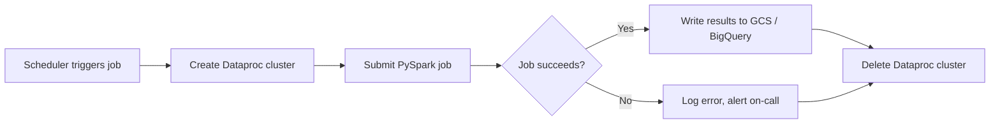

# PySpark - Production Patterns

> How PySpark jobs actually run in production: the patterns, the guardrails, and the cost controls that separate a script from a system.

---

## The Standard ETL Pattern

Every production PySpark job follows the same skeleton: **read, transform, write** -- wrapped in error handling so failures are recoverable, not catastrophic.

Think of it like a factory assembly line. Raw materials come in (read), workers shape them (transform), finished goods go out (write). If something breaks mid-line, you do not throw away everything -- you isolate the defect and keep the line moving.

```python
from pyspark.sql import SparkSession
from pyspark.sql.functions import col, current_timestamp
import sys

spark = SparkSession.builder \
    .appName("daily-orders-etl") \
    .getOrCreate()

try:
    # READ -- source data from cloud storage
    raw_df = spark.read.parquet("gs://data-lake/raw/orders/dt=2026-04-04/")

    # TRANSFORM -- clean, enrich, reshape
    cleaned_df = (
        raw_df
        .filter(col("order_id").isNotNull())
        .withColumn("processed_at", current_timestamp())
        .dropDuplicates(["order_id"])
    )

    # WRITE -- land in the curated zone
    cleaned_df.write \
        .mode("overwrite") \
        .partitionBy("region") \
        .parquet("gs://data-lake/curated/orders/dt=2026-04-04/")

    print(f"SUCCESS: wrote {cleaned_df.count()} rows")

except Exception as e:
    print(f"FAILURE: {e}")
    sys.exit(1)

finally:
    spark.stop()
```

**Why `try/finally/spark.stop()`?** In a cluster environment, orphaned SparkSessions hold resources. The `finally` block guarantees cleanup whether the job succeeds or fails.

---

## Batch Processing Pattern: The Dataproc Lifecycle

On Google Cloud Dataproc (Google's managed Spark service), the cost-optimal pattern is **ephemeral clusters**: spin one up, run your job, tear it down.



**The "create, run, delete" pattern in code (via gcloud CLI):**

```bash
# 1. CREATE -- cluster lives only for this job
gcloud dataproc clusters create daily-etl-cluster \
    --region=us-central1 \
    --num-workers=4 \
    --worker-machine-type=n2-standard-8 \
    --max-idle=10m

# 2. RUN -- submit PySpark job
gcloud dataproc jobs submit pyspark \
    gs://my-bucket/jobs/daily_orders_etl.py \
    --cluster=daily-etl-cluster \
    --region=us-central1

# 3. DELETE -- stop paying
gcloud dataproc clusters delete daily-etl-cluster \
    --region=us-central1 --quiet
```

**Why ephemeral?** A 4-node cluster running 24/7 costs roughly 30x more than the same cluster running 45 minutes per day. The "create-run-delete" pattern is how teams keep Spark costs under control.

---

## Incremental Processing

Processing all historical data every run is wasteful. Incremental processing means: **only process what is new since the last run.**

### Watermark Approach

Store a "high-water mark" -- the latest timestamp you have already processed -- and read only records after it.

```python
# Read the watermark from a control table or file
last_watermark = "2026-04-03T23:59:59"

# Read only new data
new_data = spark.read.parquet("gs://data-lake/raw/events/") \
    .filter(col("event_time") > last_watermark)

# Process and write
new_data.write.mode("append").parquet("gs://data-lake/curated/events/")

# Update the watermark
new_watermark = new_data.agg({"event_time": "max"}).collect()[0][0]
# Persist new_watermark to your control table
```

### Partition-Based Approach

If source data is already partitioned by date (e.g., `dt=2026-04-04/`), simply read the latest partition:

```python
today = "2026-04-04"
daily_df = spark.read.parquet(f"gs://data-lake/raw/orders/dt={today}/")
```

This is simpler but only works when the source is reliably partitioned.

---

## Slowly Changing Dimension (SCD) Type 2

SCD Type 2 preserves history. When a customer changes their address, you do not overwrite the old row. You close it (set an `end_date`) and insert a new row marked as current.

**Analogy:** Think of a passport. When you renew it, the old one gets stamped "expired" and you receive a new one. Both exist in the system -- the old one for history, the new one as current.

```python
from pyspark.sql.functions import lit, when
from datetime import date

# Existing dimension table
dim_df = spark.read.parquet("gs://warehouse/dim_customer/")

# Incoming updates
updates_df = spark.read.parquet("gs://staging/customer_updates/")

today = lit(date.today())

# Step 1: Identify changed records
changed = dim_df.alias("old").join(
    updates_df.alias("new"),
    on="customer_id"
).filter(
    (col("old.address") != col("new.address")) &
    (col("old.is_current") == True)
)

# Step 2: Close old records
closed_old = changed.select("old.*").withColumn(
    "end_date", today
).withColumn(
    "is_current", lit(False)
)

# Step 3: Create new current records
new_current = changed.select("new.*").withColumn(
    "start_date", today
).withColumn(
    "end_date", lit(None)
).withColumn(
    "is_current", lit(True)
)

# Step 4: Unchanged records stay as-is
unchanged = dim_df.join(
    changed.select("old.customer_id"),
    on="customer_id",
    how="left_anti"
)

# Step 5: Union and write
final_dim = unchanged.unionByName(closed_old).unionByName(new_current)
final_dim.write.mode("overwrite").parquet("gs://warehouse/dim_customer/")
```

---

## Inline Data Quality Checks

Production jobs should validate data **before** writing results. A bad write is harder to fix than a blocked write.

```python
def validate(df, job_name):
    """Run quality checks. Raise on failure."""

    row_count = df.count()
    null_count = df.filter(col("order_id").isNull()).count()

    # Check 1: Not empty
    assert row_count > 0, f"{job_name}: zero rows produced"

    # Check 2: Null rate on critical columns
    null_rate = null_count / row_count
    assert null_rate < 0.01, f"{job_name}: null rate {null_rate:.2%} exceeds 1% threshold"

    # Check 3: Schema has expected columns
    expected_cols = {"order_id", "customer_id", "amount", "order_date"}
    actual_cols = set(df.columns)
    missing = expected_cols - actual_cols
    assert not missing, f"{job_name}: missing columns {missing}"

    print(f"{job_name}: PASSED -- {row_count} rows, {null_rate:.4%} null rate")

# Usage in ETL
cleaned_df = transform(raw_df)
validate(cleaned_df, "daily-orders-etl")
cleaned_df.write.mode("overwrite").parquet(output_path)
```

---

## Writing to Multiple Outputs

Production pipelines often need the same data in multiple destinations -- for example, Parquet files in Google Cloud Storage (GCS) for the data lake and a BigQuery table for analysts.

```python
# Write 1: Parquet to GCS (data lake)
cleaned_df.write \
    .mode("overwrite") \
    .partitionBy("region") \
    .parquet("gs://data-lake/curated/orders/")

# Write 2: BigQuery (analytics warehouse)
cleaned_df.write \
    .format("bigquery") \
    .option("table", "project.dataset.orders") \
    .option("temporaryGcsBucket", "my-temp-bucket") \
    .mode("overwrite") \
    .save()
```

**Why both?** The Parquet files are cheap, durable, and format-agnostic (any tool can read them). BigQuery gives analysts SQL access with sub-second queries. Different consumers, different needs.

---

## Delta Lake MERGE Pattern

Delta Lake adds ACID (Atomicity, Consistency, Isolation, Durability) transactions to your data lake. The MERGE operation is the workhorse for upserts: insert new records, update existing ones, in a single atomic operation.

```python
from delta.tables import DeltaTable

# Existing Delta table
target = DeltaTable.forPath(spark, "gs://data-lake/delta/orders/")

# New incoming data
source = spark.read.parquet("gs://staging/orders_update/")

# MERGE: upsert in one atomic operation
target.alias("t").merge(
    source.alias("s"),
    "t.order_id = s.order_id"
).whenMatchedUpdate(set={
    "status": "s.status",
    "updated_at": "s.updated_at"
}).whenNotMatchedInsertAll() \
  .execute()
```

**Why Delta MERGE over read-modify-write?** Without Delta, an upsert requires reading the entire table, joining, deduplicating, and rewriting. Delta MERGE does this atomically -- if it fails midway, the table stays in its previous valid state.

---

## Common Production Patterns Reference

| Pattern | When to Use | Key Idea |
|---|---|---|
| Read-Transform-Write | Every ETL job | The universal skeleton; wrap in try/finally |
| Ephemeral cluster | Batch jobs (daily, hourly) | Create cluster, run job, delete cluster -- pay only for compute time |
| Watermark incremental | Event streams, append-only sources | Track latest processed timestamp; read only newer records |
| Partition incremental | Date-partitioned sources | Read only today's partition |
| SCD Type 2 | Dimension tables with history | Close old row (set end_date), insert new row as current |
| Inline quality checks | Before every write | Assert row counts, null rates, schema shape |
| Multi-output write | Lake + warehouse consumers | Write Parquet to GCS and load to BigQuery in same job |
| Delta MERGE | Upsert without full rewrite | Atomic insert/update in one operation |
| Dead letter queue | Bad records in mixed-quality sources | Route unparseable rows to a quarantine path instead of failing the job |

---

## Key Takeaways

1. **Every production job is read-transform-write wrapped in error handling.** The skeleton never changes; the transforms do.
2. **Ephemeral clusters are the cost lever.** A cluster running only during the job costs a fraction of a persistent one.
3. **Validate before you write.** Catching bad data before it lands is cheaper than cleaning it after.
4. **Delta MERGE replaces brittle read-modify-write loops** with atomic upserts.
5. **Incremental processing (watermarks or partitions) avoids reprocessing history** on every run.

---

## Quick Links

| Chapter | Title |
|---|---|
| [01](01_Foundations.md) | PySpark - Foundations |
| [02](02_Core_Operations.md) | PySpark - Core Operations |
| [03](03_Data_Engineering_Patterns.md) | PySpark - Data Engineering Patterns |
| [04](04_Advanced_Processing.md) | PySpark - Advanced Processing |
| [05](05_Cloud_Integration.md) | PySpark - Cloud Integration |
| **06** | **PySpark - Production Patterns** |
| [07](07_System_Design.md) | PySpark - System Design |
| [08](08_Quality_Security_Governance.md) | PySpark - Quality, Security, Governance |
| [09](09_Observability_Troubleshooting.md) | PySpark - Observability and Troubleshooting |
| [10](10_Decision_Guide.md) | PySpark - Decision Guide |

**Reference notebook:** [Python for DE on Colab](https://colab.research.google.com/github/sunilmogadati/systems-in-production/blob/main/implementation/notebooks/Python_for_DE.ipynb)

**Related:** [Cloud Pipeline Scale chapter](../cloud-pipeline/06_Scale.md)
