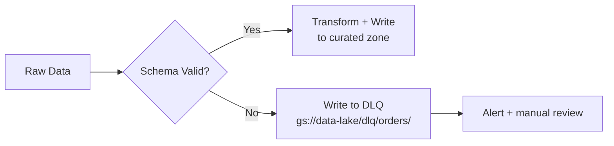
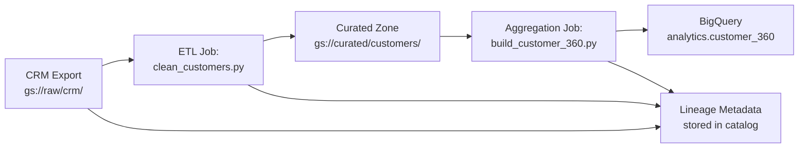

# PySpark - Quality, Security, Governance

> Data that is fast but wrong is worse than data that is slow but right. This chapter covers how to enforce correctness, protect sensitive data, and maintain trust in your pipeline outputs.

---

## Data Quality in PySpark

### Schema Validation

Schema validation is the first line of defense. If the shape of the data is wrong, nothing downstream can be right.

**Analogy:** A schema is like a building code inspection. Before any work continues, you verify the foundation matches the blueprint. If the blueprint says 4 load-bearing walls and you have 3, you stop -- you do not proceed and hope it works out.

```python
from pyspark.sql.types import StructType, StructField, StringType, DoubleType, TimestampType

# Define the expected schema
expected_schema = StructType([
    StructField("order_id", StringType(), nullable=False),
    StructField("customer_id", StringType(), nullable=False),
    StructField("amount", DoubleType(), nullable=False),
    StructField("order_date", TimestampType(), nullable=True),
    StructField("region", StringType(), nullable=True),
])

# Read with schema enforcement -- Spark will reject files that do not match
df = spark.read.schema(expected_schema).parquet("gs://data-lake/raw/orders/")
```

**Why enforce schemas?** Without enforcement, Spark infers schemas from the data. If a source system adds a column or changes a type, your downstream jobs may silently produce wrong results.

### Null Checks, Range Checks, Uniqueness Checks

```python
from pyspark.sql.functions import col, count, countDistinct

def run_quality_checks(df, table_name):
    """Run a standard suite of data quality checks."""

    total = df.count()
    results = []

    # 1. Null checks on critical columns
    for critical_col in ["order_id", "customer_id", "amount"]:
        null_count = df.filter(col(critical_col).isNull()).count()
        null_rate = null_count / total if total > 0 else 0
        passed = null_rate < 0.01  # Less than 1% nulls
        results.append({
            "check": f"null_rate_{critical_col}",
            "value": f"{null_rate:.4%}",
            "passed": passed
        })

    # 2. Range check on amount
    out_of_range = df.filter((col("amount") < 0) | (col("amount") > 1_000_000)).count()
    results.append({
        "check": "amount_range",
        "value": f"{out_of_range} out of range",
        "passed": out_of_range == 0
    })

    # 3. Uniqueness check on primary key
    distinct_keys = df.select(countDistinct("order_id")).collect()[0][0]
    results.append({
        "check": "order_id_uniqueness",
        "value": f"{distinct_keys} distinct / {total} total",
        "passed": distinct_keys == total
    })

    # Report
    failures = [r for r in results if not r["passed"]]
    if failures:
        raise ValueError(f"{table_name} quality check FAILED: {failures}")

    print(f"{table_name}: all quality checks PASSED ({total} rows)")
    return results
```

### Great Expectations Integration

Great Expectations (GE) is an open-source data quality framework. It provides a catalog of pre-built checks ("expectations") and generates human-readable quality reports.

```python
# Great Expectations can validate a Spark DataFrame directly
import great_expectations as gx

context = gx.get_context()

# Define expectations
suite = context.add_or_update_expectation_suite("orders_suite")

# Validate
validator = context.get_validator(
    batch_request=batch_request,
    expectation_suite_name="orders_suite"
)
validator.expect_column_values_to_not_be_null("order_id")
validator.expect_column_values_to_be_between("amount", min_value=0, max_value=1_000_000)
validator.expect_column_values_to_be_unique("order_id")

results = validator.validate()
```

**When to use GE vs. hand-written checks:** Hand-written checks are fine for 3-5 rules. Once you have 20+ rules across multiple tables, GE provides structure, versioning, and automated documentation.

### Dead Letter Queue (DLQ) for Bad Records

Instead of failing the entire job when some records are malformed, route bad records to a quarantine path.



```python
from pyspark.sql.functions import col

# Split into good and bad records
good_records = raw_df.filter(
    col("order_id").isNotNull() &
    col("amount").isNotNull() &
    (col("amount") >= 0)
)

bad_records = raw_df.subtract(good_records)

# Write good records to curated zone
good_records.write.mode("append").parquet("gs://data-lake/curated/orders/")

# Write bad records to dead letter queue
bad_count = bad_records.count()
if bad_count > 0:
    bad_records.write.mode("append").parquet("gs://data-lake/dlq/orders/")
    print(f"WARNING: {bad_count} records routed to DLQ")
```

---

## Security

### Service Account Permissions

On GCP (Google Cloud Platform), Spark jobs authenticate using service accounts. The principle of least privilege applies: give each job only the permissions it needs.

| Permission | Scope | Why |
|---|---|---|
| `storage.objects.get` | Source GCS bucket | Read raw data |
| `storage.objects.create` | Target GCS bucket | Write curated data |
| `bigquery.tables.updateData` | Target BigQuery dataset | Load data into warehouse |
| `dataproc.jobs.create` | Dataproc cluster | Submit jobs |

**Anti-pattern:** Using a service account with `roles/owner` or `roles/editor`. If compromised, the attacker has access to everything.

```bash
# Create a narrow service account for the ETL job
gcloud iam service-accounts create etl-orders \
    --display-name="Orders ETL Service Account"

# Grant only what it needs
gcloud projects add-iam-policy-binding my-project \
    --member="serviceAccount:etl-orders@my-project.iam.gserviceaccount.com" \
    --role="roles/storage.objectViewer" \
    --condition="expression=resource.name.startsWith('projects/_/buckets/raw-data'),title=raw-bucket-only"
```

### Encryption at Rest and in Transit

| Layer | Default on GCP | What It Means |
|---|---|---|
| At rest (GCS) | Google-managed encryption (AES-256) | Data on disk is encrypted; you hold no keys |
| At rest (CMEK) | Customer-Managed Encryption Keys via Cloud KMS (Key Management Service) | You control key rotation and revocation |
| In transit | TLS 1.2+ for all GCP API calls | Data moving between services is encrypted on the wire |
| Cluster internal | Configurable (Kerberos, HDFS encryption) | Data moving between executors within the cluster |

For most pipelines, GCP defaults provide adequate encryption. Enable CMEK when compliance (HIPAA, SOC 2) requires you to control key lifecycle.

### PII Detection and Masking

PII (Personally Identifiable Information) -- names, emails, phone numbers, Social Security Numbers (SSNs) -- must be masked before data leaves controlled environments.

```python
from pyspark.sql.functions import col, sha2, regexp_replace, when, lit

def mask_pii(df):
    """Mask PII columns for downstream consumption."""

    return df \
        .withColumn(
            "email",
            sha2(col("email"), 256)              # One-way hash -- cannot be reversed
        ) \
        .withColumn(
            "phone",
            regexp_replace(col("phone"), r"\d(?=\d{4})", "*")  # ***-***-1234
        ) \
        .withColumn(
            "ssn",
            lit("***-**-****")                     # Full redaction
        ) \
        .withColumn(
            "name",
            sha2(col("name"), 256)                 # Hash for join capability without exposure
        )

# Usage
masked_df = mask_pii(raw_customers)
masked_df.write.parquet("gs://data-lake/curated/customers_masked/")
```

**Why hash instead of delete?** Hashed values are consistent -- the same input always produces the same hash. This means you can still join tables on hashed `email` without exposing the actual email.

---

## Governance

### Data Lineage

Data lineage answers: **where did this data come from, and what happened to it along the way?**



In PySpark, capture lineage by logging job metadata:

```python
import json
from datetime import datetime

lineage_record = {
    "job_name": "clean_customers",
    "run_id": "2026-04-04-001",
    "timestamp": datetime.utcnow().isoformat(),
    "inputs": ["gs://data-lake/raw/crm/dt=2026-04-04/"],
    "outputs": ["gs://data-lake/curated/customers/dt=2026-04-04/"],
    "row_count_in": raw_df.count(),
    "row_count_out": cleaned_df.count(),
    "transformations": [
        "deduplicate on customer_id",
        "mask PII columns",
        "filter null customer_id"
    ]
}

# Write lineage to a dedicated lineage store
spark.sparkContext.parallelize([json.dumps(lineage_record)]) \
    .saveAsTextFile("gs://data-lake/lineage/clean_customers/2026-04-04/")
```

For enterprise-scale lineage, tools like **Apache Atlas**, **Google Data Catalog**, or **OpenLineage** (integrated with Airflow and Spark) provide automated lineage tracking.

### Schema Evolution

Source systems change. Columns get added, renamed, or removed. Your pipeline must handle this without breaking.

| Change | Safe? | How to Handle |
|---|---|---|
| New column added | Yes | Use `mergeSchema` option; new column appears as null in old partitions |
| Column removed | Risky | Select explicit columns; do not use `SELECT *` |
| Column type changed | Dangerous | Cast explicitly; log a warning if types do not match |
| Column renamed | Dangerous | Map old name to new name in a config; do not assume column positions |

```python
# Safe schema evolution with Delta Lake
df.write \
    .format("delta") \
    .option("mergeSchema", "true") \
    .mode("append") \
    .save("gs://data-lake/delta/orders/")
```

```python
# Defensive column selection -- do not rely on SELECT *
EXPECTED_COLUMNS = ["order_id", "customer_id", "amount", "order_date", "region"]

available_columns = set(raw_df.columns)
selected_columns = [c for c in EXPECTED_COLUMNS if c in available_columns]
missing_columns = set(EXPECTED_COLUMNS) - available_columns

if missing_columns:
    print(f"WARNING: missing columns {missing_columns} -- filling with nulls")
    for mc in missing_columns:
        raw_df = raw_df.withColumn(mc, lit(None))

clean_df = raw_df.select(*EXPECTED_COLUMNS)
```

### Audit Logging

Every production job should answer: **who ran what, when, on what data, and what was the result?**

```python
audit_record = {
    "job_name": "daily_orders_etl",
    "run_id": spark.sparkContext.applicationId,
    "submitted_by": "sa-etl-orders@my-project.iam.gserviceaccount.com",
    "start_time": datetime.utcnow().isoformat(),
    "cluster": "daily-etl-cluster",
    "input_paths": ["gs://data-lake/raw/orders/dt=2026-04-04/"],
    "output_paths": ["gs://data-lake/curated/orders/dt=2026-04-04/"],
    "rows_read": raw_count,
    "rows_written": final_count,
    "rows_rejected": bad_count,
    "status": "SUCCESS",
    "duration_seconds": elapsed,
}

# Write audit log to BigQuery for queryable history
audit_df = spark.createDataFrame([audit_record])
audit_df.write.format("bigquery") \
    .option("table", "project.audit.etl_runs") \
    .mode("append") \
    .save()
```

| Audit Field | Why It Matters |
|---|---|
| `submitted_by` | Accountability -- who triggered this job |
| `input_paths` | Reproducibility -- rerun with the same inputs |
| `rows_read` vs `rows_written` | Data loss detection -- large discrepancies signal problems |
| `rows_rejected` | Quality signal -- trending upward means source degradation |
| `duration_seconds` | Performance regression detection |

---

## Quality, Security, Governance: Summary Table

| Concern | Key Practice | Tool / Technique |
|---|---|---|
| Schema correctness | Enforce schema on read | `StructType` + `.schema()` |
| Null/range/uniqueness | Validate before write | Custom checks or Great Expectations |
| Bad records | Route to DLQ, do not fail job | Filter + write to quarantine path |
| Access control | Least-privilege service accounts | IAM roles scoped to specific buckets/tables |
| Encryption | Use platform defaults; CMEK for compliance | GCS encryption, TLS in transit |
| PII protection | Hash or redact before curated zone | `sha2()`, `regexp_replace()`, `lit()` |
| Lineage | Log inputs, outputs, transforms per job | OpenLineage, Data Catalog, custom metadata |
| Schema evolution | Explicit column selection; `mergeSchema` | Delta Lake, defensive column lists |
| Audit trail | Log every run to queryable store | BigQuery audit table |

---

## Key Takeaways

1. **Enforce schemas on read.** Inferred schemas are convenient but fragile in production.
2. **Route bad records to a DLQ** instead of failing the entire job. Fix them offline.
3. **Hash PII rather than deleting it.** You preserve join capability without exposing sensitive data.
4. **Scope service accounts tightly.** A compromised broad-access account is a breach of everything.
5. **Log lineage and audit data as part of the job**, not as an afterthought.

---

## Quick Links

| Chapter | Title |
|---|---|
| [01](01_Foundations.md) | PySpark - Foundations |
| [02](02_Core_Operations.md) | PySpark - Core Operations |
| [03](03_Data_Engineering_Patterns.md) | PySpark - Data Engineering Patterns |
| [04](04_Advanced_Processing.md) | PySpark - Advanced Processing |
| [05](05_Cloud_Integration.md) | PySpark - Cloud Integration |
| [06](06_Production_Patterns.md) | PySpark - Production Patterns |
| [07](07_System_Design.md) | PySpark - System Design |
| **08** | **PySpark - Quality, Security, Governance** |
| [09](09_Observability_Troubleshooting.md) | PySpark - Observability and Troubleshooting |
| [10](10_Decision_Guide.md) | PySpark - Decision Guide |

**Reference notebook:** [Python for DE on Colab](https://colab.research.google.com/github/sunilmogadati/systems-in-production/blob/main/implementation/notebooks/Python_for_DE.ipynb)

**Related:** [Cloud Pipeline Scale chapter](../cloud-pipeline/06_Scale.md)
