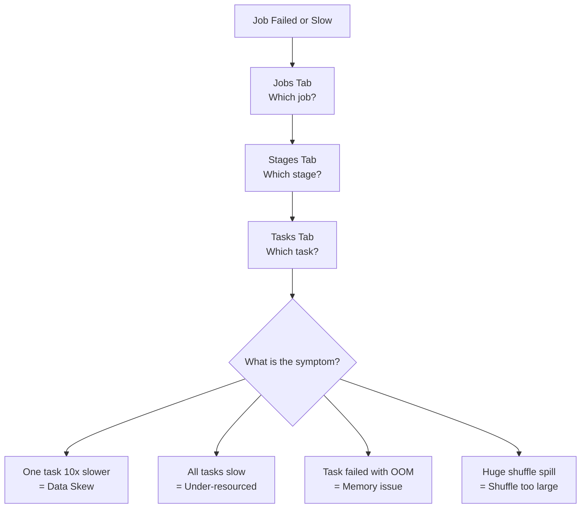
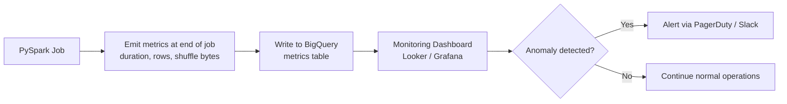

# PySpark - Observability and Troubleshooting

> When a Spark job fails or runs slowly, the Spark UI tells you exactly what went wrong -- if you know how to read it. This chapter covers systematic diagnosis, common failure patterns, and the monitoring infrastructure that catches problems before users do.

---

## The Spark UI in Detail

The Spark UI is your primary diagnostic instrument. It runs on port 4040 of the driver node by default and is accessible through the Dataproc cluster's web interface on GCP (Google Cloud Platform).

### Tab-by-Tab Guide

| Tab | What It Shows | When to Use It |
|---|---|---|
| **Jobs** | One row per Spark action (`count`, `write`, `collect`). Shows status, duration, stages. | First stop: "Which job is slow or failed?" |
| **Stages** | Stages within a job. Each shuffle boundary creates a new stage. Shows input/output sizes, shuffle read/write, task counts. | Second stop: "Which stage is the bottleneck?" |
| **Tasks** (within a stage) | Individual tasks -- one per partition. Shows duration, GC time, shuffle read/write, errors. | Third stop: "Is one task way slower than the rest?" (skew) |
| **Storage** | Cached/persisted DataFrames. Shows memory used, fraction cached, partitions cached. | "Is my cache fitting in memory or spilling to disk?" |
| **Environment** | All Spark configuration values (including defaults). | "Did my config changes actually take effect?" |
| **SQL** | Query plans for DataFrame and SQL operations. Shows physical plan, join strategies, filter pushdown. | "Which join strategy did Spark choose? Is predicate pushdown happening?" |
| **Executors** | Per-executor stats: memory used, GC time, tasks completed, shuffle read/write. | "Is one executor doing more work than others?" |



---

## The Drill-Down Debugging Method

When a Spark job fails or runs slowly, follow this systematic 4-step drill-down. Do not guess -- let the data in the Spark UI guide you.

### Step 1: Which Job Failed?

Open the **Jobs** tab. Look for jobs with status "FAILED" or abnormally long duration.

- A healthy job shows all stages complete with green checkmarks.
- A failed job shows a red X on the failed stage.
- A slow job shows one stage taking 90% of the total duration.

### Step 2: Which Stage Failed?

Click into the job. Each stage represents a chunk of work between shuffle boundaries.

**What to look at:**

- **Shuffle Read / Shuffle Write:** If these numbers are in the hundreds of gigabytes, your shuffle is too large.
- **Input Size:** If one stage reads vastly more data than expected, a filter is not pushing down.
- **Duration:** The slowest stage is your bottleneck.

### Step 3: Which Task Failed?

Click into the slow or failed stage. This shows every task (one per partition).

**What to look at:**

| Metric | Healthy | Unhealthy |
|---|---|---|
| Duration (median vs max) | Max is < 2x median | Max is > 10x median (skew) |
| GC Time | < 10% of task time | > 30% of task time (memory pressure) |
| Shuffle Spill (memory) | 0 | > 0 (data does not fit in memory) |
| Shuffle Spill (disk) | 0 | > 0 (severe -- data overflowed to disk) |
| Error message | None | OOM, fetch failed, etc. |

### Step 4: Fix the Root Cause

| Symptom | Root Cause | Fix |
|---|---|---|
| One task 10x slower than others | Data skew | Enable AQE (Adaptive Query Execution); salt the key; repartition |
| All tasks slow, GC time high | Executor memory too small | Increase `spark.executor.memory`; reduce partition count |
| Task failed with OOM (Out of Memory) | Single partition too large | Repartition to more partitions; increase memory |
| Huge shuffle read/write | Shuffle on high-cardinality key | Broadcast the smaller table; pre-aggregate before join |
| Thousands of tiny output files | Too many partitions on write | `coalesce()` before write |
| Driver OOM | `collect()` or `toPandas()` on large data | Use `take(N)` instead; aggregate before collecting |

---

## Common Performance Problems: Deep Dive

### Problem 1: Shuffle Too Large

**What it looks like:** Stage detail shows shuffle write of 100+ GB. Job takes hours instead of minutes.

**Why it happens:** Operations like `groupBy`, `join`, and `distinct` require shuffling data across the network so that matching keys land on the same executor.

**Analogy:** Imagine sorting mail at a post office. If you have 1 billion letters, sorting them all into ZIP code bins requires moving every letter to the right bin. That physical movement is the shuffle.

**Fixes:**

```python
# Fix 1: Broadcast the small table to avoid shuffle entirely
from pyspark.sql.functions import broadcast
result = large_df.join(broadcast(small_df), on="key")

# Fix 2: Pre-aggregate before joining
agg_df = large_df.groupBy("key").agg(sum("amount").alias("total"))
# Now join the smaller aggregated table instead of the full table

# Fix 3: Increase shuffle partitions (spread the work thinner)
spark.conf.set("spark.sql.shuffle.partitions", "400")  # Default is 200
```

### Problem 2: Data Skew

**What it looks like:** In the Tasks view, one task takes 45 minutes while the other 199 tasks finish in 30 seconds each.

**Why it happens:** One key (e.g., `customer_id = "GUEST"`) has millions of records while other keys have hundreds.

**Fixes:**

```python
# Fix 1: Enable AQE (Adaptive Query Execution) -- try this first
spark.conf.set("spark.sql.adaptive.enabled", "true")
spark.conf.set("spark.sql.adaptive.skewJoin.enabled", "true")

# Fix 2: Filter out the hot key, process separately, union back
hot_key_df = orders.filter(col("customer_id") == "GUEST")
normal_df = orders.filter(col("customer_id") != "GUEST")

hot_result = process_hot_key(hot_key_df)    # Custom logic for the hot key
normal_result = process_normal(normal_df)    # Standard join path

final = hot_result.unionByName(normal_result)
```

### Problem 3: OOM Errors (Executor)

**What it looks like:** Task fails with `java.lang.OutOfMemoryError: Java heap space` or `Container killed by YARN for exceeding memory limits`.

**Why it happens:** A single partition is larger than the executor's available memory.

**Fixes:**

```python
# Fix 1: Increase executor memory
spark.conf.set("spark.executor.memory", "8g")    # Was 4g
spark.conf.set("spark.executor.memoryOverhead", "2g")

# Fix 2: Increase partition count (smaller partitions = less memory per task)
df = df.repartition(400)  # Was using default 200

# Fix 3: Avoid operations that materialize large objects in memory
# BAD: explode a massive array column
# BETTER: process in batches or restructure the data
```

### Problem 4: Too Many Small Files

**What it looks like:** Write stage completes quickly, but downstream reads are slow. Listing the output directory shows thousands of files under 1 MB each.

**Why it happens:** Each Spark partition writes one file. If you have 1,000 partitions and 1 GB of data, you get 1,000 files averaging 1 MB each. File system overhead (opening, reading metadata, closing) dominates at this scale.

**Fix:**

```python
# Coalesce before writing -- merge partitions without a shuffle
df.coalesce(10).write.parquet("gs://data-lake/output/")

# Target: files between 128 MB and 1 GB each
# 1 GB of data: coalesce to 4-8 files
# 100 GB of data: coalesce to 100-200 files
```

### Problem 5: Driver OOM

**What it looks like:** The driver process crashes with `OutOfMemoryError`. No executor failures.

**Why it happens:** Calling `.collect()`, `.toPandas()`, or `.count()` on a large DataFrame pulls all data to the single driver node.

**Fix:**

```python
# BAD -- pulls entire DataFrame to driver memory
all_rows = huge_df.collect()

# BETTER -- take a sample
sample = huge_df.take(100)

# BETTER -- aggregate first, then collect the small result
summary = huge_df.groupBy("region").count().collect()

# If you must use toPandas(), filter first
small_subset = huge_df.filter(col("region") == "US-WEST").toPandas()

# Increase driver memory only as a last resort
# spark.conf.set("spark.driver.memory", "8g")
```

---

## Monitoring Spark on Dataproc

### Cloud Logging

All Spark job output (stdout, stderr, log4j logs) is automatically routed to Cloud Logging on Dataproc.

```bash
# View logs for a specific job
gcloud logging read \
    'resource.type="cloud_dataproc_job" AND resource.labels.job_id="daily-etl-001"' \
    --limit=100 --format=json
```

### Cloud Monitoring

Dataproc exposes cluster and job metrics to Cloud Monitoring. Set up alerts on:

| Metric | Alert Threshold | Why |
|---|---|---|
| Job duration | > 2x historical average | Performance regression |
| YARN memory utilization | > 85% for 10 minutes | Approaching OOM territory |
| Shuffle bytes written | > 2x historical average | Unexpected data growth or missing filter |
| Failed tasks | > 0 | Something is wrong; investigate immediately |
| Cluster idle time | > 30 minutes | Cluster should have been deleted (cost waste) |

### Key Metrics to Track Per Job

Build a metrics table that your team reviews weekly:

| Metric | What It Tells You | Where to Find It |
|---|---|---|
| **Job duration** | Is the job getting slower over time? | Spark UI Jobs tab or Cloud Logging |
| **Shuffle bytes** | Is shuffle growing with data volume? | Spark UI Stages tab |
| **Peak executor memory** | How close are you to OOM? | Spark UI Executors tab |
| **GC time %** | Is garbage collection consuming compute? | Spark UI Tasks tab |
| **Output row count** | Did the job produce expected volume? | Your audit log (see Chapter 08) |
| **Cost per run** | Cluster size x duration x price | Billing export or custom calculation |

---

## Building an Observability Pipeline

For production teams, manual Spark UI checks do not scale. Build an automated observability pipeline:



```python
from datetime import datetime

def emit_job_metrics(spark, job_name, start_time, row_count):
    """Write job metrics to BigQuery for monitoring."""
    end_time = datetime.utcnow()
    duration = (end_time - start_time).total_seconds()

    metrics = {
        "job_name": job_name,
        "run_date": end_time.strftime("%Y-%m-%d"),
        "start_time": start_time.isoformat(),
        "end_time": end_time.isoformat(),
        "duration_seconds": duration,
        "row_count": row_count,
        "spark_app_id": spark.sparkContext.applicationId,
    }

    metrics_df = spark.createDataFrame([metrics])
    metrics_df.write.format("bigquery") \
        .option("table", "project.observability.job_metrics") \
        .mode("append") \
        .save()

    return metrics
```

---

## Troubleshooting Checklist

Use this checklist when a job fails or slows down unexpectedly.

| Step | Action | Tool |
|---|---|---|
| 1 | Check job status and error message | Cloud Logging or Spark UI Jobs tab |
| 2 | Identify the failed/slow stage | Spark UI Stages tab |
| 3 | Check task-level metrics (duration spread, GC, spill) | Spark UI Tasks tab |
| 4 | Check if input data volume changed | Compare `input size` to previous runs |
| 5 | Check if schema changed upstream | Compare current schema to expected schema |
| 6 | Check cluster resource utilization | Cloud Monitoring YARN metrics |
| 7 | Check if Spark configs are correct | Spark UI Environment tab |
| 8 | Apply fix, rerun on a sample, verify in Spark UI | Manual rerun with `--properties` override |

---

## Key Takeaways

1. **Use the 4-step drill-down:** Job -> Stage -> Task -> Root cause. Do not skip steps.
2. **Data skew is the most common non-obvious performance killer.** Check max vs median task duration in every slow stage.
3. **Driver OOM is almost always caused by `collect()` or `toPandas()`.** Aggregate first, collect the small result.
4. **Automate metrics emission.** Manual Spark UI checks do not catch regressions between runs.
5. **Set alerts on job duration, shuffle bytes, and failed tasks.** These three metrics catch 80% of problems before they cascade.

---

## Quick Links

| Chapter | Title |
|---|---|
| [01](01_Why.md) | Why |
| [02](02_Concepts.md) | Concepts |
| [03](03_Hello_World.md) | Hello World |
| [04](04_How_It_Works.md) | How It Works |
| [05](05_Building_It.md) | Building It |
| [06](06_Production_Patterns.md) | PySpark - Production Patterns |
| [07](07_System_Design.md) | PySpark - System Design |
| [08](08_Quality_Security_Governance.md) | PySpark - Quality, Security, Governance |
| **09** | **PySpark - Observability and Troubleshooting** |
| [10](10_Decision_Guide.md) | PySpark - Decision Guide |

**Reference notebook:** [Python for DE on Colab](https://colab.research.google.com/github/sunilmogadati/systems-in-production/blob/main/implementation/notebooks/Python_NumPy_Pandas.ipynb)

**Related:** [Cloud Pipeline Scale chapter](../cloud-pipeline/06_Scale.md)
