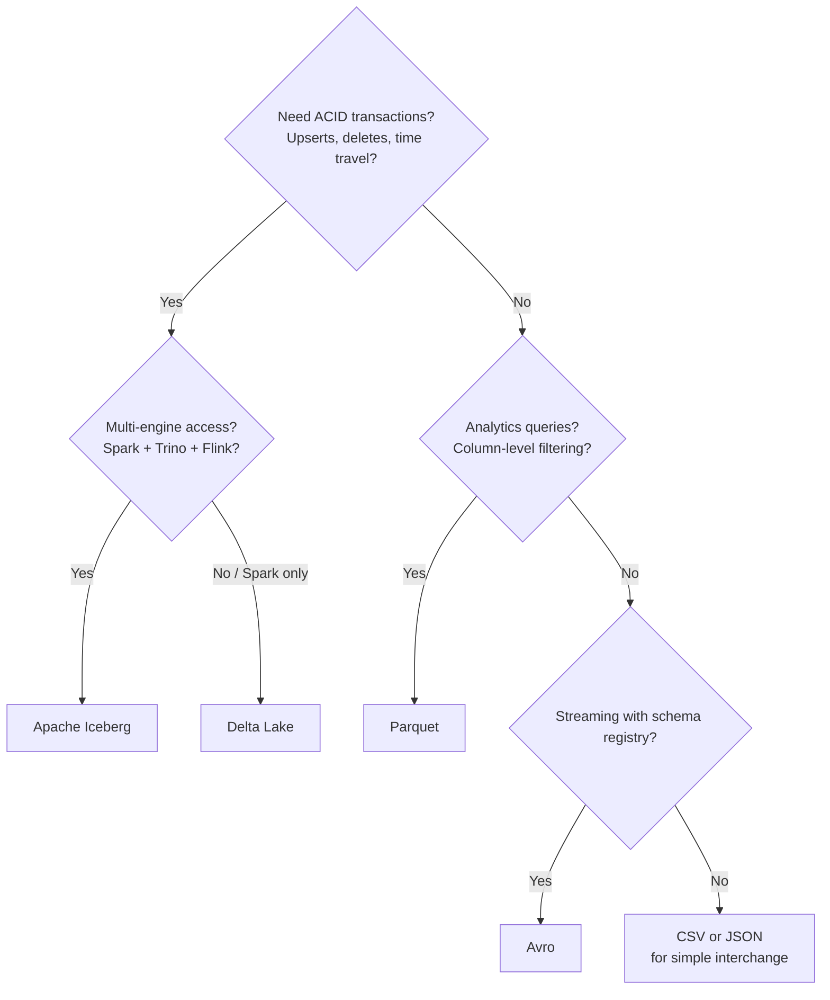
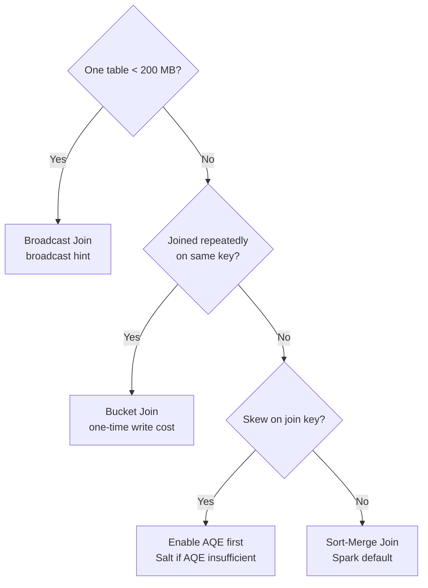

# PySpark - Decision Guide

> Not every data problem needs PySpark. This chapter helps you decide when to use it, what to pair it with, and how to avoid over-engineering.

---

## Do I Need PySpark?

The single most important decision is whether you need distributed processing at all. PySpark adds operational complexity -- clusters, shuffles, serialization overhead. If your data fits in memory on a single machine, simpler tools are faster to develop, debug, and maintain.

### The Data Size Decision Table

| Data Size (raw) | Recommended Tool | Why |
|---|---|---|
| < 1 GB | pandas | Fits in laptop memory. Faster development. Richer ecosystem for exploration. |
| 1 - 10 GB | pandas (with chunking) or Polars | pandas can handle this with `read_csv(chunksize=...)`. Polars is faster and more memory-efficient than pandas for this range. |
| 10 - 100 GB | Could go either way | If transformations are simple (filter, aggregate), BigQuery or Redshift SQL may be enough. If complex (ML features, multi-step joins), PySpark. |
| 100 GB - 10 TB | PySpark | Too large for single-machine tools. Spark distributes the work across a cluster. |
| > 10 TB | PySpark on large cluster | Spark's sweet spot. Consider partitioning strategy and cluster sizing carefully (see Chapter 07). |

### The Complexity Decision Table

Data size is not the only factor. The complexity of your transformations matters too.

| Scenario | Better Choice | Why |
|---|---|---|
| Simple aggregation (SUM, COUNT, GROUP BY) on cloud warehouse data | SQL (BigQuery / Redshift) | The warehouse engine is optimized for this; no cluster to manage |
| Complex multi-step ETL (Extract, Transform, Load) with joins, dedup, SCD | PySpark | Programmatic control, testable, version-controllable |
| Machine Learning (ML) feature engineering at scale | PySpark (with MLlib or feature store) | Distributed feature computation; direct integration with ML pipelines |
| Ad-hoc exploration on a sample | pandas / Jupyter | Faster iteration loop; instant feedback |
| Real-time stream processing | PySpark Structured Streaming or Flink | Spark handles micro-batch well; Flink for true event-at-a-time |
| One-time data migration | Whatever is simplest | PySpark is overkill for a task you run once |

**Rule of thumb:** If you are asking "Do I need PySpark?", you probably do not -- yet. Start simple. Graduate to PySpark when the simpler tool becomes a bottleneck.

---

## PySpark vs. Alternatives

| Tool | Best For | Limitations | Scale Ceiling |
|---|---|---|---|
| **pandas** | Exploration, small data, prototyping | Single machine; memory-bound; slow on > 5 GB | ~10 GB (with effort) |
| **Polars** | Medium data, fast single-machine processing | Single machine; smaller ecosystem than pandas | ~50 GB |
| **Dask** | pandas-like API on distributed data | Less mature than Spark; smaller community; weaker SQL support | ~1 TB |
| **SQL (BigQuery / Redshift)** | Aggregations, reporting, ad-hoc queries | Limited programmatic control; hard to test; no ML integration | Petabytes (but SQL-only) |
| **PySpark** | Large-scale ETL, ML features, complex pipelines | Cluster overhead; JVM (Java Virtual Machine) serialization; harder to debug | Petabytes |
| **Apache Flink** | True real-time streaming | Steeper learning curve; smaller Python ecosystem | Petabytes (streaming) |

**When people regret choosing PySpark too early:** They spend days debugging serialization errors, cluster configurations, and shuffle performance for a 500 MB dataset that pandas processes in 3 seconds.

**When people regret not choosing PySpark soon enough:** Their pandas job takes 14 hours, crashes on memory at 3 AM, and they rebuild in PySpark anyway.

---

## Cluster Sizing Quick Reference

Match your data size and job type to a starting cluster configuration. Adjust based on Spark UI observations (see Chapter 09).

| Data Size | Job Type | Workers | Machine Type | Executors | Executor Memory |
|---|---|---|---|---|---|
| 10 GB | Simple ETL | 2 | n2-standard-4 | 4 | 4 GB |
| 50 GB | ETL with joins | 4 | n2-standard-8 | 8 | 6 GB |
| 200 GB | Complex ETL + ML features | 8 | n2-highmem-8 | 16 | 8 GB |
| 1 TB | Full pipeline (joins + aggregations + write) | 16 | n2-highmem-8 | 32 | 12 GB |
| 5 TB+ | Heavy pipeline | 32+ | n2-highmem-16 | 64+ | 16 GB |

**Always start small and scale up.** Over-provisioning wastes money. Under-provisioning is visible in the Spark UI (high GC time, shuffle spill).

---

## File Format Decision Guide

| Format | Read Speed | Write Speed | Compression | Schema Evolution | ACID Transactions | Best For |
|---|---|---|---|---|---|---|
| **CSV** | Slow | Fast | Poor | None | No | Quick exports, human-readable data exchange |
| **JSON** | Slow | Fast | Poor | None | No | API payloads, semi-structured data |
| **Parquet** | Fast | Moderate | Excellent (columnar) | Limited (append-only) | No | Data lake storage, analytics queries |
| **ORC** (Optimized Row Columnar) | Fast | Moderate | Excellent | Limited | No | Hive ecosystem; similar to Parquet |
| **Delta Lake** | Fast | Moderate | Excellent | Yes (`mergeSchema`) | Yes (ACID) | Upserts, time travel, schema evolution |
| **Apache Iceberg** | Fast | Moderate | Excellent | Yes | Yes (ACID) | Multi-engine (Spark + Trino + Flink), schema evolution |
| **Avro** | Moderate | Fast | Good (row-based) | Yes | No | Streaming, schema registry integration |

### Decision Flow

**Default recommendation:** Use **Parquet** for storage. Upgrade to **Delta Lake** when you need upserts or time travel. Upgrade to **Iceberg** when you need multi-engine access.

---

## Join Strategy Decision Guide

| Scenario | Strategy | Shuffle Required? | Performance |
|---|---|---|---|
| One table < 200 MB | Broadcast join | No | Fastest -- small table sent to all executors |
| Both tables large, joined once | Sort-merge join | Yes (both sides) | Standard -- works at any scale |
| Both tables large, joined repeatedly on same key | Bucket join | No (after initial bucketing) | Fast after one-time bucketing cost |
| One table has extreme skew on join key | Salted join (with AQE as first try) | Yes | Mitigates skew by distributing hot keys |

---

## When to Optimize

**The cardinal rule: do not optimize until you have a measured bottleneck.**

Most PySpark jobs that "need optimization" actually need:
1. A correct partitioning strategy (write this right the first time)
2. Broadcast hints on small table joins (takes 10 seconds to add)
3. AQE enabled (one config line)

Everything else -- salting, bucketing, custom partitioners, manual memory tuning -- is for jobs where you have observed the problem in the Spark UI and confirmed the root cause.

### Optimization Priority Order

| Priority | Action | Effort | Impact |
|---|---|---|---|
| 1 | Enable AQE (Adaptive Query Execution) | 1 line of config | Handles skew and partition sizing automatically |
| 2 | Broadcast small tables | 1 line per join | Eliminates shuffle on small-large joins |
| 3 | Right-size partitions (~128 MB each) | 1 line of config or `repartition()` | Even workload distribution |
| 4 | `coalesce()` before write | 1 line | Prevents small file problem |
| 5 | Filter early (push predicates up) | Restructure query | Reduce data volume before expensive operations |
| 6 | Cache intermediate DataFrames | `.cache()` or `.persist()` | Avoid recomputation (only if reused) |
| 7 | Increase executor memory | Cluster config change | Fix OOM errors |
| 8 | Salt skewed keys | 10-20 lines of code | Last resort for extreme skew |
| 9 | Bucket tables | Write-time change | Last resort for repeated joins |

---

## Production Readiness Checklist

Before promoting a PySpark job to production, verify every item on this list.

### Code Quality

- [ ] Job follows read-transform-write pattern with `try/finally/spark.stop()`
- [ ] All transformations use DataFrame API (not RDD API unless necessary)
- [ ] No `.collect()` or `.toPandas()` on large DataFrames
- [ ] Column names are referenced explicitly (no `SELECT *`)
- [ ] Magic numbers are extracted to named constants or configuration

### Data Quality

- [ ] Schema is enforced on read (`StructType`)
- [ ] Null checks, range checks, and uniqueness checks run before write
- [ ] Bad records route to a dead letter queue (DLQ), not dropped silently
- [ ] Row count validation: output is within expected range of input

### Performance

- [ ] AQE (Adaptive Query Execution) is enabled
- [ ] Small table joins use `broadcast()` hint
- [ ] Output files are coalesced to reasonable sizes (128 MB - 1 GB each)
- [ ] Partitioning strategy matches query patterns (usually by date)
- [ ] No unnecessary `.cache()` calls (cache only reused DataFrames)

### Operations

- [ ] Job emits metrics (duration, row count, shuffle bytes) to monitoring
- [ ] Alerts are set for job failure, duration regression, and cost anomaly
- [ ] Audit log records who ran the job, inputs, outputs, and row counts
- [ ] Cluster uses ephemeral create-run-delete pattern (not persistent)
- [ ] Service account follows least-privilege (not `roles/owner`)

### Security and Governance

- [ ] PII (Personally Identifiable Information) columns are hashed or masked before writing to curated zone
- [ ] Service account has only required GCS (Google Cloud Storage) and BigQuery permissions
- [ ] Data lineage is logged (inputs, outputs, transformations)
- [ ] Schema evolution is handled defensively (explicit column selection)

---

## Decision Summary Table

| Decision | Quick Answer |
|---|---|
| pandas or PySpark? | Data < 10 GB: pandas. Data > 100 GB: PySpark. In between: depends on complexity. |
| CSV or Parquet? | Always Parquet for analytics. CSV only for human-readable exchange. |
| Parquet or Delta? | Parquet until you need upserts, deletes, or time travel. Then Delta. |
| Delta or Iceberg? | Delta if Spark-only. Iceberg if multi-engine (Spark + Trino + Flink). |
| Broadcast or sort-merge join? | Small table (< 200 MB): broadcast. Both large: sort-merge. |
| Optimize now or later? | Later -- unless Spark UI shows a clear bottleneck. |
| Persistent or ephemeral cluster? | Ephemeral for batch. Persistent only for interactive notebooks or streaming. |
| How many partitions? | Total data size / 128 MB. Adjust based on Spark UI task metrics. |

---

## Key Takeaways

1. **PySpark is not always the answer.** For data under 10 GB, simpler tools are faster to build and debug.
2. **Parquet is the default file format.** Upgrade to Delta Lake or Iceberg when you need ACID transactions.
3. **Do not optimize without evidence.** Enable AQE and broadcast hints first; measure before going further.
4. **The production readiness checklist is the gate.** No job goes to production without passing it.
5. **Start small, observe, adjust.** Cluster sizing, partition counts, and memory configs are hypotheses until the Spark UI confirms them.

---

## Quick Links

| Chapter | Title |
|---|---|
| [01](01_Why.md) | Why |
| [02](02_Concepts.md) | Concepts |
| [03](03_Hello_World.md) | Hello World |
| [04](04_How_It_Works.md) | How It Works |
| [05](05_Building_It.md) | Building It |
| [06](06_Production_Patterns.md) | PySpark - Production Patterns |
| [07](07_System_Design.md) | PySpark - System Design |
| [08](08_Quality_Security_Governance.md) | PySpark - Quality, Security, Governance |
| [09](09_Observability_Troubleshooting.md) | PySpark - Observability and Troubleshooting |
| **10** | **PySpark - Decision Guide** |

**Reference notebook:** [Python for DE on Colab](https://colab.research.google.com/github/sunilmogadati/systems-in-production/blob/main/implementation/notebooks/Python_NumPy_Pandas.ipynb)

**Related:** [Cloud Pipeline Scale chapter](../pipelines/cloud/06_Scale.md)
