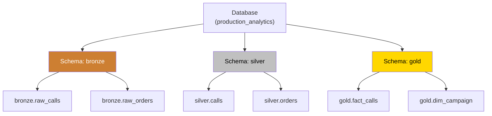
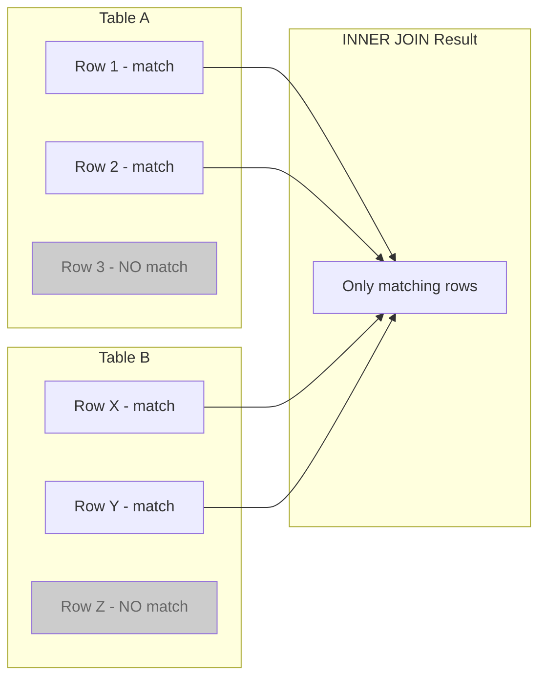
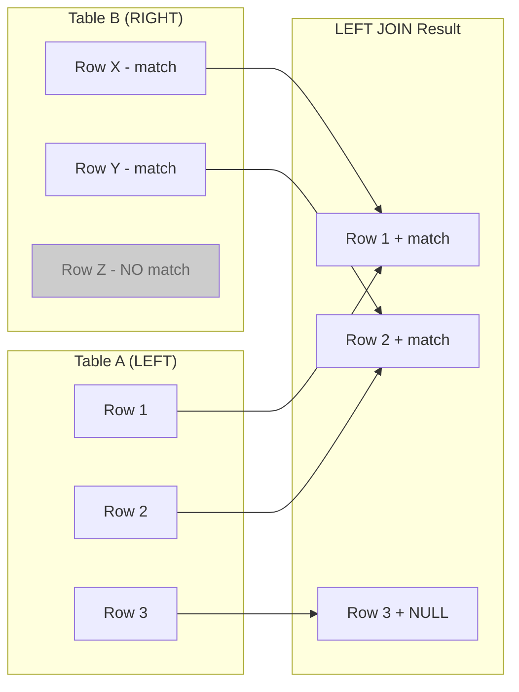
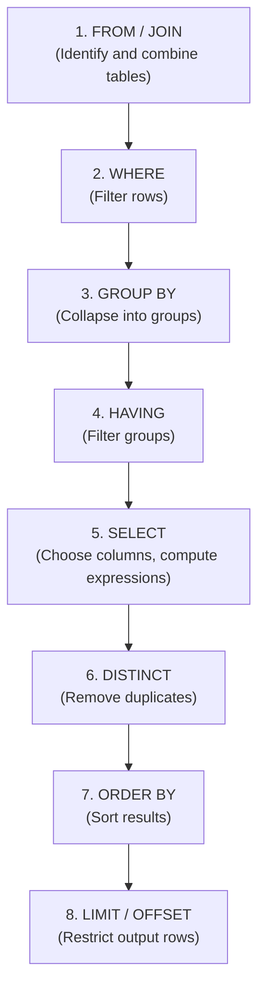

# SQL Concepts for Production Systems

**Series:** SQL for Production Systems (2 of 10)
**Notebook:** [Advanced SQL on Colab](https://colab.research.google.com/github/sunilmogadati/systems-in-production/blob/main/implementation/notebooks/Advanced_SQL.ipynb)

---

## The Hierarchy: Databases, Schemas, Tables

Before writing queries, understand how data is organized:



| Level | What It Is | Analogy |
|---|---|---|
| **Database** | The top-level container. In BigQuery this is called a "project." In Snowflake, a "database." | A filing cabinet |
| **Schema** | A namespace within a database. Groups related tables. In BigQuery, this is called a "dataset." | A drawer in the cabinet |
| **Table** | Rows and columns. The actual data. | A folder of documents |

**In production,** schemas separate pipeline stages: `bronze`, `silver`, `gold`. This is not just organization -- it enforces access control. Analysts read from `gold`. Only the pipeline service account writes to `silver`.

---

## Data Types: Why They Matter in Production

Every column has a data type. In development, wrong types cause errors. In production, wrong types cause **silent data corruption**.

| Type Category | Common Types | Production Trap |
|---|---|---|
| **String** | `VARCHAR`, `TEXT`, `STRING` | Phone numbers stored as integers lose leading zeros. `"08005551234"` becomes `8005551234`. |
| **Integer** | `INT`, `BIGINT`, `SMALLINT` | `INT` maxes out at ~2.1 billion. Order IDs at high-volume systems overflow silently in some databases. |
| **Decimal** | `DECIMAL(10,2)`, `NUMERIC` | Use `DECIMAL` for money, NEVER `FLOAT`. `FLOAT` has rounding errors: `0.1 + 0.2 = 0.30000000000000004`. |
| **Float** | `FLOAT`, `DOUBLE` | Fine for ML features and scientific data. Never for financial calculations. |
| **Boolean** | `BOOLEAN`, `BIT` | Some databases store booleans as `0/1`, others as `TRUE/FALSE`. Cross-database pipelines must handle both. |
| **Timestamp** | `TIMESTAMP`, `DATETIME`, `TIMESTAMPTZ` | `TIMESTAMP` without timezone = ambiguous. Is `2026-03-15 14:00:00` in UTC or Eastern? Use `TIMESTAMPTZ` (timestamp with timezone) or document the convention. |
| **Date** | `DATE` | Timezone truncation: a `TIMESTAMP` at `2026-03-15 23:30:00 UTC` becomes `2026-03-16` in Eastern when cast to `DATE` without timezone conversion first. Off-by-one day errors in reports. |

**The rule for production:** Define explicit types in every `CREATE TABLE`. Never rely on type inference. Never store money as `FLOAT`.

---

## Joins: Combining Tables

Joins are the core operation for combining data from multiple tables. Every production query that touches more than one table uses joins.

### INNER JOIN

Returns only rows that match in BOTH tables.



```sql
-- Get calls that have orders (only calls with a matching order appear)
SELECT c.call_id, c.disposition, o.order_id, o.order_date
FROM calls c
INNER JOIN orders o ON c.call_id = o.voiceprint_id;
```

### LEFT JOIN (Left Outer Join)

Returns ALL rows from the left table, plus matching rows from the right table. Non-matching right-side columns are `NULL`.



```sql
-- Get ALL calls, with order data if it exists (most calls are not sales)
SELECT c.call_id, c.disposition, o.order_id, o.order_date
FROM calls c
LEFT JOIN orders o ON c.call_id = o.voiceprint_id;
```

**This is the most common join in production.** You almost always want all rows from the primary table, even when there is no match in the secondary table.

### RIGHT JOIN (Right Outer Join)

Returns ALL rows from the right table, plus matching rows from the left. The mirror image of LEFT JOIN. Rarely used in practice -- most teams rewrite as a LEFT JOIN with the tables swapped for readability.

### FULL OUTER JOIN

Returns ALL rows from both tables. Non-matching rows on either side get `NULL` for the other table's columns.

```sql
-- Find orphans in both directions: calls without orders AND orders without calls
SELECT c.call_id, o.order_id
FROM calls c
FULL OUTER JOIN orders o ON c.call_id = o.voiceprint_id
WHERE c.call_id IS NULL OR o.order_id IS NULL;
```

**Production use case:** Data reconciliation. Find records that exist in one system but not the other.

### CROSS JOIN

Returns every combination of rows from both tables. If Table A has 100 rows and Table B has 50 rows, the result has 5,000 rows.

```sql
-- Generate a complete date x campaign grid (useful for filling gaps in reports)
SELECT d.date, c.campaign_name
FROM dim_date d
CROSS JOIN dim_campaign c
WHERE d.date BETWEEN '2026-01-01' AND '2026-03-31';
```

**Warning:** Cross joins on large tables produce enormous result sets. Use intentionally and with filters.

### Join Summary

| Join Type | Returns | Use Case |
|---|---|---|
| **INNER** | Only matching rows | Get calls that resulted in orders |
| **LEFT** | All left + matching right | Get all calls, with order data if present |
| **RIGHT** | All right + matching left | Rarely used; rewrite as LEFT JOIN |
| **FULL OUTER** | All rows from both sides | Data reconciliation, finding orphans |
| **CROSS** | Every combination | Generate grids, date spines |

---

## Aggregations: GROUP BY, HAVING, and Aggregate Functions

Aggregations collapse many rows into summary rows.

```sql
-- How many calls per campaign, with average duration?
SELECT
    ds.campaign_name,
    COUNT(*)                          AS total_calls,
    AVG(vc.duration_seconds)          AS avg_duration,
    MIN(vc.call_started_at)           AS first_call,
    MAX(vc.call_started_at)           AS last_call,
    SUM(CASE WHEN vc.disposition_type = 'ORDER' THEN 1 ELSE 0 END) AS orders
FROM va_calls vc
JOIN dnis_sources ds ON vc.dnis = ds.dnis
GROUP BY ds.campaign_name;
```

### Aggregate Functions

| Function | What It Does | NULL Behavior |
|---|---|---|
| `COUNT(*)` | Counts all rows | Counts rows with NULLs |
| `COUNT(column)` | Counts non-NULL values | Skips NULLs |
| `COUNT(DISTINCT column)` | Counts unique non-NULL values | Skips NULLs |
| `SUM(column)` | Sum of values | Skips NULLs (returns NULL if all NULL) |
| `AVG(column)` | Average of values | Skips NULLs (does NOT treat NULL as 0) |
| `MIN(column)` | Minimum value | Skips NULLs |
| `MAX(column)` | Maximum value | Skips NULLs |

**Production trap with AVG:** If 10 rows have values `[100, 200, NULL, 300]`, the `AVG` is `200` (sum of 600 divided by 3 non-NULL values), not `150` (divided by 4). This difference changes business metrics.

### HAVING: Filtering After Aggregation

`WHERE` filters rows BEFORE aggregation. `HAVING` filters groups AFTER aggregation.

```sql
-- Campaigns with more than 1000 calls AND conversion rate above 5%
SELECT
    ds.campaign_name,
    COUNT(*) AS total_calls,
    SUM(CASE WHEN vc.disposition_type = 'ORDER' THEN 1 ELSE 0 END) * 100.0
        / COUNT(*) AS conversion_pct
FROM va_calls vc
JOIN dnis_sources ds ON vc.dnis = ds.dnis
GROUP BY ds.campaign_name
HAVING COUNT(*) > 1000
   AND SUM(CASE WHEN vc.disposition_type = 'ORDER' THEN 1 ELSE 0 END) * 100.0
        / COUNT(*) > 5.0;
```

---

## Subqueries vs CTEs (Common Table Expressions)

Both let you build multi-step queries. CTEs are almost always the better choice in production.

### Subquery (inline, harder to read)

```sql
SELECT *
FROM (
    SELECT call_id, duration_seconds,
           ROW_NUMBER() OVER (PARTITION BY call_id ORDER BY call_started_at DESC) AS rn
    FROM va_calls
) deduped
WHERE rn = 1;
```

### CTE (named, readable, reusable within the query)

```sql
WITH deduped AS (
    SELECT call_id, duration_seconds,
           ROW_NUMBER() OVER (PARTITION BY call_id ORDER BY call_started_at DESC) AS rn
    FROM va_calls
)
SELECT *
FROM deduped
WHERE rn = 1;
```

### Why CTEs Win in Production

| Feature | Subquery | CTE |
|---|---|---|
| **Readability** | Nested, hard to follow | Named steps, reads top-to-bottom |
| **Reuse** | Must duplicate the subquery | Reference the CTE name multiple times |
| **Debugging** | Comment out inner layers? Hard | Comment out one CTE, test in isolation |
| **dbt models** | Discouraged | Standard pattern |
| **Performance** | Identical in most engines | Identical in most engines |

**The rule:** Use CTEs for any query with more than one logical step. Name them descriptively: `deduped_calls`, `calls_with_orders`, `campaign_metrics`.

---

## Window Functions: Analytics Without Collapsing Rows

Window functions compute values across a set of rows related to the current row -- WITHOUT reducing the result to one row per group (unlike `GROUP BY`).

### ROW_NUMBER: Assign a Sequence

```sql
-- Deduplicate: keep only the latest record per call_id
SELECT *
FROM (
    SELECT *,
           ROW_NUMBER() OVER (
               PARTITION BY call_id
               ORDER BY call_started_at DESC
           ) AS row_num
    FROM va_calls
) ranked
WHERE row_num = 1;
```

`PARTITION BY call_id` = restart numbering for each call_id.
`ORDER BY call_started_at DESC` = most recent first.
`row_num = 1` = keep only the most recent.

**This is the standard deduplication pattern in production SQL.**

### RANK and DENSE_RANK

```sql
-- Rank campaigns by total revenue
SELECT
    campaign_name,
    total_revenue,
    RANK() OVER (ORDER BY total_revenue DESC) AS revenue_rank,
    DENSE_RANK() OVER (ORDER BY total_revenue DESC) AS dense_revenue_rank
FROM campaign_summary;
```

| Function | Behavior with Ties | Example: values 100, 100, 80 |
|---|---|---|
| `ROW_NUMBER` | No ties, arbitrary order within ties | 1, 2, 3 |
| `RANK` | Same rank for ties, gaps after | 1, 1, 3 |
| `DENSE_RANK` | Same rank for ties, no gaps | 1, 1, 2 |

### LAG and LEAD: Look Backward and Forward

```sql
-- Compare each day's call volume to the previous day
SELECT
    call_date,
    daily_calls,
    LAG(daily_calls, 1) OVER (ORDER BY call_date)  AS prev_day_calls,
    daily_calls - LAG(daily_calls, 1) OVER (ORDER BY call_date) AS day_over_day_change
FROM daily_call_counts;
```

`LAG(column, N)` = value from N rows before.
`LEAD(column, N)` = value from N rows after.

**Production use case:** Change detection. Alert when a metric drops more than 20% from the previous period.

### SUM OVER: Running Totals

```sql
-- Running total of revenue by day within each campaign
SELECT
    campaign_name,
    order_date,
    daily_revenue,
    SUM(daily_revenue) OVER (
        PARTITION BY campaign_name
        ORDER BY order_date
        ROWS BETWEEN UNBOUNDED PRECEDING AND CURRENT ROW
    ) AS cumulative_revenue
FROM daily_campaign_revenue;
```

### Window Function Summary

| Function | Purpose | Production Use |
|---|---|---|
| `ROW_NUMBER()` | Unique sequence per partition | Deduplication |
| `RANK()` | Ranking with gaps | Leaderboards, top-N with ties |
| `DENSE_RANK()` | Ranking without gaps | Percentile buckets |
| `LAG()` | Previous row value | Day-over-day change, trend detection |
| `LEAD()` | Next row value | Forward-looking comparison |
| `SUM() OVER` | Running total | Cumulative revenue, running counts |
| `AVG() OVER` | Moving average | Smoothed metrics, trend lines |
| `NTILE(N)` | Split into N equal groups | Quartile/decile analysis |

---

## CASE WHEN: Conditional Logic

SQL's equivalent of if/else. Used constantly in production for categorization, flagging, and derived columns.

```sql
SELECT
    call_id,
    duration_seconds,
    CASE
        WHEN duration_seconds < 30   THEN 'Short'
        WHEN duration_seconds < 120  THEN 'Medium'
        WHEN duration_seconds < 300  THEN 'Long'
        ELSE 'Very Long'
    END AS duration_category,
    CASE
        WHEN disposition_type = 'ORDER' THEN TRUE
        ELSE FALSE
    END AS is_sale
FROM va_calls;
```

**Production patterns:**
- Categorize numeric ranges into buckets
- Map source codes to human-readable labels
- Flag records for quality review
- Compute conditional aggregates: `SUM(CASE WHEN is_sale THEN revenue ELSE 0 END)`

---

## NULL Handling: The Most Common Source of Bugs

`NULL` means "unknown." It does not mean zero. It does not mean empty string. It does not mean false. Any operation involving `NULL` produces `NULL` (with a few exceptions).

### The NULL Traps

```sql
-- All of these evaluate to NULL, not what you expect
SELECT NULL = NULL;         -- NULL (not TRUE!)
SELECT NULL <> NULL;        -- NULL (not TRUE!)
SELECT NULL + 100;          -- NULL
SELECT NULL > 0;            -- NULL
SELECT 'hello' || NULL;     -- NULL (in PostgreSQL -- string concatenation with NULL = NULL)
```

### IS NULL and IS NOT NULL

```sql
-- The ONLY way to check for NULL
SELECT * FROM calls WHERE order_id IS NULL;      -- Calls with no order
SELECT * FROM calls WHERE order_id IS NOT NULL;  -- Calls with an order
```

**Never write** `WHERE order_id = NULL`. It returns zero rows. Always.

### COALESCE: Replace NULL with a Default

```sql
-- If duration_seconds is NULL, use 0
SELECT call_id, COALESCE(duration_seconds, 0) AS duration_seconds
FROM va_calls;

-- Chain multiple fallbacks: use first non-NULL value
SELECT COALESCE(ship_city, bill_city, 'Unknown') AS city
FROM orders;
```

### NULLIF: Turn a Value into NULL

```sql
-- Prevent division by zero: NULLIF returns NULL if the two arguments are equal
SELECT
    total_orders * 100.0 / NULLIF(total_calls, 0) AS conversion_pct
FROM campaign_summary;
-- If total_calls is 0, NULLIF returns NULL, and the division returns NULL instead of erroring
```

### NULL in Aggregations

| Expression | Result |
|---|---|
| `COUNT(*)` on 10 rows (3 have NULL in `col`) | 10 |
| `COUNT(col)` on same 10 rows | 7 |
| `SUM(col)` where all values are NULL | NULL (not 0) |
| `AVG(col)` with values `[100, NULL, 200]` | 150 (only 2 values counted) |

---

## Query Execution Order

Most people think SQL executes top-to-bottom, the way it reads. It does not. The database executes clauses in this order:



### Why This Matters

**1. You cannot use a SELECT alias in WHERE.**

```sql
-- THIS FAILS: conversion_pct does not exist yet at the WHERE stage
SELECT total_orders * 100.0 / total_calls AS conversion_pct
FROM campaign_summary
WHERE conversion_pct > 5;  -- ERROR

-- FIX: Repeat the expression, or use a CTE/subquery
SELECT total_orders * 100.0 / total_calls AS conversion_pct
FROM campaign_summary
WHERE total_orders * 100.0 / total_calls > 5;
```

**2. You CAN use a SELECT alias in ORDER BY.**

```sql
-- This works because ORDER BY executes AFTER SELECT
SELECT campaign_name, COUNT(*) AS total_calls
FROM va_calls
GROUP BY campaign_name
ORDER BY total_calls DESC;
```

**3. WHERE filters before GROUP BY. HAVING filters after.**

```sql
-- WHERE removes individual rows, HAVING removes entire groups
SELECT campaign_name, COUNT(*) AS total_calls
FROM va_calls
WHERE channel = 'VA'            -- Filter rows first (only VA calls)
GROUP BY campaign_name
HAVING COUNT(*) > 100;          -- Then filter groups (only campaigns with 100+ calls)
```

---

## SQL Across Databases: Key Differences

SQL is standardized, but every database has dialect differences. When your pipeline targets multiple engines, these differences matter.

| Feature | PostgreSQL | BigQuery | Redshift | Snowflake |
|---|---|---|---|---|
| **String concatenation** | `\|\|` | `CONCAT()` | `\|\|` | `\|\|` or `CONCAT()` |
| **Current timestamp** | `NOW()` | `CURRENT_TIMESTAMP()` | `GETDATE()` | `CURRENT_TIMESTAMP()` |
| **Date truncation** | `DATE_TRUNC('month', col)` | `DATE_TRUNC(col, MONTH)` | `DATE_TRUNC('month', col)` | `DATE_TRUNC('MONTH', col)` |
| **Safe cast** | `col::int` (errors on fail) | `SAFE_CAST(col AS INT64)` | `col::int` (errors on fail) | `TRY_CAST(col AS INT)` |
| **Upsert** | `INSERT ... ON CONFLICT` | `MERGE` | `MERGE` (preview) | `MERGE` |
| **Array support** | Native (`ARRAY[]`) | Native (`ARRAY<>`) | Limited (`SUPER` type) | Native (`ARRAY`) |
| **JSON support** | `JSONB` operators | `JSON_EXTRACT_SCALAR()` | `JSON_EXTRACT_PATH_TEXT()` | `PARSE_JSON()` |
| **Window frame default** | `RANGE BETWEEN UNBOUNDED PRECEDING AND CURRENT ROW` | Same | Same | Same |
| **BOOLEAN type** | `BOOLEAN` | `BOOL` | `BOOLEAN` | `BOOLEAN` |
| **Integer division** | `5/2 = 2` (integer) | `5/2 = 2` (integer) | `5/2 = 2` (integer) | `5/2 = 2` (integer) |

**Production takeaway:** Always cast one operand to `FLOAT` or `DECIMAL` before division to avoid integer truncation. `CAST(total_orders AS DECIMAL) / total_calls` or `total_orders * 1.0 / total_calls`.

---

## Key Terms Glossary

| Term | Pronunciation | Definition |
|---|---|---|
| **CTE** | "C-T-E" | Common Table Expression. A named temporary result set defined with `WITH`. Exists only for the duration of the query. |
| **DDL** | "D-D-L" | Data Definition Language. Statements that define structure: `CREATE TABLE`, `ALTER TABLE`, `DROP TABLE`. |
| **DML** | "D-M-L" | Data Manipulation Language. Statements that modify data: `INSERT`, `UPDATE`, `DELETE`, `MERGE`. |
| **ACID** | "acid" | Atomicity, Consistency, Isolation, Durability. Properties that guarantee reliable database transactions. |
| **NULL** | "null" | A marker for a missing or unknown value. Not zero, not empty string, not false. |
| **Window Function** | -- | A function that computes a value across a set of rows related to the current row, without collapsing the result set. |
| **Partition** | "par-TISH-un" | In window functions: the subset of rows the function operates on (`PARTITION BY`). In tables: a physical division of data for storage and query performance. |
| **Predicate** | "PRED-ih-kit" | A condition in a `WHERE` or `HAVING` clause that evaluates to true, false, or unknown. |
| **Cardinality** | "car-din-AL-ih-tee" | The number of distinct values in a column. High cardinality = many unique values (e.g., user IDs). Low cardinality = few unique values (e.g., status codes). |
| **TIMESTAMPTZ** | "timestamp-Z" | Timestamp with timezone. Stores the absolute moment in time, not a wall-clock reading. |

---

## Quick Links: SQL Chapter Series

| Chapter | Title |
|---|---|
| 01 | [Why It Still Matters](01_Why.md) |
| **02** | [Concepts](02_Concepts.md) |
| 03 | [Hello World](03_Hello_World.md) |
| 04 | [How It Works](04_How_It_Works.md) |
| 05 | [Building It](05_Building_It.md) |
| 06 | Production Patterns (coming soon) |
| 07 | System Design (coming soon) |
| 08 | Quality, Security, and Governance (coming soon) |
| 09 | Observability and Troubleshooting (coming soon) |
| 10 | Decision Guide (coming soon) |
