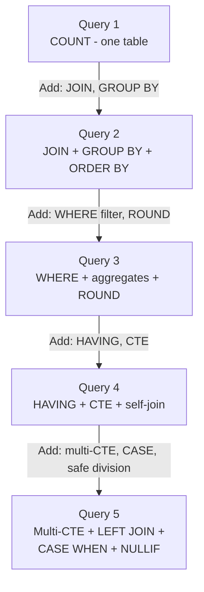

# SQL Hello World - Query Real Data in 5 Minutes

**Series:** SQL for Production Systems (3 of 10)
**Notebook:** [Advanced SQL on Colab](https://colab.research.google.com/github/sunilmogadati/systems-in-production/blob/main/implementation/notebooks/Advanced_SQL.ipynb)

---

## The Dataset

These queries run against the call center operational tables. The schema comes from a real-world call center system with virtual agent (VA) calls, orders, payments, and campaign routing.

Key tables:

| Table | What It Stores | Row Count (synthetic) |
|---|---|---|
| `va_calls` | Every VA call: timestamps, duration, disposition, sentiment | ~510 |
| `calls` | Core call records across all channels (VA + live agent) | ~510 |
| `orders` | Order headers: customer, shipping, status | ~78 |
| `order_details` | Line items: product, quantity, price | ~120 |
| `payments` | Payment attempts: amount, method, status | ~66 |
| `dnis_sources` | Phone number to campaign mapping | ~10 |

See [Source Tables](../star-schema-design/02a_Source_Tables.md) for full schema definitions.

These queries work in PostgreSQL, BigQuery, Snowflake, or any standard SQL engine. Minor syntax adjustments noted where needed.

---

## Query 1: How Many Calls Total?

The simplest possible question. One table, one function.

```sql
SELECT COUNT(*) AS total_calls
FROM va_calls;
```

**What this does:** Counts every row in the `va_calls` table. `COUNT(*)` counts all rows, including those with NULL values in some columns.

**You Should See:**

| total_calls |
|---|
| 510 |

**What you just learned:** `SELECT`, `FROM`, `COUNT(*)`, and column aliasing with `AS`.

---

## Query 2: Calls by Campaign

Now group the data. Which campaigns are driving the most call volume?

```sql
SELECT
    ds.campaign_name,
    COUNT(*)                   AS total_calls,
    MIN(vc.call_started_at)    AS first_call,
    MAX(vc.call_started_at)    AS last_call
FROM va_calls vc
JOIN dnis_sources ds ON vc.dnis = ds.dnis
GROUP BY ds.campaign_name
ORDER BY total_calls DESC;
```

**What this does:**
1. Joins `va_calls` to `dnis_sources` on the DNIS (Dialed Number Identification Service) -- the phone number that was called. This maps each call to its campaign.
2. Groups by campaign name.
3. Counts calls and finds the date range per campaign.
4. Sorts by volume, highest first.

**You Should See:**

| campaign_name | total_calls | first_call | last_call |
|---|---|---|---|
| SmartPulse TV Spring | 187 | 2026-03-10 08:12:33 | 2026-03-21 22:45:11 |
| VitaBlend Digital Q1 | 142 | 2026-03-10 09:01:22 | 2026-03-21 21:33:44 |
| SmartPulse Radio Test | 98 | 2026-03-12 10:15:00 | 2026-03-20 18:22:17 |
| ... | ... | ... | ... |

(Exact numbers depend on the synthetic data generation run.)

**What you just learned:** `JOIN`, `GROUP BY`, `ORDER BY`, multiple aggregate functions in one query, table aliases (`vc`, `ds`).

---

## Query 3: Average Duration by Disposition

Which call outcomes take the longest? This tells operations where agents spend the most time.

```sql
SELECT
    disposition_type,
    COUNT(*)                              AS call_count,
    ROUND(AVG(duration_seconds), 1)       AS avg_duration_sec,
    ROUND(AVG(duration_seconds) / 60.0, 1) AS avg_duration_min,
    MIN(duration_seconds)                 AS min_duration,
    MAX(duration_seconds)                 AS max_duration
FROM va_calls
WHERE disposition_type IS NOT NULL
GROUP BY disposition_type
ORDER BY avg_duration_sec DESC;
```

**What this does:**
1. Filters out rows where `disposition_type` is NULL (bad data, not useful for analysis).
2. Groups by disposition type (ORDER, NO_SALE, ABANDON, etc.).
3. Calculates average, minimum, and maximum duration for each group.
4. `ROUND(value, 1)` rounds to 1 decimal place.
5. Division by `60.0` (not `60`) forces decimal division. Without the `.0`, integer division would truncate: `125 / 60 = 2` instead of `2.1`.

**You Should See:**

| disposition_type | call_count | avg_duration_sec | avg_duration_min | min_duration | max_duration |
|---|---|---|---|---|---|
| ORDER | 78 | 245.3 | 4.1 | 90 | 480 |
| NO_SALE | 289 | 142.7 | 2.4 | 15 | 390 |
| ABANDON | 112 | 28.4 | 0.5 | 3 | 95 |
| ... | ... | ... | ... | ... | ... |

**What you just learned:** `WHERE` with `IS NOT NULL`, `ROUND()`, decimal division, filtering before aggregation.

---

## Query 4: Find Duplicate Call IDs

Production data has duplicates. Source systems send the same record twice, retry logic creates extra rows, and ETL (Extract, Transform, Load) bugs propagate copies. Finding duplicates is a core production skill.

```sql
-- Step 1: Find which call_ids appear more than once
SELECT
    call_id,
    COUNT(*) AS occurrence_count
FROM va_calls
GROUP BY call_id
HAVING COUNT(*) > 1
ORDER BY occurrence_count DESC;
```

**What this does:**
1. Groups by `call_id` (which should be unique).
2. `HAVING COUNT(*) > 1` keeps only groups with duplicates. `HAVING` filters after aggregation -- `WHERE` cannot reference aggregate functions.
3. Orders by the worst offenders first.

**You Should See:**

| call_id | occurrence_count |
|---|---|
| CALL-20260315-00042 | 3 |
| CALL-20260315-00187 | 2 |
| CALL-20260316-00099 | 2 |

(The synthetic dataset has intentional duplicates built in for teaching.)

```sql
-- Step 2: See the actual duplicate rows (what is different between them?)
WITH dupes AS (
    SELECT call_id
    FROM va_calls
    GROUP BY call_id
    HAVING COUNT(*) > 1
)
SELECT vc.*
FROM va_calls vc
JOIN dupes d ON vc.call_id = d.call_id
ORDER BY vc.call_id, vc.call_started_at;
```

**What you just learned:** `HAVING` (post-aggregation filter), CTEs for multi-step logic, self-referencing patterns for data quality investigation.

---

## Query 5: Join Calls with Orders, Calculate Conversion Rate

This is the production question: "What percentage of calls result in a sale?" It requires joining two tables and computing a ratio.

```sql
WITH call_orders AS (
    -- Join calls to orders via voiceprint_id
    -- LEFT JOIN: keep ALL calls, even those without orders
    SELECT
        vc.call_id,
        vc.dnis,
        vc.disposition_type,
        vc.duration_seconds,
        o.order_id,
        CASE WHEN o.order_id IS NOT NULL THEN 1 ELSE 0 END AS is_conversion
    FROM va_calls vc
    LEFT JOIN orders o ON vc.call_id = o.voiceprint_id
),

campaign_conversion AS (
    -- Aggregate by campaign
    SELECT
        ds.campaign_name,
        COUNT(*)                    AS total_calls,
        SUM(co.is_conversion)       AS total_orders,
        ROUND(
            SUM(co.is_conversion) * 100.0 / NULLIF(COUNT(*), 0),
            1
        )                           AS conversion_pct
    FROM call_orders co
    JOIN dnis_sources ds ON co.dnis = ds.dnis
    GROUP BY ds.campaign_name
)

SELECT
    campaign_name,
    total_calls,
    total_orders,
    conversion_pct
FROM campaign_conversion
ORDER BY conversion_pct DESC;
```

**What this does:**
1. **CTE 1 (`call_orders`):** LEFT JOINs every VA call to orders. Creates an `is_conversion` flag using `CASE WHEN`. Calls without orders get `is_conversion = 0`.
2. **CTE 2 (`campaign_conversion`):** Joins to `dnis_sources` for campaign names, then aggregates. `NULLIF(COUNT(*), 0)` prevents division by zero -- if a campaign has zero calls, the division returns NULL instead of erroring.
3. **Final SELECT:** Sorts by conversion rate, best performing campaigns first.

**You Should See:**

| campaign_name | total_calls | total_orders | conversion_pct |
|---|---|---|---|
| SmartPulse TV Spring | 187 | 34 | 18.2 |
| VitaBlend Digital Q1 | 142 | 22 | 15.5 |
| SmartPulse Radio Test | 98 | 12 | 12.2 |
| ... | ... | ... | ... |

**What you just learned:** Multi-CTE queries, LEFT JOIN for inclusive joins, CASE WHEN for derived flags, NULLIF for safe division, building complex analysis from simple steps.

---

## How Each Query Builds on the Previous



| Query | New Concepts | Production Skill |
|---|---|---|
| 1 | `COUNT(*)`, `AS` | Validate data loaded correctly |
| 2 | `JOIN`, `GROUP BY`, `ORDER BY` | Dimensional analysis (metrics by category) |
| 3 | `WHERE`, `ROUND`, decimal division | Filtered aggregation, data cleaning |
| 4 | `HAVING`, CTE | Data quality investigation |
| 5 | Multi-CTE, `LEFT JOIN`, `CASE WHEN`, `NULLIF` | Business metric calculation |

---

## Running These Queries

**BigQuery Console:** Paste any query into the BigQuery web console. Replace table names with your dataset prefix: `your_project.your_dataset.va_calls`.

**PostgreSQL (local or cloud):** Load the synthetic CSV files into a local database, then run the queries directly. The syntax is identical.

**Colab Notebook:** Open the [Advanced SQL notebook](https://colab.research.google.com/github/sunilmogadati/systems-in-production/blob/main/implementation/notebooks/Advanced_SQL.ipynb) and run the cells. The dataset is loaded automatically.

**Any SQL Engine:** These queries use standard ANSI SQL. They run on MySQL, SQL Server, Redshift, Snowflake, DuckDB, or SQLite with minimal changes (mostly timestamp function names).

---

## Quick Links: SQL Chapter Series

| Chapter | Title |
|---|---|
| 01 | [Why It Still Matters](01_Why.md) |
| 02 | [Concepts](02_Concepts.md) |
| **03** | [Hello World](03_Hello_World.md) |
| 04 | [How It Works](04_How_It_Works.md) |
| 05 | [Building It](05_Building_It.md) |
| 06 | Production Patterns (coming soon) |
| 07 | System Design (coming soon) |
| 08 | Quality, Security, and Governance (coming soon) |
| 09 | Observability and Troubleshooting (coming soon) |
| 10 | Decision Guide (coming soon) |
