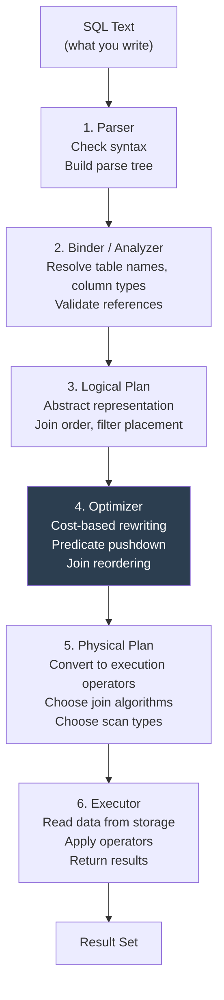
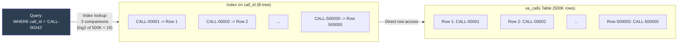
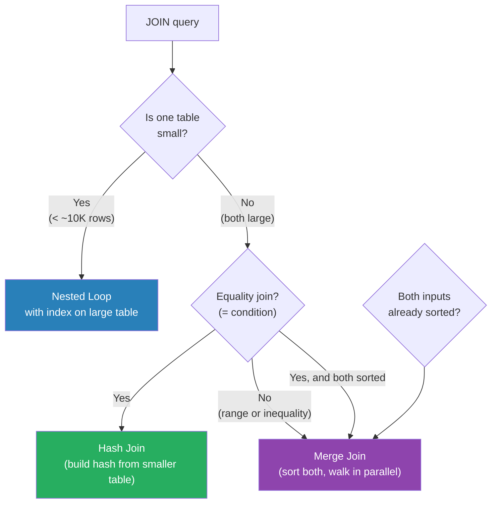
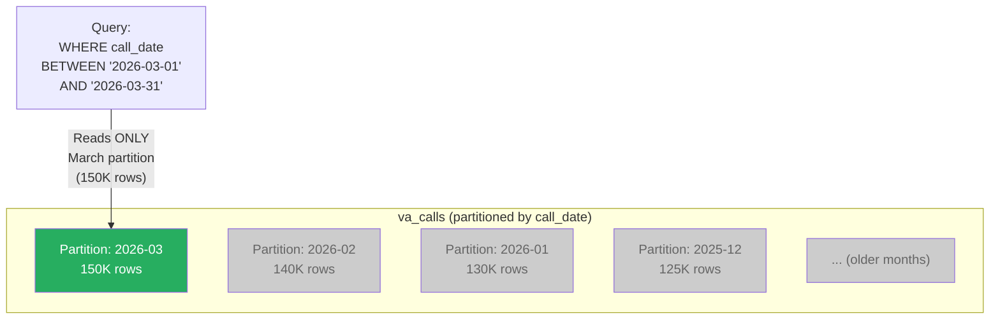

# How SQL Executes - What Happens Under the Hood

**Series:** SQL for Production Systems (4 of 10)
**Notebook:** [Advanced SQL on Colab](https://colab.research.google.com/github/sunilmogadati/systems-in-production/blob/main/implementation/notebooks/Advanced_SQL.ipynb)

---

## Your SQL Is a Request, Not an Instruction

When you write Python, the interpreter executes your code line by line, in the order you wrote it. SQL does not work this way.

SQL is **declarative.** You describe WHAT you want. The database decides HOW to get it. Your `SELECT` statement is a specification handed to a query planner -- a sophisticated optimizer that has been refined over decades. The planner reads your query, considers dozens of possible execution strategies, estimates the cost of each, and picks the cheapest one.

This is why two queries that return identical results can have wildly different performance. The planner chose different strategies.

---

## From SQL Text to Result: The Execution Pipeline



### What Happens at Each Stage

| Stage | What It Does | Example |
|---|---|---|
| **Parser** | Checks syntax. Is the SQL grammatically valid? Builds a tree of tokens. | Catches typos: `SELCT` instead of `SELECT` |
| **Binder** | Resolves names. Does `va_calls` exist? Does it have a column called `call_id`? What type is it? | Catches invalid column references |
| **Logical Plan** | Converts the query into a tree of abstract operations: scan, filter, join, aggregate, project. No decisions about HOW to execute yet. | `Filter(disposition_type = 'ORDER') -> Scan(va_calls)` |
| **Optimizer** | The critical stage. Rewrites the plan for performance. Pushes filters closer to the data. Reorders joins. Eliminates redundant steps. Uses table statistics to estimate costs. | Moves `WHERE` filter before `JOIN` so fewer rows participate in the join |
| **Physical Plan** | Maps logical operations to physical operators: hash join vs merge join, index scan vs table scan, sort vs hash for GROUP BY. | Chooses hash join for large tables, nested loop for small ones |
| **Executor** | Runs the physical plan. Reads pages from disk or cache, applies operators, streams results back. | Actually reads the bytes and returns rows |

---

## Indexes: The Most Important Performance Tool

An index is a separate data structure that maps column values to their row locations -- like the index at the back of a textbook. Instead of reading every page to find "query planner," you look up "query planner" in the index, get page 47, and go directly there.

### How an Index Works



Without an index, the database reads every row (a **full table scan**) to find `CALL-00342`. With an index on `call_id`, it performs a binary search through the B-tree (B-tree stands for "balanced tree") and finds the row in approximately 19 comparisons instead of 500,000 row reads.

### When Indexes Help

| Scenario | Benefit |
|---|---|
| `WHERE` filters on indexed columns | Skip directly to matching rows |
| `JOIN` conditions on indexed columns | Fast key lookups instead of scanning |
| `ORDER BY` on indexed columns | Data is already sorted, no sort step needed |
| `UNIQUE` constraints | The database creates an index automatically |
| Primary keys | Always indexed automatically |

### When Indexes Hurt

| Scenario | Cost |
|---|---|
| Small tables (under ~10,000 rows) | Full scan is faster than index overhead |
| Columns with low cardinality (e.g., `status` with 3 values) | Index points to too many rows; scan is cheaper |
| Heavy write workloads | Every `INSERT`, `UPDATE`, `DELETE` must update every index on the table |
| Too many indexes | Storage overhead, slower writes, optimizer confusion |
| Queries that read most of the table anyway | Index adds overhead without reducing reads |

**The rule of thumb:** Index columns that appear in `WHERE`, `JOIN ON`, and `ORDER BY` clauses, but only when the table is large enough to benefit and the column has sufficient cardinality.

---

## Table Scans vs Index Scans

The two fundamental ways a database reads data:

| Scan Type | What Happens | When Used | Cost |
|---|---|---|---|
| **Full Table Scan** (Sequential Scan) | Reads every row in the table, front to back | No useful index exists, or the query needs most of the table | O(n) -- proportional to table size |
| **Index Scan** | Looks up values in the index, then fetches only matching rows from the table | Index exists on the filtered column and the filter is selective | O(log n + k) where k = matching rows |
| **Index Only Scan** | Reads data entirely from the index without touching the table | All required columns are in the index (covering index) | Fastest possible |
| **Bitmap Index Scan** | Builds a bitmap of matching rows from the index, then fetches them in bulk | Multiple conditions on indexed columns, or medium selectivity | Between table scan and index scan |

**Example:** A query with `WHERE call_started_at > '2026-03-15'` on a table with 500,000 rows:
- If the filter returns 100 rows: **index scan** (read 100 rows, skip 499,900).
- If the filter returns 400,000 rows: **full table scan** (reading 80% of the table through an index is slower than reading the whole thing sequentially).

The optimizer makes this decision automatically based on table statistics.

---

## Join Algorithms: How the Database Combines Tables

When you write `JOIN`, the database must decide HOW to combine the rows. There are three main algorithms:

### Nested Loop Join

The simplest algorithm. For each row in Table A, scan all rows in Table B looking for matches.

```
For each row in va_calls:
    For each row in dnis_sources:
        If va_calls.dnis = dnis_sources.dnis:
            Output the combined row
```

| Property | Detail |
|---|---|
| **Time complexity** | O(n * m) where n and m are table sizes |
| **Best for** | Small tables (one or both sides), or when an index exists on the inner table |
| **Worst for** | Two large tables without indexes |
| **Used when** | One table is small (e.g., 10-row lookup table joining to a million-row fact table) |

### Hash Join

Build a hash table from the smaller table, then probe it with the larger table.

```
Step 1: Read all of dnis_sources into a hash table keyed by dnis
Step 2: For each row in va_calls:
            Look up va_calls.dnis in the hash table
            If found, output the combined row
```

| Property | Detail |
|---|---|
| **Time complexity** | O(n + m) -- much better than nested loop for large tables |
| **Best for** | Large tables with equality joins (`=`) |
| **Worst for** | Very large tables where the hash table does not fit in memory |
| **Used when** | Most large-table joins in practice |

### Merge Join (Sort-Merge Join)

Sort both tables by the join key, then walk through them in parallel.

```
Step 1: Sort va_calls by dnis
Step 2: Sort dnis_sources by dnis
Step 3: Walk both sorted lists simultaneously, matching rows
```

| Property | Detail |
|---|---|
| **Time complexity** | O(n log n + m log m) for sorting, then O(n + m) for merging |
| **Best for** | When both inputs are already sorted (e.g., from an index), or when the result needs to be sorted |
| **Worst for** | Unsorted large tables (sorting is expensive) |
| **Used when** | Both tables have indexes on the join key, or the query includes `ORDER BY` on the join key |

### Join Algorithm Summary



You do not choose the algorithm. The optimizer does. But understanding which algorithm is running helps you diagnose slow queries.

---

## EXPLAIN and EXPLAIN ANALYZE: Reading Execution Plans

Every database provides a way to see the plan the optimizer chose WITHOUT running the query (`EXPLAIN`) or to see the plan AND actual execution statistics (`EXPLAIN ANALYZE`).

### PostgreSQL Example

```sql
EXPLAIN ANALYZE
SELECT vc.call_id, vc.duration_seconds, ds.campaign_name
FROM va_calls vc
JOIN dnis_sources ds ON vc.dnis = ds.dnis
WHERE vc.disposition_type = 'ORDER';
```

Output (simplified):

```
Hash Join  (cost=1.23..45.67 rows=78 width=52) (actual time=0.12..0.89 rows=78 loops=1)
  Hash Cond: (vc.dnis = ds.dnis)
  -> Seq Scan on va_calls vc  (cost=0.00..35.00 rows=78 width=44) (actual time=0.01..0.45 rows=78 loops=1)
        Filter: (disposition_type = 'ORDER')
        Rows Removed by Filter: 432
  -> Hash  (cost=1.10..1.10 rows=10 width=36) (actual time=0.03..0.03 rows=10 loops=1)
        -> Seq Scan on dnis_sources ds  (cost=0.00..1.10 rows=10 width=36) (actual time=0.01..0.01 rows=10 loops=1)
Planning Time: 0.15 ms
Execution Time: 0.95 ms
```

### How to Read This

Read the plan **from bottom to top, inside to outside:**

| Line | What It Tells You |
|---|---|
| `Seq Scan on dnis_sources` | Full table scan on the small table (10 rows -- index not needed) |
| `Hash` | Built a hash table from dnis_sources |
| `Seq Scan on va_calls` with `Filter` | Scanned va_calls, applied the WHERE filter, removed 432 rows, kept 78 |
| `Hash Join` | Probed the hash table with the 78 surviving rows |
| `actual time=0.12..0.89` | Started producing rows at 0.12ms, finished at 0.89ms |
| `rows=78` | 78 rows in the final result |
| `Execution Time: 0.95 ms` | Total wall clock time |

### BigQuery Example

BigQuery shows the execution plan in the Query Results panel under "Execution details." It shows stages, slot usage, bytes read, and shuffle bytes. The concepts are the same -- different presentation.

### What to Look For in Execution Plans

| Red Flag | What It Means | Fix |
|---|---|---|
| **Seq Scan on a large table** (millions of rows) with a selective filter | No index on the filtered column | Create an index on that column |
| **Nested Loop** between two large tables | One or both tables are not indexed on the join key | Create indexes or restructure the query |
| **Sort** step consuming most of the time | `ORDER BY` or `MERGE JOIN` on unsorted data | Add an index that provides sort order, or remove unnecessary ORDER BY |
| **Rows Removed by Filter** is very high | The filter is applied late, after reading many rows | Push the filter earlier (sometimes restructuring the query helps) |
| **Estimated rows** far from **actual rows** | Stale statistics | Run `ANALYZE` (PostgreSQL) or update table statistics |

---

## Why Some Queries Are Fast and Others Are Slow

### Fast Query: Indexed Lookup

```sql
-- 0.5ms: Index on call_id, single row lookup
SELECT * FROM va_calls WHERE call_id = 'CALL-20260315-00042';
```

The database uses the index to find one row directly. Reads ~3 index pages + 1 data page. Done.

### Slow Query: Full Scan with Late Filter

```sql
-- 12 seconds: No index on disposition_type, scans 50 million rows
SELECT * FROM va_calls WHERE disposition_type = 'ORDER';
```

Without an index, the database reads every row. On a 50-million-row table, that means reading gigabytes of data to return 78 rows.

### Slow Query: Cartesian Explosion

```sql
-- Danger: Accidentally creates 50M x 50M row intermediate result
SELECT *
FROM va_calls a, va_calls b
WHERE a.dnis = b.dnis;
```

A cross join filtered by DNIS creates a massive intermediate result before filtering. If 10,000 calls share the same DNIS, that DNIS alone produces 10,000 * 10,000 = 100 million row combinations.

### Slow Query: Function on Indexed Column

```sql
-- Slow: wrapping the column in a function prevents index use
SELECT * FROM va_calls WHERE UPPER(disposition_type) = 'ORDER';

-- Fast: apply the function to the value instead, or use a functional index
SELECT * FROM va_calls WHERE disposition_type = 'ORDER';
```

When you wrap a column in a function (`UPPER`, `CAST`, `DATE`), the database cannot use an index on that column because the indexed values do not match the transformed values. This is called "defeating the index."

---

## Partitioning: Split Large Tables by Date or Key

Partitioning divides a large table into smaller physical segments. Each segment (partition) is stored and queried independently. The database only reads partitions relevant to the query.



**Without partitioning:** A query for March data reads all 500K+ rows across all months.
**With partitioning:** The same query reads only the 150K rows in the March partition. The other partitions are not touched. This is called **partition pruning.**

### Common Partitioning Strategies

| Strategy | Partition Key | Use Case |
|---|---|---|
| **By date** (most common) | `call_date`, `order_date`, `event_date` | Time-series data, logs, events. Most queries filter by date range. |
| **By key** | `customer_id`, `region`, `campaign_id` | Multi-tenant systems, geo-distributed data |
| **By hash** | Hash of a column | Even distribution when no natural range exists |

### BigQuery Syntax

```sql
CREATE TABLE silver.calls
PARTITION BY DATE(call_started_at)
AS SELECT * FROM bronze.raw_calls;
```

### PostgreSQL Syntax

```sql
CREATE TABLE va_calls (
    call_id VARCHAR(100),
    call_started_at TIMESTAMPTZ,
    -- ... other columns
) PARTITION BY RANGE (call_started_at);

CREATE TABLE va_calls_2026_03 PARTITION OF va_calls
    FOR VALUES FROM ('2026-03-01') TO ('2026-04-01');
```

---

## Clustering: Sort Data Within Partitions

Clustering (also called "cluster keys" in Snowflake, "sort keys" in Redshift) controls the physical order of rows within a partition or table. When data is sorted by the column you frequently filter on, the database reads contiguous blocks of data instead of scattered random reads.

```mermaid
flowchart LR
    subgraph Unclustered["Unclustered: Random Row Order"]
        U1["Row: campaign=A, 14:00"]
        U2["Row: campaign=C, 09:00"]
        U3["Row: campaign=A, 10:00"]
        U4["Row: campaign=B, 11:00"]
        U5["Row: campaign=A, 16:00"]
    end

    subgraph Clustered["Clustered by campaign"]
        C1["Row: campaign=A, 10:00"]
        C2["Row: campaign=A, 14:00"]
        C3["Row: campaign=A, 16:00"]
        C4["Row: campaign=B, 11:00"]
        C5["Row: campaign=C, 09:00"]
    end

    Unclustered -->|"CLUSTER BY campaign"| Clustered
```



**Unclustered:** A query for `campaign = 'A'` reads scattered blocks across the entire partition.
**Clustered by campaign:** The same query reads a contiguous block of rows. Fewer disk reads, faster results.

### BigQuery Syntax

```sql
CREATE TABLE silver.calls
PARTITION BY DATE(call_started_at)
CLUSTER BY campaign_name, disposition_type
AS SELECT * FROM bronze.raw_calls;
```

BigQuery allows up to 4 clustering columns. Choose the columns that appear most frequently in your `WHERE` and `GROUP BY` clauses.

---

## Putting It Together: A Slow Query, Diagnosed

```sql
-- This query takes 45 seconds on a 50-million-row table
SELECT
    ds.campaign_name,
    DATE(vc.call_started_at) AS call_date,
    COUNT(*) AS daily_calls
FROM va_calls vc
JOIN dnis_sources ds ON vc.dnis = ds.dnis
WHERE EXTRACT(MONTH FROM vc.call_started_at) = 3
  AND EXTRACT(YEAR FROM vc.call_started_at) = 2026
GROUP BY ds.campaign_name, DATE(vc.call_started_at)
ORDER BY ds.campaign_name, call_date;
```

**Why it is slow:**

1. `EXTRACT(MONTH FROM vc.call_started_at)` wraps the column in a function -- defeats partition pruning and any index on `call_started_at`.
2. The database must read ALL partitions because it cannot determine the date range from the `EXTRACT` function.
3. Full table scan on 50 million rows.

**Fixed version (0.8 seconds):**

```sql
SELECT
    ds.campaign_name,
    DATE(vc.call_started_at) AS call_date,
    COUNT(*) AS daily_calls
FROM va_calls vc
JOIN dnis_sources ds ON vc.dnis = ds.dnis
WHERE vc.call_started_at >= '2026-03-01'
  AND vc.call_started_at < '2026-04-01'
GROUP BY ds.campaign_name, DATE(vc.call_started_at)
ORDER BY ds.campaign_name, call_date;
```

**What changed:** The `WHERE` clause now uses a range comparison directly on the column. The optimizer can prune partitions and use indexes. Same results, 50 times faster.

---

## Quick Links: SQL Chapter Series

| Chapter | Title |
|---|---|
| 01 | [Why It Still Matters](01_Why.md) |
| 02 | [Concepts](02_Concepts.md) |
| 03 | [Hello World](03_Hello_World.md) |
| **04** | [How It Works](04_How_It_Works.md) |
| 05 | [Building It](05_Building_It.md) |
| 06 | Production Patterns (coming soon) |
| 07 | System Design (coming soon) |
| 08 | Quality, Security, and Governance (coming soon) |
| 09 | Observability and Troubleshooting (coming soon) |
| 10 | Decision Guide (coming soon) |
