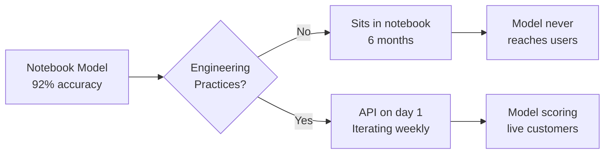
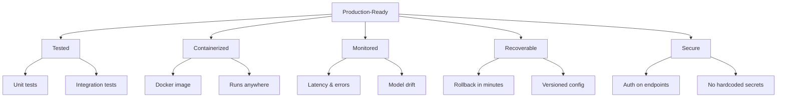
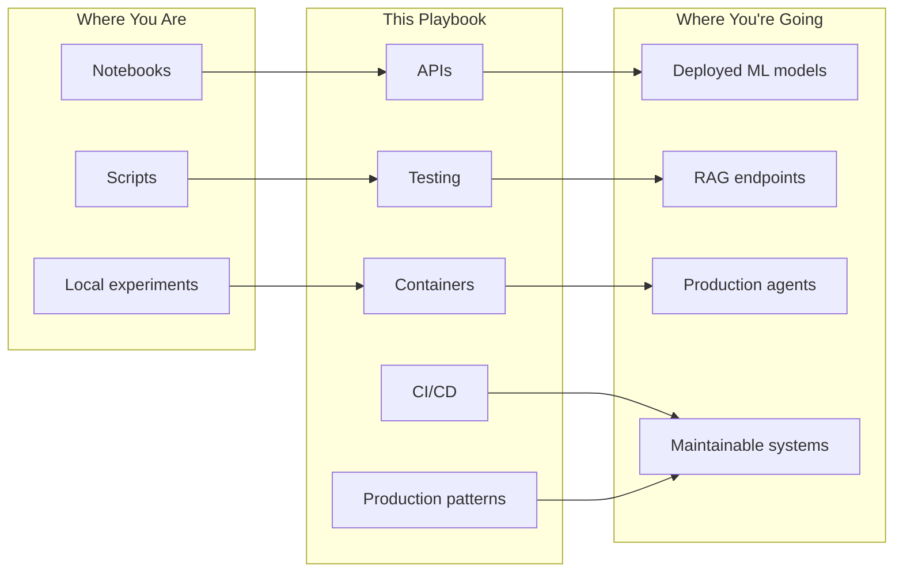

# Software Engineering for Production Systems -- Why It Matters

## The Gap

There is a gap between "it works in my notebook" and "it runs in production." Every AI/Data engineer hits it. The notebook runs perfectly on your laptop. The model scores 92% accuracy. The RAG pipeline retrieves relevant documents. The agent chains tools together correctly.

Then someone asks: "How do we deploy this?"

And the answer is silence.

This gap is not about intelligence or skill. It is about engineering practices that were never taught alongside data science and machine learning. This playbook closes that gap.

---

## Two Teams, Same Model

**Team A** builds a churn prediction model. Accuracy: 92%. They present it in a Jupyter notebook during a sprint review. Leadership is impressed. The notebook sits in a shared drive. Six months later, the model has never scored a single live customer. The data scientist who built it has moved to another project. Nobody else can run it. The notebook references a CSV that no longer exists.

**Team B** builds the same model. Same accuracy. But on day one, they wrap it in a FastAPI endpoint. They write five unit tests. They containerize it with Docker. They set up a GitHub Actions pipeline that runs tests on every push. Within a week, the model is scoring live customers through an internal API. They iterate weekly -- improving features, retraining, monitoring drift.

Both teams had the same technical ability. The difference was software engineering practice.

---

## Why AI/Data Engineers Need Software Engineering

You already know how to build models, pipelines, and agents. What you need is the engineering scaffold that makes them usable by other people and systems.

| Concern | Without SWE Practices | With SWE Practices |
|---|---|---|
| **Reliability** | "It worked when I ran it" | Automated tests prove it works on every change |
| **Collaboration** | One person understands the code | Any team member can read, modify, and deploy |
| **Maintainability** | Spaghetti code in one long notebook | Modular code with clear separation of concerns |
| **Deployability** | Manual steps to run anything | One command to build, test, and deploy |
| **Recoverability** | "We need to rebuild from scratch" | Roll back to the last working version in seconds |

---

## What "Production-Ready" Actually Means

A system is production-ready when it meets five criteria:

### 1. Tested
Automated tests verify that the system behaves correctly. Unit tests cover individual functions. Integration tests cover components working together. You do not deploy without passing tests.

### 2. Containerized
The system runs in a Docker container. It does not depend on your laptop's Python version, your local file paths, or packages you installed six months ago. If it runs in the container, it runs anywhere.

### 3. Monitored
You know when the system is healthy and when it is not. You track request latency, error rates, model prediction distributions, and resource usage. You find out about problems before your users do.

### 4. Recoverable
When something breaks -- and it will -- you can roll back to the previous version in minutes. Database migrations are reversible. Configuration changes are version-controlled. There is no single point of failure that requires rebuilding from scratch.

### 5. Secure
API endpoints require authentication. Secrets are not hardcoded. Data in transit is encrypted. Access is scoped to what each service needs and nothing more.

---

## The Cost of Skipping Engineering

Technical debt is not an abstract concept. It has concrete consequences.

**Fragile systems.** A pipeline that breaks when the input schema changes by one column. A model endpoint that crashes under 10 concurrent requests because nobody tested concurrency. A RAG system that returns garbage when the vector store index is rebuilt.

**"Only one person understands this."** The most dangerous sentence in engineering. When the person who wrote the notebook leaves, the system becomes a black box. No documentation, no tests, no clear entry point. The team either reverse-engineers it or rewrites it.

**Compounding slowness.** Every shortcut today becomes a tax on tomorrow. Skipping tests means bugs reach production. Skipping containers means "works on my machine" arguments. Skipping CI/CD means manual, error-prone deployments. These costs compound. A team that moves fast without engineering practices will move slower and slower over time.

**Deployment paralysis.** The model is ready. The pipeline is ready. But deploying it requires a two-day manual process involving SSH, screen sessions, and a prayer. So nobody deploys. Features pile up. The gap between what is built and what is live grows wider.

---

## What This Playbook Covers

This playbook takes you from notebook to production. It assumes you can write Python and build AI/Data systems. It teaches you how to ship them.

The chapters build on each other:

| Chapter | What You Learn |
|---|---|
| 01 -- Why (this chapter) | Why production engineering matters |
| 02 -- Concepts | Core SWE concepts: APIs, testing, containers, CI/CD |
| 03 -- Hello World | Deploy an ML model as an API in 10 minutes |
| 04 -- How It Works | Deep dive into HTTP, REST, auth, error handling |
| 05 -- Building It | Build a complete production RAG service end-to-end |
| 06 -- Production Patterns | Testing strategies for AI/Data systems |
| 07 -- System Design | Docker and docker-compose for ML/AI workloads |
| 08 -- CI/CD | Automated pipelines from commit to production |
| 09 -- Observability and Troubleshooting | Observability for models, pipelines, and agents |
| 10 -- Decision Guide | Production patterns: retry, circuit breaker, feature flags |

---

## Quick Links

| Chapter | Title |
|---|---|
| [01 -- Why](01_Why.md) | Software Engineering for Production Systems -- Why It Matters |
| [02 -- Concepts](02_Concepts.md) | Software Engineering Concepts for AI/Data Systems |
| [03 -- Hello World](03_Hello_World.md) | Notebook to API in 10 Minutes |
| [04 -- How It Works](04_How_It_Works.md) | How Production Services Work |
| [05 -- Building It](05_Building_It.md) | Building a Complete Production Service |
| [06 -- Production Patterns](06_Production_Patterns.md) | Production Software Patterns |
| [07 -- System Design](07_System_Design.md) | System Design for AI/Data Servicesads |
| [08 -- CI/CD](08_Quality_Security_Governance.md) | Automated Pipelines from Commit to Production |
| [09 -- Observability and Troubleshooting](09_Observability_Troubleshooting.md) | Observability for Models, Pipelines, and Agents |
| [10 -- Decision Guide](10_Decision_Guide.md) | Production Patterns for Reliable Systems |
