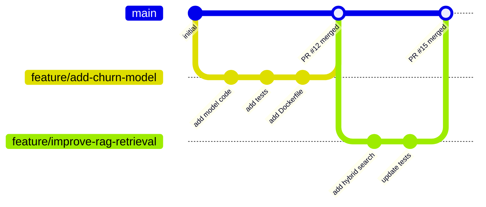
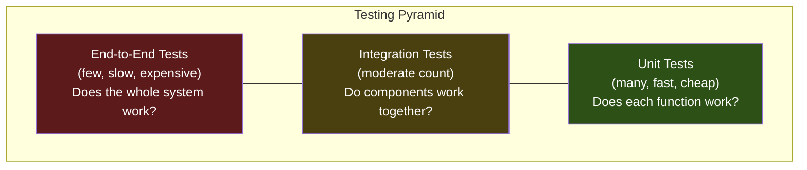
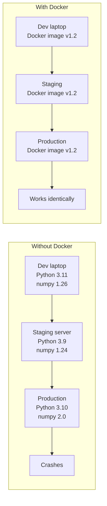
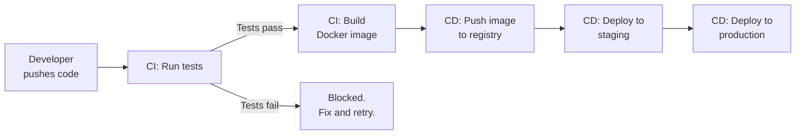
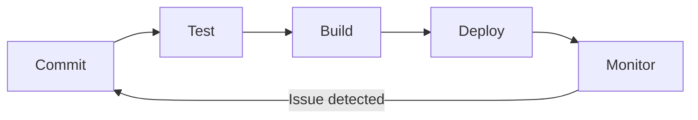

# Software Engineering Concepts for AI/Data Systems

This chapter covers the core concepts you need before building production services. Each concept is explained in the context of deploying ML models, RAG pipelines, and agents -- not generic web development.

---

## APIs -- The Interface to Your System

An API (Application Programming Interface) is how other systems talk to yours. When you build a model in a notebook, you call `model.predict()` directly. In production, something else calls your model -- a web app, a mobile app, another service, a cron job. The API is the contract between your system and everything that consumes it.

**REST** (Representational State Transfer) is the most common API style. It uses HTTP, the same protocol your browser uses. Resources are URLs. Actions are HTTP methods.

| HTTP Method | Purpose | Example |
|---|---|---|
| `GET` | Read a resource | `GET /models/churn-v2/status` |
| `POST` | Create or submit | `POST /predict` with input features |
| `PUT` | Replace a resource | `PUT /models/churn-v2` to deploy a new version |
| `DELETE` | Remove a resource | `DELETE /models/churn-v1` to retire an old model |

**Request and Response:**

```
Request:
  POST /predict HTTP/1.1
  Content-Type: application/json
  Authorization: Bearer <token>

  {"customer_id": 12345, "tenure_months": 24, "monthly_spend": 89.50}

Response:
  HTTP/1.1 200 OK
  Content-Type: application/json

  {"prediction": "no_churn", "confidence": 0.87, "model_version": "churn-v2"}
```

Every API call has this structure: a method, a URL, headers, and optionally a body. The response has a status code, headers, and a body. This is the fundamental communication pattern for all production services.

---

## Microservices vs. Monolith

How you structure your system matters. There are two ends of the spectrum.

A **monolith** is one application that does everything. Your API, your model inference, your data processing, your RAG retrieval -- all in one codebase, one deployment.

**Microservices** split each concern into its own independently deployable service. The prediction service, the retrieval service, the embedding service -- each runs separately and communicates over HTTP or message queues.

| Factor | Monolith | Microservices |
|---|---|---|
| **Complexity** | Low at first, grows over time | High at first, stays manageable |
| **Deployment** | Deploy everything together | Deploy each service independently |
| **Scaling** | Scale the whole app | Scale only what needs it (e.g., just the inference service) |
| **Team size** | Works well for 1-5 engineers | Works well for 5+ engineers |
| **Debugging** | One log, one process | Distributed tracing across services |
| **Best for** | Early-stage, single team, MVP | Multiple teams, different scaling needs |
| **AI/Data example** | RAG app: API + retrieval + generation in one service | RAG app: embedding service + vector store + generation service + API gateway |

**Start with a monolith. Extract microservices when you feel the pain.** Most AI/Data systems should begin as a single well-structured application. When one component needs to scale independently (e.g., your embedding service is a bottleneck), extract it.

---

## The 12-Factor App (Five That Matter Most)

The 12-Factor App is a methodology for building production applications. Not all 12 factors are equally important for AI/Data systems. These five are non-negotiable.

### 1. Codebase -- One repo, many deploys

One Git repository per service. The same codebase deploys to staging and production. You do not copy files between environments. You do not maintain separate codebases for "dev" and "prod."

### 2. Config -- Environment variables, not code

Database URLs, API keys, model paths, feature flags -- all come from environment variables. Never hardcode `OPENAI_API_KEY = "sk-..."` in your source code. This is both a security requirement and a deployment requirement. The same code runs in dev (pointing to a local database) and production (pointing to a managed database) by changing only environment variables.

### 3. Dependencies -- Explicitly declare and isolate

Every dependency is listed in `requirements.txt` or `pyproject.toml` with pinned versions. `pip install numpy` is not a dependency declaration. `numpy==1.26.4` in a requirements file is. This prevents "it worked on my machine" because your machine had numpy 1.26 and production got numpy 2.0.

### 4. Backing services -- Treat attached resources as replaceable

Your PostgreSQL database, your Redis cache, your vector store, your S3 bucket -- they are all "backing services" accessed via URLs from config. You can swap a local PostgreSQL for a managed RDS instance by changing one environment variable. Your code does not know or care which one it is talking to.

### 5. Logs -- Treat logs as event streams

Do not write log files. Write to stdout. Let the infrastructure (Docker, Kubernetes, CloudWatch) collect and route logs. In your Python code: `logging.info("Prediction served", extra={"model": "v2", "latency_ms": 45})`. In production, these stream to a log aggregator where you can search, filter, and alert.

---

## Design Patterns That Matter

Patterns are reusable solutions to common problems. These four appear constantly in production AI/Data systems.

### Repository Pattern

Separates data access from business logic. Your service layer calls `repo.get_embeddings(doc_id)` without knowing whether embeddings come from PostgreSQL, Pinecone, or a local FAISS index.

```python
# Without pattern: business logic tangled with data access
def search(query):
    conn = psycopg2.connect(DATABASE_URL)
    cursor = conn.cursor()
    cursor.execute("SELECT * FROM embeddings WHERE ...")
    # ... mix of SQL and business logic

# With pattern: clean separation
class EmbeddingRepository:
    def find_similar(self, vector, top_k=5):
        # Data access isolated here
        ...

class SearchService:
    def __init__(self, repo: EmbeddingRepository):
        self.repo = repo

    def search(self, query):
        embedding = self.embed(query)
        return self.repo.find_similar(embedding, top_k=5)
```

### Dependency Injection

Pass dependencies into a class instead of creating them inside. This makes testing possible -- you inject a mock database in tests and a real database in production.

```python
# Hard to test: creates its own database connection
class PredictionService:
    def __init__(self):
        self.db = PostgresDatabase("production-url")

# Easy to test: accepts any database
class PredictionService:
    def __init__(self, db: Database):
        self.db = db

# In production
service = PredictionService(db=PostgresDatabase(os.getenv("DATABASE_URL")))
# In tests
service = PredictionService(db=FakeDatabase())
```

### Factory Pattern

Creates objects without exposing creation logic. Useful when you need different model versions or different vector stores depending on configuration.

```python
def create_model(config: dict):
    if config["type"] == "sklearn":
        return SklearnModel(config["path"])
    elif config["type"] == "pytorch":
        return PyTorchModel(config["path"])
    elif config["type"] == "onnx":
        return ONNXModel(config["path"])
```

### Strategy Pattern

Swap algorithms at runtime. A RAG system might use different retrieval strategies (dense, sparse, hybrid) depending on the query type.

```python
class DenseRetrieval:
    def retrieve(self, query, top_k):
        # Vector similarity search
        ...

class HybridRetrieval:
    def retrieve(self, query, top_k):
        # BM25 + vector similarity
        ...

class RAGService:
    def __init__(self, retriever):
        self.retriever = retriever

    def answer(self, query):
        docs = self.retriever.retrieve(query, top_k=5)
        return self.generate(query, docs)
```

---

## Version Control -- Git Fundamentals

Git is the foundation of collaboration and deployment. If your code is not in Git, it does not exist in a production context.

**Branching strategy for AI/Data teams:**



**The workflow:**

1. Create a branch from `main` for each feature or fix
2. Make commits with clear messages: "Add churn prediction endpoint with input validation"
3. Open a Pull Request (PR) for review
4. CI runs tests automatically on the PR
5. After review and passing tests, merge to `main`
6. `main` is always deployable

**Merge strategies:**

| Strategy | When to Use |
|---|---|
| **Merge commit** | Default. Preserves full branch history. |
| **Squash and merge** | Clean history. Combines all branch commits into one. Best for feature branches. |
| **Rebase and merge** | Linear history. Use when you want a clean commit log without merge commits. |

---

## The Testing Pyramid

Tests are not optional in production systems. They are the only way to know your system works before your users find out it does not.



| Level | What It Tests | AI/Data Example | Speed |
|---|---|---|---|
| **Unit** | Individual functions | Does `preprocess_features()` handle nulls correctly? | Milliseconds |
| **Integration** | Components together | Does the API endpoint call the model and return valid JSON? | Seconds |
| **End-to-End** | Full system flow | Does a request hit the API, retrieve from the vector store, call the LLM, and return an answer? | Minutes |

Write many unit tests. Write some integration tests. Write few end-to-end tests. This ratio keeps your test suite fast enough to run on every commit.

---

## Containers -- Docker

Docker solves "it works on my machine." A container packages your code, dependencies, and runtime into a single image that runs identically everywhere.

**Analogy:** Before shipping containers (the physical ones), loading a cargo ship meant handling thousands of individual items of different shapes and sizes. Shipping containers standardized this -- everything goes in a standard box. Docker does the same for software. Your ML model, your Python dependencies, your system libraries -- all in one standard box.



A **Dockerfile** defines how to build the image. A **docker-compose.yml** defines how to run multiple containers together (your app + database + vector store).

---

## CI/CD -- Continuous Integration and Continuous Deployment

CI/CD automates the path from code change to production.

**Continuous Integration (CI):** Every push triggers automated tests. If tests fail, the merge is blocked. This catches bugs before they reach production.

**Continuous Deployment (CD):** After tests pass, the code is automatically built into a Docker image and deployed. No manual steps. No SSH. No "can you deploy this when you get a chance?"



**Tools:** GitHub Actions (most common for teams already on GitHub), GitLab CI, Jenkins, CircleCI. This playbook uses GitHub Actions.

---

## Infrastructure as Code

Instead of clicking through AWS or GCP consoles to create resources, you define them in code.

**Terraform** uses its own language (HCL) to define infrastructure:

```hcl
resource "aws_ecs_service" "prediction_api" {
  name            = "prediction-api"
  cluster         = aws_ecs_cluster.main.id
  task_definition = aws_ecs_task_definition.prediction.arn
  desired_count   = 2
}
```

**AWS CDK** and **CDKTF** let you define infrastructure in Python, TypeScript, or other languages you already know.

The benefit: your infrastructure is version-controlled, reviewable, and reproducible. You can tear down and recreate an entire environment from code.

---

## The Path from Code to Production

Every change follows this path:



1. **Commit** -- Developer pushes code to a feature branch
2. **Test** -- CI runs unit tests, integration tests, linting
3. **Build** -- Docker image is built with the new code
4. **Deploy** -- Image is deployed to staging, then production
5. **Monitor** -- Logs, metrics, and alerts track system health
6. **Iterate** -- Monitoring reveals issues or improvement opportunities, loop back to commit

This loop runs continuously. A mature team completes it multiple times per day. Every concept in this chapter supports one or more steps in this loop.

---

## Quick Links

| Chapter | Title |
|---|---|
| [01 -- Why](01_Why.md) | Software Engineering for Production Systems -- Why It Matters |
| [02 -- Concepts](02_Concepts.md) | Software Engineering Concepts for AI/Data Systems |
| [03 -- Hello World](03_Hello_World.md) | Notebook to API in 10 Minutes |
| [04 -- How It Works](04_How_It_Works.md) | How Production Services Work |
| [05 -- Building It](05_Building_It.md) | Building a Complete Production Service |
| [06 -- Production Patterns](06_Production_Patterns.md) | Production Software Patterns |
| [07 -- System Design](07_System_Design.md) | System Design for AI/Data Servicesads |
| [08 -- CI/CD](08_Quality_Security_Governance.md) | Automated Pipelines from Commit to Production |
| [09 -- Observability and Troubleshooting](09_Observability_Troubleshooting.md) | Observability for Models, Pipelines, and Agents |
| [10 -- Decision Guide](10_Decision_Guide.md) | Production Patterns for Reliable Systems |
