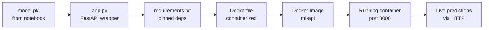

# Hello World -- Notebook to API in 10 Minutes

You have a trained ML model in a notebook. By the end of this chapter, it will be running as an API endpoint inside a Docker container. This is not a toy exercise. This is the exact pattern used to deploy models in production.

---

## What You Start With

A trained scikit-learn model saved as a pickle file. In your notebook, you did something like this:

```python
import pickle
from sklearn.ensemble import RandomForestClassifier

# Train
model = RandomForestClassifier()
model.fit(X_train, y_train)

# Save
with open("model.pkl", "wb") as f:
    pickle.dump(model, f)
```

You now have `model.pkl`. That file contains your trained model. Everything below turns it into a live API.

---

## Step 1: Create the API

Create a file called `app.py`:

```python
from fastapi import FastAPI
import pickle

app = FastAPI()

# Load model once at startup, not on every request
with open("model.pkl", "rb") as f:
    model = pickle.load(f)


@app.get("/health")
def health():
    return {"status": "healthy"}


@app.post("/predict")
def predict(data: dict):
    features = [list(data.values())]
    prediction = model.predict(features)
    return {"prediction": prediction[0]}
```

That is a complete API. The `/health` endpoint lets you check if the service is running. The `/predict` endpoint accepts features and returns a prediction.

**You Should See:** A file called `app.py` with 16 lines of code. No frameworks to learn beyond FastAPI. No boilerplate.

---

## Step 2: Install Dependencies

Create a file called `requirements.txt`:

```
fastapi==0.115.0
uvicorn==0.30.0
scikit-learn==1.5.0
```

Install them:

```bash
pip install -r requirements.txt
```

**You Should See:** Packages installing without errors. If you get version conflicts, check your Python version (3.10+ recommended).

---

## Step 3: Run It Locally

```bash
uvicorn app:app --reload --host 0.0.0.0 --port 8000
```

**You Should See:**

```
INFO:     Uvicorn running on http://0.0.0.0:8000 (Press CTRL+C to quit)
INFO:     Started reloader process
INFO:     Started server process
INFO:     Waiting for application startup.
INFO:     Application startup complete.
```

Your model is now serving predictions over HTTP. Open a browser to `http://localhost:8000/docs` and you get an interactive API documentation page for free -- FastAPI generates it automatically from your code.

---

## Step 4: Test It

Open a new terminal. Send a health check:

```bash
curl http://localhost:8000/health
```

**You Should See:**

```json
{"status": "healthy"}
```

Now send a prediction request. Adjust the feature names and values to match your model:

```bash
curl -X POST http://localhost:8000/predict \
  -H "Content-Type: application/json" \
  -d '{"tenure_months": 24, "monthly_spend": 89.50, "support_tickets": 2}'
```

**You Should See:**

```json
{"prediction": "no_churn"}
```

Or whatever your model returns. The point is: your notebook model is now responding to HTTP requests.

---

## Step 5: Containerize It

Create a file called `Dockerfile`:

```dockerfile
FROM python:3.11-slim
WORKDIR /app
COPY requirements.txt .
RUN pip install --no-cache-dir -r requirements.txt
COPY . .
CMD ["uvicorn", "app:app", "--host", "0.0.0.0", "--port", "8000"]
```

Six lines. Here is what each does:

| Line | Purpose |
|---|---|
| `FROM python:3.11-slim` | Start from an official Python image (slim = smaller, no extras) |
| `WORKDIR /app` | Set the working directory inside the container |
| `COPY requirements.txt .` | Copy dependencies file first (for Docker layer caching) |
| `RUN pip install ...` | Install Python packages |
| `COPY . .` | Copy your application code |
| `CMD [...]` | Define the command to run when the container starts |

Build the image:

```bash
docker build -t ml-api .
```

**You Should See:**

```
[+] Building 45.2s (9/9) FINISHED
 => => naming to docker.io/library/ml-api
```

Run the container:

```bash
docker run -p 8000:8000 ml-api
```

**You Should See:** The same Uvicorn startup output as before. Test it with the same curl commands. The behavior is identical, but now it runs inside a container that you can ship anywhere.

---

## Step 6: Verify the Full Flow

Run through every check:

```bash
# Health check
curl http://localhost:8000/health

# Prediction
curl -X POST http://localhost:8000/predict \
  -H "Content-Type: application/json" \
  -d '{"tenure_months": 24, "monthly_spend": 89.50, "support_tickets": 2}'

# Interactive docs (open in browser)
open http://localhost:8000/docs
```

**You Should See:**
- Health returns `{"status": "healthy"}`
- Predict returns a valid prediction
- `/docs` shows an interactive Swagger UI page with your endpoints listed

---

## What You Just Did



In 10 minutes, you went from a pickle file to a containerized API serving live predictions. This is not a demo. This is the foundation of every production ML deployment.

---

## What This Does NOT Have Yet

This Hello World is intentionally minimal. It serves predictions, but it is not production-ready. Here is what is missing and where in this playbook you will add it:

| Missing | Why It Matters | Chapter |
|---|---|---|
| Input validation | Malformed requests crash the server | 04 -- How It Works |
| Error handling | Unhandled exceptions return ugly 500 errors | 04 -- How It Works |
| Authentication | Anyone can call your endpoint | 04 -- How It Works |
| Tests | No way to verify correctness automatically | 05 -- Building It |
| Service layer | Business logic mixed with API layer | 05 -- Building It |
| Multi-stage Docker build | Image is larger than it needs to be | 07 -- System Design |
| CI/CD pipeline | Deployment is manual | 08 -- CI/CD |
| Monitoring | No visibility into latency, errors, or model drift | 09 -- Observability and Troubleshooting |
| Retry logic | One failure = one lost request | 10 -- Decision Guide |

Every chapter that follows adds one or more of these layers. By chapter 05, you will have a complete production service. By chapter 10, you will have a resilient one.

---

## Your Project Structure So Far

```
ml-api/
    app.py              # FastAPI application
    model.pkl           # Trained model
    requirements.txt    # Pinned dependencies
    Dockerfile          # Container definition
```

Four files. This is the seed of every production ML service.

---

## Quick Links

| Chapter | Title |
|---|---|
| [01 -- Why](01_Why.md) | Software Engineering for Production Systems -- Why It Matters |
| [02 -- Concepts](02_Concepts.md) | Software Engineering Concepts for AI/Data Systems |
| [03 -- Hello World](03_Hello_World.md) | Notebook to API in 10 Minutes |
| [04 -- How It Works](04_How_It_Works.md) | How Production Services Work |
| [05 -- Building It](05_Building_It.md) | Building a Complete Production Service |
| [06 -- Production Patterns](06_Production_Patterns.md) | Production Software Patterns |
| [07 -- System Design](07_System_Design.md) | System Design for AI/Data Servicesads |
| [08 -- CI/CD](08_Quality_Security_Governance.md) | Automated Pipelines from Commit to Production |
| [09 -- Observability and Troubleshooting](09_Observability_Troubleshooting.md) | Observability for Models, Pipelines, and Agents |
| [10 -- Decision Guide](10_Decision_Guide.md) | Production Patterns for Reliable Systems |
