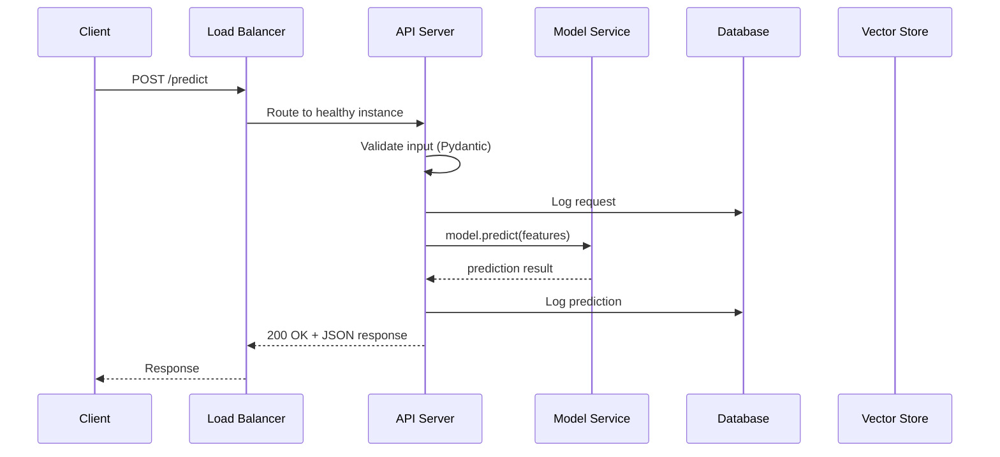
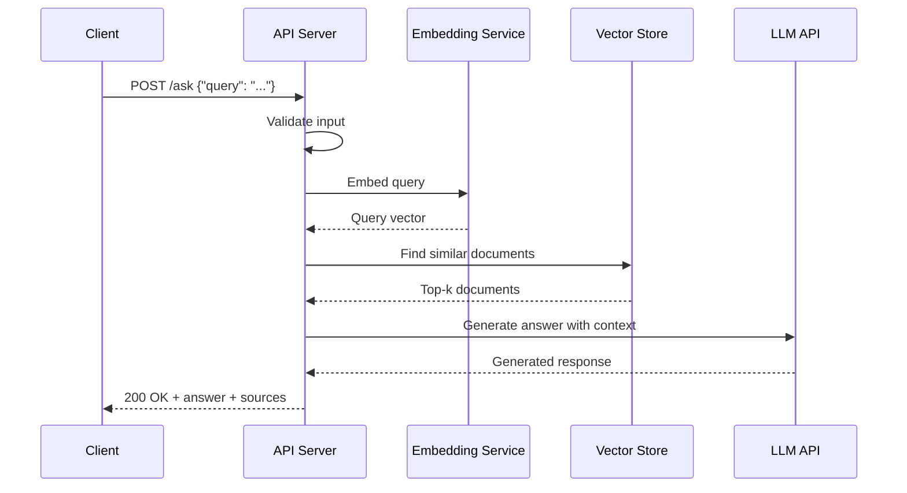
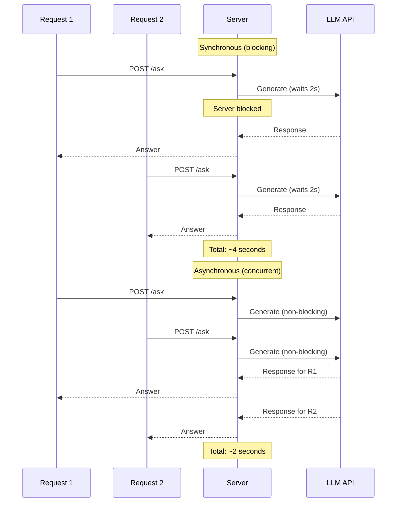
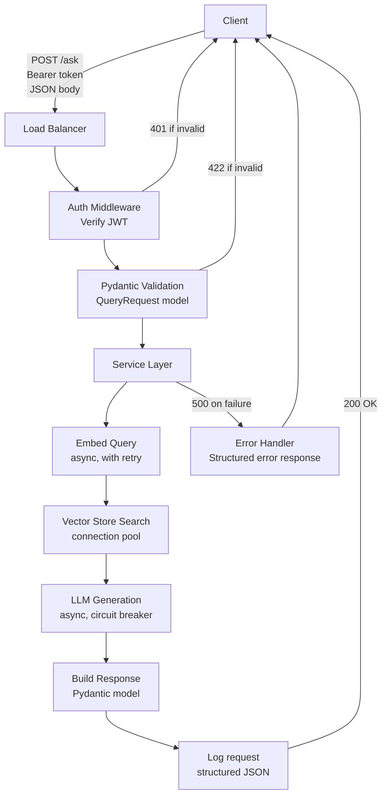

# How Production Services Work

Chapter 03 got a model running as an API. This chapter explains the mechanics underneath -- HTTP, REST, authentication, serialization, async execution, error handling, and connection management. These are the building blocks of every production service, whether you are deploying an ML model, a RAG endpoint, or a diagnostic agent.

---

## HTTP Deep Dive

HTTP (HyperText Transfer Protocol) is the language that clients and servers use to communicate. Every API call you make -- every prediction request, every document retrieval, every health check -- is an HTTP conversation.

### Methods

| Method | Meaning | Idempotent | AI/Data Example |
|---|---|---|---|
| `GET` | Retrieve a resource | Yes | Get model status, retrieve cached prediction |
| `POST` | Submit data for processing | No | Send features for prediction, submit a query for RAG |
| `PUT` | Replace a resource entirely | Yes | Deploy a new model version |
| `PATCH` | Partially update a resource | No | Update model metadata (e.g., change description) |
| `DELETE` | Remove a resource | Yes | Retire an old model version |

**Idempotent** means calling it multiple times has the same effect as calling it once. `GET /models/v2` returns the same model every time. `DELETE /models/v1` deletes it once; calling it again changes nothing. `POST /predict` is not idempotent -- each call may process different data and have different side effects (logging, billing).

### Status Codes

Status codes tell the client what happened. Memorize these five groups:

| Code | Meaning | When You See It |
|---|---|---|
| **200 OK** | Success | Prediction returned successfully |
| **201 Created** | Resource created | New model version registered |
| **400 Bad Request** | Client sent invalid data | Missing required feature, wrong data type |
| **401 Unauthorized** | No credentials or invalid credentials | Missing API key, expired JWT token |
| **403 Forbidden** | Valid credentials but insufficient permissions | User cannot access admin endpoints |
| **404 Not Found** | Resource does not exist | Requested a model version that was never deployed |
| **422 Unprocessable Entity** | Valid JSON but fails validation | Feature value out of expected range |
| **429 Too Many Requests** | Rate limit exceeded | Client sending too many predictions per second |
| **500 Internal Server Error** | Server broke | Unhandled exception in your code |
| **502 Bad Gateway** | Upstream service failed | Your service could not reach the vector store |
| **503 Service Unavailable** | Server overloaded or in maintenance | Model is loading, not ready yet |

**Rule of thumb:** 2xx = success, 4xx = client's fault, 5xx = server's fault. Your API should never return a 500 if you can help it. Every foreseeable error should return a 4xx with a clear message.

### Headers and Body

**Headers** carry metadata: content type, authentication tokens, caching directives, request IDs for tracing.

**Body** carries the payload: input features for prediction, query text for RAG, the response with results.

```
POST /predict HTTP/1.1
Host: api.example.com
Content-Type: application/json          # I'm sending JSON
Authorization: Bearer eyJhbGciOi...     # My credentials
X-Request-ID: req-abc-123              # For tracing this request through logs

{"tenure_months": 24, "monthly_spend": 89.50}
```

---

## REST Conventions

REST maps CRUD operations (Create, Read, Update, Delete) to HTTP methods on resource URLs.

| Operation | HTTP | URL | Body |
|---|---|---|---|
| List all models | `GET` | `/models` | -- |
| Get one model | `GET` | `/models/churn-v2` | -- |
| Deploy a model | `POST` | `/models` | `{"name": "churn-v3", "path": "s3://..."}` |
| Replace a model | `PUT` | `/models/churn-v2` | Full model definition |
| Retire a model | `DELETE` | `/models/churn-v1` | -- |
| Get predictions | `POST` | `/models/churn-v2/predict` | `{"features": {...}}` |

**Resources are nouns, not verbs.** `/predict` is acceptable as a shortcut, but `/models/{id}/predict` is more RESTful. Use plural nouns: `/models`, not `/model`.

---

## Request/Response Lifecycle

When a client sends a request, here is what happens:



For a RAG endpoint, the flow includes the vector store:



Every production service follows this pattern: receive, validate, process, respond. The processing step varies (model inference, retrieval + generation, tool execution for agents), but the structure is the same.

---

## Serialization: JSON and Pydantic

**Serialization** is converting data structures to and from a transmittable format. JSON is the standard for HTTP APIs.

Raw dictionaries work but provide no validation:

```python
@app.post("/predict")
def predict(data: dict):  # Accepts literally anything
    features = list(data.values())  # Crashes if data is wrong shape
    ...
```

**Pydantic models** define the exact shape of your data and validate it automatically:

```python
from pydantic import BaseModel, Field


class PredictionRequest(BaseModel):
    tenure_months: int = Field(..., ge=0, description="Customer tenure in months")
    monthly_spend: float = Field(..., gt=0, description="Monthly spend in dollars")
    support_tickets: int = Field(default=0, ge=0)


class PredictionResponse(BaseModel):
    prediction: str
    confidence: float = Field(..., ge=0.0, le=1.0)
    model_version: str


@app.post("/predict", response_model=PredictionResponse)
def predict(request: PredictionRequest):
    features = [request.tenure_months, request.monthly_spend, request.support_tickets]
    prediction = model.predict([features])
    confidence = model.predict_proba([features]).max()
    return PredictionResponse(
        prediction=prediction[0],
        confidence=float(confidence),
        model_version="churn-v2"
    )
```

**What Pydantic gives you:**
- Automatic type checking (send a string for `tenure_months` and get a clear 422 error)
- Range validation (`ge=0` means greater than or equal to zero)
- Documentation (FastAPI uses Pydantic models to generate the `/docs` page)
- Serialization (the response is automatically converted to JSON)

If a client sends `{"tenure_months": "twenty-four"}`, they get:

```json
{
  "detail": [
    {
      "loc": ["body", "tenure_months"],
      "msg": "Input should be a valid integer",
      "type": "int_parsing"
    }
  ]
}
```

No crash. No 500. A clear 422 with a message the client can act on.

---

## Authentication

Production APIs must verify who is calling them.

### API Keys

Simplest approach. The client includes a key in the header. The server checks it against a list of valid keys.

```python
from fastapi import Header, HTTPException


@app.post("/predict")
def predict(request: PredictionRequest, x_api_key: str = Header(...)):
    if x_api_key not in VALID_API_KEYS:
        raise HTTPException(status_code=401, detail="Invalid API key")
    ...
```

**When to use:** Internal services, simple integrations, MVP.

### JWT Tokens (JSON Web Tokens)

A signed token that encodes the user's identity and permissions. The client logs in once, receives a token, and includes it in subsequent requests. The server verifies the signature without hitting a database.

```python
from fastapi import Depends
from fastapi.security import HTTPBearer, HTTPAuthorizationCredentials
import jwt

security = HTTPBearer()


def verify_token(credentials: HTTPAuthorizationCredentials = Depends(security)):
    try:
        payload = jwt.decode(credentials.credentials, SECRET_KEY, algorithms=["HS256"])
        return payload
    except jwt.ExpiredSignatureError:
        raise HTTPException(status_code=401, detail="Token expired")
    except jwt.InvalidTokenError:
        raise HTTPException(status_code=401, detail="Invalid token")
```

**When to use:** User-facing APIs, multi-tenant systems, when you need to encode permissions in the token.

### OAuth 2.0

Delegates authentication to a provider (Google, GitHub, Okta). The client authenticates with the provider and receives a token your API can verify.

**When to use:** Enterprise integrations, SSO (Single Sign-On) requirements, when users already have accounts with an identity provider.

| Method | Complexity | Best For |
|---|---|---|
| API Keys | Low | Internal services, MVPs |
| JWT Tokens | Medium | User-facing APIs, multi-tenant |
| OAuth 2.0 | High | Enterprise, SSO |

---

## Async vs. Sync

Python's `async`/`await` lets your server handle multiple requests concurrently without threads. But it is not always the right choice.

### Sync (Synchronous)

The server processes one request at a time per worker. Each request blocks until complete.

```python
@app.post("/predict")
def predict(request: PredictionRequest):  # def = synchronous
    # CPU-bound: model inference uses the CPU fully
    prediction = model.predict([request.features])
    return {"prediction": prediction[0]}
```

**Use sync for:** CPU-bound work like model inference, heavy data processing, anything that keeps the CPU busy.

### Async (Asynchronous)

The server can handle other requests while waiting for I/O (network calls, database queries, file reads).

```python
@app.post("/ask")
async def ask(request: QueryRequest):  # async def = asynchronous
    # I/O-bound: waiting for external services
    embedding = await embedding_client.embed(request.query)
    documents = await vector_store.search(embedding, top_k=5)
    answer = await llm_client.generate(request.query, documents)
    return {"answer": answer, "sources": documents}
```

**Use async for:** I/O-bound work like calling LLM APIs, querying vector stores, fetching from databases. While waiting for the LLM response, the server can handle other incoming requests.



**The rule:** If your endpoint waits for external services (LLM calls, database queries, HTTP requests), use `async`. If it does CPU-heavy computation (model inference, data transformation), use `def`.

---

## Connection Management

Opening a new database connection or HTTP client for every request is slow and wasteful. Production services manage connections efficiently.

### Database Connection Pools

A pool maintains a set of open connections. When a request needs the database, it borrows a connection from the pool. When done, it returns it.

```python
from sqlalchemy.ext.asyncio import create_async_engine, AsyncSession
from sqlalchemy.orm import sessionmaker

engine = create_async_engine(
    DATABASE_URL,
    pool_size=10,        # Keep 10 connections open
    max_overflow=20,     # Allow up to 20 more under load
    pool_timeout=30,     # Wait 30s for a connection before failing
)
AsyncSessionLocal = sessionmaker(engine, class_=AsyncSession)


async def get_db():
    async with AsyncSessionLocal() as session:
        yield session
```

### HTTP Client Reuse

If your service calls external APIs (LLM providers, embedding services), reuse the HTTP client:

```python
import httpx

# Create once at startup
http_client = httpx.AsyncClient(
    timeout=30.0,
    limits=httpx.Limits(max_connections=100, max_keepalive_connections=20)
)

# Use in every request
async def call_llm(prompt: str):
    response = await http_client.post(LLM_URL, json={"prompt": prompt})
    return response.json()

# Close on shutdown
@app.on_event("shutdown")
async def shutdown():
    await http_client.aclose()
```

---

## Error Handling

Production services fail gracefully. They never return raw stack traces to clients. They provide structured errors that clients can programmatically handle.

### Structured Error Responses

```python
from fastapi import HTTPException
from pydantic import BaseModel


class ErrorResponse(BaseModel):
    error: str
    detail: str
    request_id: str


@app.post("/predict")
def predict(request: PredictionRequest):
    try:
        prediction = model.predict([request.features])
    except ValueError as e:
        raise HTTPException(
            status_code=400,
            detail={"error": "invalid_input", "detail": str(e), "request_id": "req-123"}
        )
    except Exception as e:
        logger.error(f"Prediction failed: {e}", exc_info=True)
        raise HTTPException(
            status_code=500,
            detail={"error": "prediction_failed", "detail": "Internal error", "request_id": "req-123"}
        )
```

### Retry Logic

External services fail. LLM APIs return 503. Vector stores timeout. Retries with exponential backoff handle transient failures:

```python
import asyncio
import random


async def call_with_retry(func, max_retries=3, base_delay=1.0):
    for attempt in range(max_retries):
        try:
            return await func()
        except Exception as e:
            if attempt == max_retries - 1:
                raise
            delay = base_delay * (2 ** attempt) + random.uniform(0, 1)
            logger.warning(f"Attempt {attempt + 1} failed: {e}. Retrying in {delay:.1f}s")
            await asyncio.sleep(delay)
```

The `random.uniform(0, 1)` is jitter -- it prevents multiple clients from retrying at the exact same time and overwhelming the server.

### Circuit Breakers

If a downstream service is consistently failing, stop calling it. A circuit breaker tracks failures and "opens" the circuit after a threshold, returning a fallback response immediately instead of waiting for timeouts.

```python
class CircuitBreaker:
    def __init__(self, failure_threshold=5, reset_timeout=60):
        self.failures = 0
        self.threshold = failure_threshold
        self.reset_timeout = reset_timeout
        self.last_failure_time = None
        self.is_open = False

    async def call(self, func, fallback=None):
        if self.is_open:
            if time.time() - self.last_failure_time > self.reset_timeout:
                self.is_open = False  # Try again (half-open state)
            elif fallback:
                return fallback()
            else:
                raise ServiceUnavailableError("Circuit breaker open")

        try:
            result = await func()
            self.failures = 0
            return result
        except Exception as e:
            self.failures += 1
            self.last_failure_time = time.time()
            if self.failures >= self.threshold:
                self.is_open = True
            raise
```

**Where this matters for AI/Data systems:**
- LLM API goes down: circuit breaker kicks in, returns a cached response or a "service degraded" message instead of timing out for 30 seconds per request
- Vector store is overloaded: circuit breaker stops queries, returns "search temporarily unavailable"
- Embedding service is slow: circuit breaker prevents cascading timeouts across your whole system

---

## Putting It All Together

A production RAG endpoint combines everything from this chapter:



Every layer serves a purpose. Authentication stops unauthorized access. Validation stops bad data. Retry logic handles transient failures. Circuit breakers prevent cascading failures. Connection pools handle concurrent load. Structured errors give clients actionable information.

This is not over-engineering. This is what it takes to run a service that stays up when real traffic hits it.

---

## Quick Links

| Chapter | Title |
|---|---|
| [01 -- Why](01_Why.md) | Software Engineering for Production Systems -- Why It Matters |
| [02 -- Concepts](02_Concepts.md) | Software Engineering Concepts for AI/Data Systems |
| [03 -- Hello World](03_Hello_World.md) | Notebook to API in 10 Minutes |
| [04 -- How It Works](04_How_It_Works.md) | How Production Services Work |
| [05 -- Building It](05_Building_It.md) | Building a Complete Production Service |
| [06 -- Production Patterns](06_Production_Patterns.md) | Production Software Patterns |
| [07 -- System Design](07_System_Design.md) | System Design for AI/Data Servicesads |
| [08 -- CI/CD](08_Quality_Security_Governance.md) | Automated Pipelines from Commit to Production |
| [09 -- Observability and Troubleshooting](09_Observability_Troubleshooting.md) | Observability for Models, Pipelines, and Agents |
| [10 -- Decision Guide](10_Decision_Guide.md) | Production Patterns for Reliable Systems |
