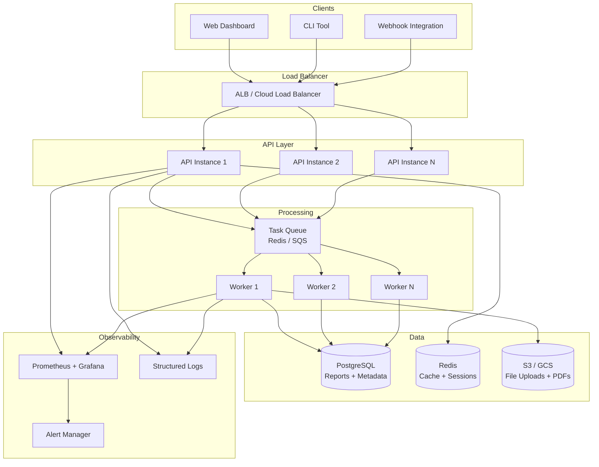
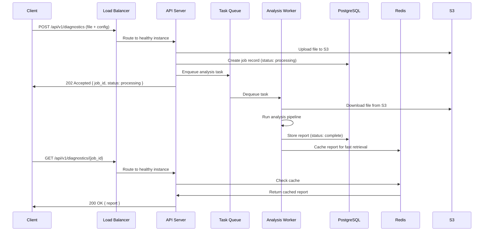

# System Design for AI/Data Services

**System design is not architecture astronomy. It is a repeatable process for answering "how do we build this so it works at scale, stays up, and does not get hacked?" This chapter gives you a 10-step framework and then applies it to a concrete system -- a production diagnostic API service.**

---

## The 10-Step System Design Framework

Every production system answers the same ten questions. Skip any of them and you will discover the gap in production -- at 2 AM, under load, with customers watching.

| Step | Question | What You Decide |
|:---|:---|:---|
| 1. Requirements | What must it do? What are the constraints? | Functional requirements, non-functional requirements, scale targets |
| 2. API Design | How do clients talk to it? | Endpoints, request/response contracts, versioning |
| 3. Data Storage | Where does data live? | SQL, NoSQL, vector DB, object storage, caching |
| 4. Service Architecture | How is the code organized? | Monolith, microservices, serverless |
| 5. Communication | How do services talk to each other? | Sync (REST/gRPC), async (queues), streaming |
| 6. Scaling | How does it handle growth? | Horizontal, vertical, auto-scaling, load balancing |
| 7. Caching | What can we avoid recomputing? | Cache layers, invalidation strategy, TTLs |
| 8. Reliability | What happens when things fail? | Redundancy, failover, disaster recovery, retries |
| 9. Security | How do we protect it? | Auth, encryption, network isolation, input validation |
| 10. Operations | How do we run it? | Deployment, monitoring, alerting, incident response |

---

## Step 1: Requirements

Split every requirement into three buckets:

**Functional requirements** -- what the system does:
- Accept diagnostic data via API (file upload or JSON payload)
- Run analysis pipeline (data quality checks, delivery health scoring, anomaly detection)
- Return a structured report with scores and recommendations

**Non-functional requirements** -- how well it does it:
- Latency: API response under 500ms for simple queries, under 30s for full reports
- Throughput: 100 concurrent users, 10,000 reports/day
- Availability: 99.9% uptime (8.7 hours downtime/year)
- Data retention: Reports stored for 2 years

**Constraints** -- what you cannot change:
- Budget: $2,000/month infrastructure
- Team: 3 engineers
- Compliance: Customer data must not leave the region (data residency)

---

## Step 2: API Design

Define the contract before writing a line of code. Your API is a promise to every client that depends on you.

```yaml
# OpenAPI-style contract
POST /api/v1/diagnostics
  Request:
    - client_id: string (required)
    - data_source: "upload" | "oauth" (required)
    - file: binary (if upload)
    - config: { depth: "quick" | "full" }
  Response (202 Accepted):
    - job_id: string
    - status: "processing"
    - estimated_seconds: integer

GET /api/v1/diagnostics/{job_id}
  Response (200 OK):
    - job_id: string
    - status: "processing" | "complete" | "failed"
    - report: { health_score: float, sections: [...] }
    - created_at: ISO 8601 timestamp

GET /api/v1/health/ready
  Response (200 OK):
    - status: "ready"
    - dependencies: { db: "ok", cache: "ok", ml_model: "loaded" }
```

**Key decisions:**
- Return `202 Accepted` for long-running operations, not `200 OK`. The client polls or gets a webhook callback.
- Version your API (`/v1/`) from day one. Changing a contract without versioning breaks every client.
- Use Pydantic models for request/response validation -- never trust raw input.

---

## Step 3: Data Storage

Pick storage based on the access pattern, not the hype cycle.

| Storage | Best For | Access Pattern | Example Use |
|:---|:---|:---|:---|
| **PostgreSQL** | Structured data, transactions, relationships | SQL queries, joins, ACID transactions | Client records, report metadata, audit logs |
| **MongoDB** | Semi-structured documents, flexible schema | Document lookups by ID, nested data | Raw diagnostic uploads, configuration documents |
| **Redis** | Fast key-value lookups, caching, counters | GET/SET by key, pub/sub, sorted sets | Session data, rate limit counters, job status |
| **ChromaDB / pgvector** | Vector similarity search | Nearest-neighbor queries on embeddings | RAG retrieval, semantic search over reports |
| **BigQuery / Athena** | Analytics over large datasets | SQL over petabytes, columnar scans | Historical report analysis, trend dashboards |
| **S3 / GCS** | Files, artifacts, backups | PUT/GET by path | Uploaded files, generated PDFs, model artifacts |

**For the diagnostic service:** PostgreSQL (primary data store) + Redis (caching, job queue) + S3 (file uploads, generated reports).

---

## Step 4: Service Architecture

### Monolith vs. Microservices

| Criteria | Monolith | Microservices |
|:---|:---|:---|
| Team size | Under 10 engineers | 10+ engineers, multiple teams |
| Deployment | One artifact, one deploy | Independent deploys per service |
| Complexity | Simple ops, complex codebase | Complex ops, simple per-service code |
| Scaling | Scale the whole thing | Scale individual bottlenecks |
| Data | One database, simple queries | Distributed data, eventual consistency |
| Debugging | Stack trace in one process | Distributed tracing across services |
| **Start here** | Yes (almost always) | No (earn the complexity first) |

**The rule:** Start with a well-structured monolith. Extract services only when you have a concrete reason -- a component that needs independent scaling, a team boundary that requires independent deployment, or a technology requirement that demands a different runtime.

### Serverless vs. Containers

| Criteria | Serverless (Lambda / Cloud Functions) | Containers (ECS / Cloud Run / K8s) |
|:---|:---|:---|
| Startup time | Cold starts (100ms-10s depending on runtime) | Warm (containers already running) |
| Cost model | Pay per invocation | Pay for running instances |
| Max execution | 15 min (Lambda), 60 min (Cloud Run) | Unlimited |
| State | Stateless by design | Can be stateful |
| Best for | Event handlers, webhooks, light APIs | Long-running services, ML inference, stateful apps |
| Worst for | Long ML inference, persistent connections | Low-traffic services (paying for idle) |

---

## Step 5: Communication

| Style | When to Use | Latency | Coupling | Example |
|:---|:---|:---|:---|:---|
| **Sync REST** | Client needs immediate response | Medium | Tight | `GET /api/v1/users/123` |
| **Sync gRPC** | Internal service-to-service, high throughput | Low | Tight (schema) | Model serving, real-time feature lookup |
| **Async queue** | Caller does not need immediate result | Variable | Loose | "Process this report" message on SQS |
| **Streaming** | Real-time data flow, change feeds | Continuous | Medium | Kafka event stream, WebSocket updates |

**For the diagnostic service:**
- Client-to-API: Sync REST (submit job, check status)
- API-to-analysis-pipeline: Async queue (decouple submission from processing)
- Analysis-pipeline-to-notification: Event-driven (emit "report.complete" event)

---

## Step 6: Scaling

**Horizontal scaling:** Add more instances behind a load balancer. Works for stateless services (the diagnostic API). Does not work for stateful services without shared state management.

**Vertical scaling:** Give a single instance more CPU/RAM. Works for databases and ML inference where the workload cannot be easily parallelized.

**Auto-scaling:** Set rules: "if CPU > 70% for 5 minutes, add an instance. If CPU < 30% for 10 minutes, remove one." Cloud Run and Lambda handle this automatically. ECS and Kubernetes require configuration.

**Load balancing strategies:**

| Strategy | How It Works | Best For |
|:---|:---|:---|
| Round robin | Rotate through instances equally | Uniform workloads |
| Least connections | Send to the instance with fewest active connections | Variable-duration requests |
| Weighted | Send more traffic to more powerful instances | Mixed instance sizes |
| Session affinity | Same client always hits the same instance | Stateful sessions (avoid if possible) |

---

## Step 7: Caching

For the diagnostic service, three caching layers:

1. **Redis cache for report results.** Once a report is generated, cache it. Reports do not change after creation. TTL: 24 hours.
2. **In-memory cache for ML model.** Load the model into memory once at startup, not per-request. Reload on deployment.
3. **CDN for static report assets.** If reports include charts or PDFs, serve them from CloudFront/Cloudflare.

**Cache invalidation rule:** For this service, most cached data is immutable (generated reports). The hard invalidation problem only applies to mutable data like client profiles -- use write-through caching there.

---

## Step 8: Reliability

| Technique | What It Does | Implementation |
|:---|:---|:---|
| **Multi-AZ deployment** | Survive data center failure | Deploy to 2+ availability zones |
| **Database replicas** | Survive primary DB failure | Read replicas + automatic failover (RDS Multi-AZ) |
| **Retry + circuit breaker** | Survive transient downstream failures | See Chapter 06 |
| **Backup + restore** | Survive data loss | Automated daily backups, test restore monthly |
| **Disaster recovery** | Survive regional outage | Cross-region replication (if 99.99% SLA required) |

**Recovery Point Objective (RPO):** How much data can you lose? (Answer: "last backup" -- 24 hours is common, 1 hour for critical systems.)

**Recovery Time Objective (RTO):** How long until you are back online? (Answer: automated failover = minutes, manual restore = hours.)

---

## Step 9: Security

- **Authentication:** API keys for service-to-service, OAuth 2.0 / JWT for user-facing APIs
- **Authorization:** Role-based access control (RBAC). Not every user can access every report.
- **Encryption in transit:** TLS everywhere. No exceptions. Not even internal traffic.
- **Encryption at rest:** Database encryption, S3 bucket encryption, KMS-managed keys.
- **Network isolation:** VPC with private subnets for databases, public subnets for load balancers only.
- **Input validation:** Pydantic models on every endpoint. Reject malformed input at the door.

---

## Step 10: Operations

- **Deployment:** CI/CD pipeline (GitHub Actions). Green/blue or canary deployments.
- **Monitoring:** Prometheus + Grafana for metrics, structured logging, distributed tracing.
- **Alerting:** SLO-based alerts (error rate > 1% for 5 minutes, latency p99 > 2s).
- **Incident response:** On-call rotation, runbook for common failures, blameless post-mortems.
- **Documentation:** Architecture decision records (ADRs) for every significant choice.

---

## Applied Example: Diagnostic API Service Architecture



---

## Request Flow



---

## Database Selection Guide

| Question | PostgreSQL | MongoDB | Redis | ChromaDB / pgvector | BigQuery / Athena |
|:---|:---|:---|:---|:---|:---|
| Need transactions? | Yes | Limited | No | No | No |
| Need joins? | Yes | Workarounds | No | No | Yes |
| Schema flexibility? | Rigid (use migrations) | Flexible | Key-value only | Vector + metadata | Rigid (columnar) |
| Query language? | SQL | MQL / aggregation | Commands | Similarity search | SQL |
| Scale pattern? | Vertical + read replicas | Horizontal (sharding) | In-memory, cluster | Depends on backend | Serverless, auto |
| Best for? | Primary data store | Documents, catalogs | Cache, sessions, queues | RAG, semantic search | Analytics, reporting |
| Typical latency? | 1-50ms | 1-50ms | <1ms | 5-100ms | Seconds (scan-based) |

**Default choice:** PostgreSQL until you have a specific reason to use something else. It handles JSON documents (jsonb), full-text search, and even vector search (pgvector). One database is simpler to operate than three.

---

## Quick Links -- All Chapters

| Chapter | Title |
|:---|:---|
| [01](01_Why.md) | Why |
| [02](02_Concepts.md) | Concepts |
| [03](03_Hello_World.md) | Hello World |
| [04](04_How_It_Works.md) | How It Works |
| [05](05_Building_It.md) | Building It |
| [06](06_Production_Patterns.md) | Production Software Patterns |
| [07](07_System_Design.md) | **System Design for AI/Data Services** |
| [08](08_Quality_Security_Governance.md) | Quality, Security, and Governance |
| [09](09_Observability_Troubleshooting.md) | Observability and Troubleshooting |
| [10](10_Decision_Guide.md) | Software Engineering Decision Guide |
