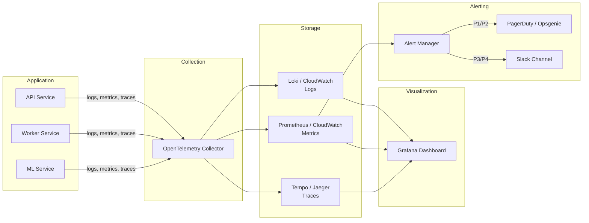

# Observability and Troubleshooting

**A system you cannot observe is a system you cannot fix. Observability is not "add logging" -- it is the ability to ask any question about your system's behavior and get an answer from the data it emits. This chapter covers the three pillars (logs, metrics, traces), alerting that does not cause fatigue, and a systematic method for debugging production incidents.**

---

## The Three Pillars of Observability

| Pillar | What It Captures | Question It Answers | Example |
|:---|:---|:---|:---|
| **Logs** | Discrete events with context | "What happened during this specific request?" | `{"level": "ERROR", "request_id": "abc-123", "message": "DB connection timeout"}` |
| **Metrics** | Aggregated numerical measurements over time | "How is the system performing overall right now?" | Request rate: 450 req/s, Error rate: 2.3%, p99 latency: 800ms |
| **Traces** | The path of a single request across services | "Where did this request spend its time?" | API (12ms) -> Queue (45ms) -> Worker (320ms) -> DB (85ms) |

All three are necessary. Metrics tell you something is wrong. Logs tell you what went wrong. Traces tell you where it went wrong.

---

## Logging

### Structured Logging

Production logs are JSON, not print statements. JSON logs can be queried, filtered, aggregated, and alerted on. Print statements cannot.

```python
# WRONG -- unstructured, unparseable
print(f"Error processing request for client {client_id}: {e}")

# RIGHT -- structured, queryable
import structlog

logger = structlog.get_logger()

logger.error(
    "request_processing_failed",
    client_id=client_id,
    error_type=type(e).__name__,
    error_message=str(e),
    request_id=request_id,
    duration_ms=elapsed_ms,
)
```

The structured log produces:
```json
{
    "event": "request_processing_failed",
    "level": "error",
    "timestamp": "2026-04-04T14:23:01Z",
    "client_id": "acme-corp",
    "error_type": "ConnectionError",
    "error_message": "Connection to DB timed out after 5s",
    "request_id": "req-abc-123",
    "duration_ms": 5023
}
```

Now you can query: "Show me all errors for client `acme-corp` in the last hour" or "What percentage of requests have `ConnectionError`?"

### Log Levels

| Level | When to Use | Example |
|:---|:---|:---|
| **DEBUG** | Developer troubleshooting, never in production by default | `"Parsed 47 rows from CSV upload"` |
| **INFO** | Normal operations, request lifecycle | `"Report generation started"`, `"Report generation complete"` |
| **WARNING** | Something unexpected but the system handled it | `"Retry 2 of 3 for payment service"`, `"Cache miss, falling back to DB"` |
| **ERROR** | Something failed and needs attention | `"Database connection timeout"`, `"Invalid API key rejected"` |
| **CRITICAL** | The system is broken, immediate action required | `"All DB connections exhausted"`, `"Model file not found at startup"` |

**Rule of thumb:** In production, set the default level to INFO. Turn on DEBUG temporarily when investigating a specific issue. Log CRITICAL and ERROR to alerting channels.

### What to Log

**Always log:**
- Request ID (correlate all logs for a single request)
- Timestamp (ISO 8601 with timezone)
- Duration (how long the operation took)
- Status (success/failure)
- Error details (type, message, stack trace for ERROR/CRITICAL)
- Service name and version

**Never log:**
- Passwords, API keys, tokens
- PII (Personally Identifiable Information): names, emails, SSNs, credit cards
- Full request/response bodies in production (too verbose, may contain PII)

### Python Logging Setup

```python
import structlog
import logging

def configure_logging(log_level: str = "INFO"):
    """Configure structured JSON logging for production."""
    structlog.configure(
        processors=[
            structlog.contextvars.merge_contextvars,
            structlog.processors.add_log_level,
            structlog.processors.TimeStamper(fmt="iso"),
            structlog.processors.StackInfoRenderer(),
            structlog.processors.format_exc_info,
            structlog.processors.JSONRenderer(),
        ],
        wrapper_class=structlog.make_filtering_bound_logger(
            getattr(logging, log_level)
        ),
    )

# In your request middleware -- bind context for all logs in this request
import structlog
from contextvars import ContextVar

logger = structlog.get_logger()

async def logging_middleware(request, call_next):
    request_id = request.headers.get("X-Request-ID", str(uuid.uuid4()))
    structlog.contextvars.clear_contextvars()
    structlog.contextvars.bind_contextvars(
        request_id=request_id,
        method=request.method,
        path=request.url.path,
    )
    logger.info("request_started")
    start = time.time()
    response = await call_next(request)
    duration_ms = (time.time() - start) * 1000
    logger.info("request_completed", status=response.status_code, duration_ms=round(duration_ms))
    return response
```

---

## Metrics

### The RED Method

Three metrics that tell you if a service is healthy:

| Metric | What It Measures | Alert When |
|:---|:---|:---|
| **R**ate | Requests per second | Sudden drop (traffic disappeared) or spike (possible attack) |
| **E**rrors | Error rate (errors / total requests) | Above threshold (e.g., > 1% for 5 minutes) |
| **D**uration | Response time (p50, p95, p99) | p99 exceeds SLO (e.g., > 2 seconds) |

### Saturation Metrics

| Metric | What It Measures | Danger Zone |
|:---|:---|:---|
| **CPU** | Compute utilization | Sustained > 80% |
| **Memory** | RAM usage | > 85% (OOM kill risk) |
| **Disk** | Storage usage | > 90% (writes will fail) |
| **Connections** | Database / HTTP pool usage | > 80% of max (queuing starts) |
| **Queue depth** | Messages waiting to be processed | Growing continuously (consumers cannot keep up) |

### Custom Metrics for AI/Data Systems

| Metric | Why It Matters |
|:---|:---|
| **Prediction latency** (p50, p95, p99) | ML inference time directly affects user experience |
| **Cache hit rate** | Low hit rate means the cache is not effective |
| **Queue depth + processing time** | Are background jobs keeping up? |
| **Model accuracy / drift** | Is the model's performance degrading over time? |
| **Feature store freshness** | Are features stale? When was the last update? |
| **Token usage** (for LLM-based systems) | Cost control and rate limit awareness |

### Prometheus + Grafana Pattern

Prometheus scrapes metrics from your application. Grafana visualizes them. This is the standard open-source observability stack.

```python
from prometheus_client import Counter, Histogram, Gauge, start_http_server

# Define metrics
REQUEST_COUNT = Counter(
    "http_requests_total",
    "Total HTTP requests",
    ["method", "endpoint", "status"],
)
REQUEST_DURATION = Histogram(
    "http_request_duration_seconds",
    "HTTP request duration",
    ["method", "endpoint"],
    buckets=[0.01, 0.05, 0.1, 0.25, 0.5, 1.0, 2.5, 5.0, 10.0],
)
ACTIVE_CONNECTIONS = Gauge(
    "db_active_connections",
    "Number of active database connections",
)

# Instrument your code
@app.middleware("http")
async def metrics_middleware(request, call_next):
    start = time.time()
    response = await call_next(request)
    duration = time.time() - start
    REQUEST_COUNT.labels(
        method=request.method,
        endpoint=request.url.path,
        status=response.status_code,
    ).inc()
    REQUEST_DURATION.labels(
        method=request.method,
        endpoint=request.url.path,
    ).observe(duration)
    return response

# Expose metrics endpoint for Prometheus to scrape
start_http_server(8001)  # Prometheus scrapes localhost:8001/metrics
```

---

## Tracing

### Distributed Tracing with OpenTelemetry

When a request crosses multiple services, you need to follow it end-to-end. OpenTelemetry (OTel) is the industry standard.

**How it works:**
1. The first service generates a trace ID and attaches it to the request (HTTP header `traceparent`)
2. Every downstream service reads the trace ID and creates a span (a named, timed operation)
3. All spans are sent to a collector (Jaeger, Tempo, Datadog)
4. You can visualize the entire request as a waterfall timeline

```python
from opentelemetry import trace
from opentelemetry.sdk.trace import TracerProvider
from opentelemetry.sdk.trace.export import BatchSpanProcessor
from opentelemetry.exporter.otlp.proto.grpc.trace_exporter import OTLPSpanExporter

# Setup (once at startup)
provider = TracerProvider()
processor = BatchSpanProcessor(OTLPSpanExporter(endpoint="http://collector:4317"))
provider.add_span_processor(processor)
trace.set_tracer_provider(provider)

tracer = trace.get_tracer("diagnostic-service")

# Instrument a function
async def process_diagnostic(job_id: str):
    with tracer.start_as_current_span("process_diagnostic") as span:
        span.set_attribute("job.id", job_id)

        with tracer.start_as_current_span("fetch_data"):
            data = await fetch_client_data(job_id)

        with tracer.start_as_current_span("run_analysis"):
            results = await analyze_data(data)

        with tracer.start_as_current_span("store_results"):
            await store_report(job_id, results)

        span.set_attribute("job.status", "complete")
```

**Trace ID propagation:** When your API calls another service, include the trace context in the HTTP headers. OpenTelemetry's HTTP client instrumentation does this automatically.

---

## Alerting

### What to Alert On

Alert on symptoms (what the user experiences), not causes (what broke internally).

| Alert On (Symptoms) | Do NOT Alert On (Causes) |
|:---|:---|
| Error rate > 1% for 5 minutes | A single 500 error |
| p99 latency > 2s for 5 minutes | CPU at 75% |
| Zero successful requests in 2 minutes | A pod restarting once |
| SLO budget burn rate too high | Disk at 60% |
| Queue depth growing for 15 minutes | A background job failed once |

### Alert Fatigue

If your team gets 50 alerts a day, nobody reads them. Every alert must require a human action. If the system can recover on its own (a retry succeeds, a pod restarts), that is not an alert -- that is a log entry.

**The test:** For every alert, ask: "What does the on-call engineer do when this fires?" If the answer is "look at it and dismiss it," delete the alert.

### Severity Levels

| Severity | Response Time | Example | Who Gets Paged |
|:---|:---|:---|:---|
| **P1 - Critical** | Respond in 5 min | Service is down, data loss imminent | On-call engineer, immediately |
| **P2 - High** | Respond in 30 min | Degraded performance, partial outage | On-call engineer |
| **P3 - Medium** | Respond in 4 hours | Non-critical feature broken, elevated errors | Engineering team (Slack channel) |
| **P4 - Low** | Next business day | Cosmetic issue, minor performance degradation | Ticketing system |

---

## The Observability Pipeline



---

## The Drill-Down Debugging Method

When a production issue occurs, follow this sequence. Do not skip steps.

```
Step 1: Alert fires
    "Error rate for diagnostic-api exceeded 5% for 3 minutes"

Step 2: Check metrics dashboard
    - When did errors start? (10:47 AM)
    - Which endpoint? (/api/v1/diagnostics)
    - What changed at 10:47? (deployment at 10:45)

Step 3: Check logs (filter by time + service)
    - Filter: service=diagnostic-api, level=ERROR, time=10:45-10:50
    - Finding: "ConnectionRefusedError: Cannot connect to Redis at redis:6379"

Step 4: Check trace (follow a specific failed request)
    - Trace shows: API span (2ms) -> Redis span (FAILED, 5001ms timeout)
    - Redis was unreachable

Step 5: Root cause
    - Redis pod was OOM-killed at 10:46 (memory limit hit)
    - Kubernetes restarted it but the API had no retry/circuit breaker for Redis

Step 6: Fix, deploy, verify
    - Immediate: Restart Redis with higher memory limit
    - Follow-up: Add circuit breaker for Redis connection
    - Verify: Error rate back to baseline, confirm in metrics dashboard
```

**Key principle:** Always go from broad (metrics: "something is wrong") to narrow (traces: "this specific request failed at this specific line"). Do not start by reading random logs -- you will drown in noise.

---

## Incident Response

### The Five Phases

| Phase | Goal | Actions |
|:---|:---|:---|
| **1. Detect** | Know something is wrong | Automated alerts, user reports, synthetic monitoring |
| **2. Triage** | Assess severity and impact | How many users affected? Is data at risk? P1/P2/P3/P4? |
| **3. Mitigate** | Stop the bleeding | Rollback, feature flag off, scale up, redirect traffic |
| **4. Fix** | Address root cause | Code fix, config change, infrastructure repair |
| **5. Post-mortem** | Prevent recurrence | Blameless review, action items, timeline documentation |

### Incident Communication Template

```
INCIDENT: [Service] - [Brief Description]
SEVERITY: P1 / P2 / P3
DETECTED: [timestamp]
IMPACT: [What users are experiencing]
STATUS: Investigating / Mitigating / Resolved

TIMELINE:
10:45 - Deployment v2.3.1 rolled out
10:47 - Error rate alert fired
10:48 - On-call engineer acknowledged
10:52 - Root cause identified (Redis OOM)
10:55 - Redis restarted with increased memory
10:57 - Error rate returned to normal
11:00 - Incident resolved

ACTION ITEMS:
- [ ] Add circuit breaker for Redis connection (owner: Alice, due: Apr 8)
- [ ] Set up Redis memory alerts at 80% (owner: Bob, due: Apr 5)
- [ ] Document Redis scaling procedure in runbook (owner: Alice, due: Apr 10)
```

### Post-Mortem Rules

1. **Blameless.** The goal is to improve the system, not punish people. "The deploy process allowed a breaking change" not "Alice deployed broken code."
2. **Timeline-driven.** What happened, in what order, with timestamps.
3. **Action items with owners and due dates.** A post-mortem without action items is a story, not a process improvement.
4. **Published to the team.** Everyone learns from every incident.

---

## Quick Links -- All Chapters

| Chapter | Title |
|:---|:---|
| [01](01_Why.md) | Why |
| [02](02_Concepts.md) | Concepts |
| [03](03_Hello_World.md) | Hello World |
| [04](04_How_It_Works.md) | How It Works |
| [05](05_Building_It.md) | Building It |
| [06](06_Production_Patterns.md) | Production Software Patterns |
| [07](07_System_Design.md) | System Design for AI/Data Services |
| [08](08_Quality_Security_Governance.md) | Quality, Security, and Governance |
| [09](09_Observability_Troubleshooting.md) | **Observability and Troubleshooting** |
| [10](10_Decision_Guide.md) | Software Engineering Decision Guide |
