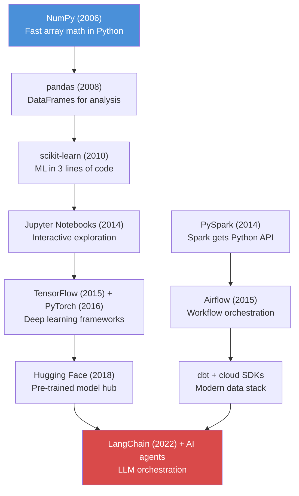

# Python -- Why It's the Language of AI and Data

**Python is not the best language. It has the best ecosystem. That distinction matters.**

---

## The Story

A senior Java developer with 15 years of experience joins an AI team. She knows generics, dependency injection, design patterns, microservices. Her first task: fine-tune a language model on customer support transcripts.

She opens the codebase. It is Python. Not because Python is faster (it is not). Not because Python is safer (it is not). But because every library she needs -- PyTorch for training, Hugging Face for models, LangChain for orchestration, MLflow for experiment tracking -- is Python-first. Some are Python-only.

A data engineer on the same team faces the same reality. His Spark jobs are PySpark. His Airflow DAGs (Directed Acyclic Graphs -- the workflow definitions that schedule and orchestrate pipeline tasks) are Python. His cloud SDK calls are Python. His dbt (data build tool) models call Python for complex transforms.

Neither of them chose Python because they love it. They chose it because the ecosystem chose it for them.

---

## Why Python Won

Python became the default language for AI and data work through a specific sequence of events, not by accident:



The critical insight: Python did not win on technical merit. It won on **library gravity**. Once NumPy made numerical computing accessible, every subsequent library built on top of it. Each new library made the next one more likely to choose Python. By the time deep learning arrived, there was no realistic alternative.

---

## Python vs Other Languages for AI and Data Engineering

| Dimension | Python | Java | Scala | R | Go |
|:---|:---|:---|:---|:---|:---|
| **AI/ML library support** | Best (PyTorch, TF, scikit-learn, LangChain) | Limited (DL4J, Tribuo) | Via Spark MLlib | Strong for statistics, weak for production | Minimal |
| **Data engineering** | Strong (PySpark, Airflow, dbt) | Strong (Flink, Beam, legacy Hadoop) | Strong (native Spark) | Weak | Growing (data pipelines) |
| **Cloud SDKs** | First-class (boto3, google-cloud) | First-class | Via Java SDKs | Limited | First-class |
| **Learning curve** | Low | High (verbose syntax) | High (type system) | Medium (stats-first) | Medium |
| **Runtime performance** | Slow (but delegates to C/Rust) | Fast | Fast | Slow | Fast |
| **Type safety** | Optional (type hints) | Strong | Strong | Weak | Strong |
| **Deployment** | Containers, serverless | JVM everywhere | JVM | Not typical | Static binary |
| **Job market (AI)** | Required | Nice to have | Nice to have | Declining | Emerging |
| **Job market (DE)** | Required | Common | Less common (declining) | Rare | Emerging |

**The takeaway:** Python is required for both AI and DE roles. Java and Scala are useful additions, not replacements. R is a legacy choice for statistics-only work. Go is emerging for infrastructure but has no AI ecosystem.

---

## You Don't Need to Master Python

This is worth stating directly: if you already know any programming language, you do not need to become a Python expert to be productive in AI or data engineering. You need to:

1. **Read Python fluently** -- understand what existing code does
2. **Write Python adequately** -- modify existing code, write new functions, use libraries
3. **Know the ecosystem** -- which library to use for which task

That third point is what actually separates a productive engineer from someone who is "learning Python." Knowing that `pandas` handles DataFrames, `boto3` talks to AWS (Amazon Web Services), and `FastAPI` builds REST endpoints matters more than memorizing Python syntax.

---

## What Python Looks Like for AI Engineers

The AI engineer's Python world centers on data manipulation and model building:

| Task | Library | What It Does |
|:---|:---|:---|
| Array math | NumPy | N-dimensional arrays, linear algebra, fast math |
| Data manipulation | pandas | DataFrames -- load, filter, transform, aggregate tabular data |
| Classical ML (Machine Learning) | scikit-learn | Train/evaluate models in 3-5 lines: regression, classification, clustering |
| Deep learning | PyTorch | Neural networks, GPU (Graphics Processing Unit) training, custom architectures |
| Pre-trained models | Hugging Face transformers | Load BERT, GPT, etc. in 2 lines |
| LLM (Large Language Model) orchestration | LangChain | Chain prompts, tools, and retrieval into AI applications |
| Experiment tracking | MLflow | Log metrics, compare runs, register models |
| Vector search | FAISS, ChromaDB | Similarity search for RAG (Retrieval-Augmented Generation) |

```python
# The AI engineer's daily workflow in 6 lines
import pandas as pd
from sklearn.ensemble import RandomForestClassifier

df = pd.read_csv("customer_calls.csv")
X, y = df.drop("churned", axis=1), df["churned"]
model = RandomForestClassifier().fit(X, y)
print(f"Accuracy: {model.score(X, y):.2%}")
```

Guided workshop: [Python for AI Workshop on Colab](https://colab.research.google.com/github/sunilmogadati/systems-in-production/blob/main/implementation/notebooks/Python_for_AI_Workshop.ipynb) -- zero to ML model in 2 hours

Deep dive: [Python Basics on Colab](https://colab.research.google.com/github/sunilmogadati/systems-in-production/blob/main/implementation/notebooks/Python_Basics.ipynb)

For Java developers: [Python for Java Developers on Colab](https://colab.research.google.com/github/sunilmogadati/systems-in-production/blob/main/implementation/notebooks/Python_Java_Bridge.ipynb)

---

## What Python Looks Like for Data Engineers

The data engineer's Python world centers on pipelines, orchestration, and cloud services:

| Task | Library | What It Does |
|:---|:---|:---|
| Distributed processing | PySpark | SQL + Python on Spark clusters -- process TB-scale data |
| Workflow orchestration | Airflow | Schedule and monitor DAGs -- the "cron on steroids" for pipelines |
| AWS services | boto3 | S3, Glue, Redshift, Lambda -- all from Python |
| GCP (Google Cloud Platform) services | google-cloud | BigQuery, GCS (Google Cloud Storage), Dataflow -- all from Python |
| Data transforms | dbt (via Python models) | SQL-first transforms with Python escape hatch |
| File formats | pyarrow, fastparquet | Read/write Parquet, Arrow, ORC (Optimized Row Columnar) |
| Data quality | Great Expectations, Soda | Assert data contracts: row counts, null checks, schema validation |

```python
# The data engineer's daily workflow in 6 lines
from pyspark.sql import SparkSession

spark = SparkSession.builder.appName("pipeline").getOrCreate()
df = spark.read.csv("s3://raw-data/calls/*.csv", header=True)
clean = df.dropDuplicates(["call_id"]).filter("duration > 0")
clean.write.parquet("s3://processed-data/calls/", mode="overwrite")
```

Deep dive: [Python for DE on Colab](https://colab.research.google.com/github/sunilmogadati/systems-in-production/blob/main/implementation/notebooks/Python_NumPy_Pandas.ipynb)

---

## If You Already Know Another Language

Python will feel familiar. Here is what is different:

| Concept | Java / C# | JavaScript | Python |
|:---|:---|:---|:---|
| **Blocks** | `{ curly braces }` | `{ curly braces }` | Indentation (4 spaces) |
| **Variables** | `String name = "Alice";` | `let name = "Alice";` | `name = "Alice"` |
| **Types** | Declared and enforced | Dynamic | Dynamic (optional hints) |
| **Semicolons** | Required | Optional but conventional | Not used |
| **Main entry point** | `public static void main` | None (script runs top-down) | `if __name__ == "__main__":` |
| **Null** | `null` | `null` / `undefined` | `None` |
| **Boolean** | `true` / `false` | `true` / `false` | `True` / `False` (capitalized) |
| **Print** | `System.out.println()` | `console.log()` | `print()` |
| **String format** | `String.format()` or `+` | Template literals | f-strings: `f"Hello {name}"` |
| **List/Array** | `ArrayList<String>` | `[1, 2, 3]` | `[1, 2, 3]` |
| **Dictionary/Map** | `HashMap<K, V>` | `{ key: value }` | `{"key": "value"}` |
| **For loop** | `for (int i = 0; ...)` | `for (let x of arr)` | `for x in arr:` |
| **Lambda** | `(x) -> x * 2` | `(x) => x * 2` | `lambda x: x * 2` |
| **Imports** | `import java.util.List;` | `import X from 'y'` | `import pandas as pd` |
| **Package manager** | Maven / Gradle | npm / yarn | pip / uv |

The biggest adjustment for Java/C# developers is not syntax -- it is the absence of ceremony. No class required to run code. No type declarations required. No compilation step. You write a `.py` file and run it. That simplicity is why data scientists adopted Python and why the ecosystem grew around it.

---

## What Comes Next

This chapter explained why Python is the language you need. The next two chapters cover:

- **[02 -- Core Concepts](02_Concepts.md):** A quick-reference for engineers who already know another language. Data structures, functions, packages, virtual environments, and the ecosystem map.
- **[03 -- Hello World](03_Hello_World.md):** Two hands-on tracks (AI and DE) that show how the same Python patterns apply to both roles.

---

*Foundations -- Python (Chapter 1 of 3)*
