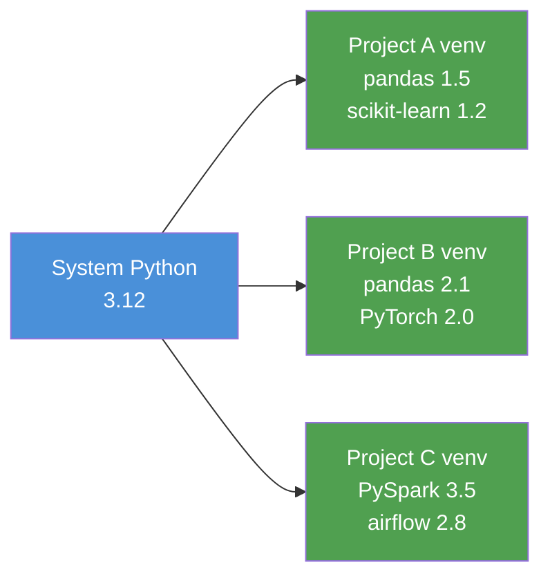
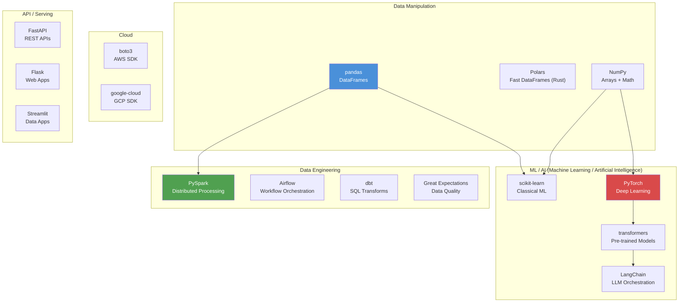

# Python -- Core Concepts for AI and Data Engineers

**This is not a Python tutorial. It is a quick-reference for engineers who already know another language and need to be productive in Python fast.**

---

## Data Structures

Python has four built-in collection types. If you know Java or JavaScript, each one has a direct equivalent:

| Python | Java Equivalent | JS Equivalent | Ordered? | Mutable? | Duplicates? | Use Case |
|:---|:---|:---|:---|:---|:---|:---|
| `list` | `ArrayList` | `Array` | Yes | Yes | Yes | Sequences, iteration |
| `dict` | `HashMap` | `Object` / `Map` | Yes (3.7+) | Yes | Keys: No | Key-value lookup |
| `set` | `HashSet` | `Set` | No | Yes | No | Membership testing, dedup |
| `tuple` | (no direct equiv) | (no direct equiv) | Yes | No | Yes | Fixed records, dict keys |

```python
# list -- ordered, mutable
calls = ["inbound", "outbound", "transfer"]
calls.append("voicemail")

# dict -- key-value pairs
call_record = {
    "call_id": "C-1001",
    "duration": 245,
    "outcome": "resolved"
}
print(call_record["duration"])  # 245

# set -- unique values only
unique_agents = {"Alice", "Bob", "Alice"}  # {"Alice", "Bob"}

# tuple -- immutable (cannot change after creation)
coordinates = (40.7128, -74.0060)  # lat, long -- safe as a dict key
```

**When to use what:**
- Default to `list` for sequences.
- Use `dict` when you need lookup by key (90% of real code).
- Use `set` when you need to check "is X in this collection?" -- O(1) lookup vs O(n) for a list.
- Use `tuple` for data that should never change (database rows, coordinates, function return values with multiple items).

---

## List Comprehensions

This is the single most Pythonic pattern. Once you internalize it, you can read most Python data code:

```python
# Long form (what you would write in Java/JS)
results = []
for call in calls:
    if call["duration"] > 60:
        results.append(call["agent_name"])

# List comprehension (what Python developers write)
results = [call["agent_name"] for call in calls if call["duration"] > 60]
```

The pattern is always: `[EXPRESSION for ITEM in ITERABLE if CONDITION]`

```python
# Square numbers
squares = [x ** 2 for x in range(10)]

# Dict comprehension (same pattern, curly braces)
name_to_id = {agent["name"]: agent["id"] for agent in agents}

# Set comprehension
unique_outcomes = {call["outcome"] for call in calls}
```

**Rule of thumb:** If the comprehension takes more than one line to read, use a regular loop. Readability beats cleverness.

---

## Functions, Classes, and Decorators

### Functions

```python
# Basic function
def calculate_handle_time(start: str, end: str) -> float:
    """Calculate the handle time in seconds between two ISO timestamps."""
    # Type hints are optional but recommended -- they help editors and teammates
    from datetime import datetime
    fmt = "%Y-%m-%dT%H:%M:%S"
    delta = datetime.strptime(end, fmt) - datetime.strptime(start, fmt)
    return delta.total_seconds()

# Default arguments
def connect_to_db(host: str = "localhost", port: int = 5432) -> None:
    print(f"Connecting to {host}:{port}")

# *args and **kwargs -- accept variable arguments
def log_event(event_type: str, *tags, **metadata):
    print(f"Event: {event_type}, Tags: {tags}, Meta: {metadata}")

log_event("call_ended", "inbound", "priority", agent="Alice", duration=120)
```

### Classes (Just Enough for AI/DE Libraries)

You rarely write classes in AI/DE work. But you need to read them because every library uses them:

```python
class DataPipeline:
    """A minimal pipeline that reads, transforms, and writes data."""

    def __init__(self, source: str, destination: str):
        # __init__ is the constructor (like Java's constructor)
        self.source = source
        self.destination = destination
        self.records_processed = 0

    def run(self) -> int:
        # 'self' is explicit in Python (like 'this' in Java, but you must declare it)
        data = self._read()
        clean = self._transform(data)
        self._write(clean)
        return self.records_processed

    def _read(self):
        # Leading underscore = private by convention (not enforced)
        pass

    def _transform(self, data):
        pass

    def _write(self, data):
        pass
```

### Decorators

Decorators wrap functions with additional behavior. You will see them everywhere in AI/DE:

```python
# In Airflow -- @task turns a function into a DAG task
from airflow.decorators import task

@task
def extract():
    return load_data_from_s3()

# In FastAPI -- @app.get turns a function into an HTTP endpoint
from fastapi import FastAPI
app = FastAPI()

@app.get("/health")
def health_check():
    return {"status": "healthy"}

# In PyTorch -- @torch.no_grad() disables gradient computation
import torch

@torch.no_grad()
def predict(model, inputs):
    return model(inputs)
```

You do not need to write custom decorators. You need to recognize that `@something` means "this function is being wrapped with extra behavior."

---

## File I/O (Input/Output): CSV, JSON, Parquet

Three formats dominate AI and data engineering. Here is how to read and write each:

```python
import pandas as pd
import json

# --- CSV (Comma-Separated Values) ---
# Most common for small datasets, exports, human-readable data
df = pd.read_csv("calls.csv")
df.to_csv("output.csv", index=False)

# --- JSON (JavaScript Object Notation) ---
# Common for API responses, configuration, nested data
with open("config.json", "r") as f:
    config = json.load(f)  # Returns a dict

with open("output.json", "w") as f:
    json.dump(config, f, indent=2)

# JSON Lines (one JSON object per line -- common in streaming/logging)
df = pd.read_json("events.jsonl", lines=True)

# --- Parquet (columnar binary format) ---
# Production standard for data pipelines: compressed, fast, typed
df = pd.read_parquet("calls.parquet")
df.to_parquet("output.parquet", index=False)
```

**When to use what:**

| Format | Read Speed | File Size | Schema Enforcement | Use Case |
|:---|:---|:---|:---|:---|
| CSV | Slow | Large | None | Prototyping, exports, human review |
| JSON | Medium | Medium | None | APIs, configs, nested structures |
| Parquet | Fast | Small (compressed) | Yes (typed columns) | Production pipelines, warehouses, ML training data |

**Production rule:** Data enters as CSV or JSON. It gets converted to Parquet as early as possible in the pipeline. Every downstream step reads Parquet.

---

## Virtual Environments

A virtual environment is an isolated Python installation. It solves the problem of "project A needs library version 1.0, project B needs version 2.0."

Think of it like Docker for Python packages, but lighter.



### Option 1: venv (built-in, always available)

```bash
# Create a virtual environment
python -m venv .venv

# Activate it
source .venv/bin/activate    # macOS/Linux
.venv\Scripts\activate       # Windows

# Install packages (only affects this environment)
pip install pandas scikit-learn

# Freeze dependencies
pip freeze > requirements.txt

# Deactivate when done
deactivate
```

### Option 2: uv (modern, fast -- recommended)

`uv` is a Rust-based package manager that replaces pip, venv, and pyenv in one tool. It is 10-100x faster than pip.

```bash
# Install uv (one-time)
curl -LsSf https://astral.sh/uv/install.sh | sh

# Create project with virtual environment
uv init my-project
cd my-project

# Add dependencies (automatically creates venv and installs)
uv add pandas scikit-learn

# Run a script inside the environment
uv run python train.py

# Sync from existing requirements
uv pip install -r requirements.txt
```

**Recommendation:** Use `uv` for new projects. Use `venv` + `pip` when working with legacy codebases or restricted environments.

---

## Package Management

| File | Purpose | Example |
|:---|:---|:---|
| `requirements.txt` | Flat list of packages + versions | `pandas==2.1.0` |
| `pyproject.toml` | Modern project metadata + dependencies | Replaces `setup.py` + `requirements.txt` |
| `setup.py` | Legacy project definition | Still in older projects, being replaced |
| `uv.lock` | Exact locked versions (uv) | Like `package-lock.json` in Node.js |

```toml
# pyproject.toml -- the modern standard
[project]
name = "call-center-pipeline"
version = "0.1.0"
requires-python = ">=3.11"
dependencies = [
    "pandas>=2.0",
    "pyarrow>=14.0",
    "scikit-learn>=1.3",
]

[project.optional-dependencies]
dev = ["pytest", "ruff", "mypy"]
```

**Key practice:** Always pin your dependencies. `pandas` without a version means your pipeline could break when pandas releases a new version. In production, use `==` for exact pins. In development, use `>=` with a minimum.

---

## The Python Ecosystem Map

This is the map you reference when someone says "use X" and you need to know where it fits:



**Reading the map:**
- **AI engineers** live in the ML/AI box, with pandas and NumPy as their data layer.
- **Data engineers** live in the Data Engineering box, with pandas for prototyping and PySpark for production scale.
- **Both** use cloud SDKs and FastAPI for deployment.
- Polars is the emerging alternative to pandas -- faster for large datasets, but the ecosystem (scikit-learn, PySpark) still assumes pandas.

---

## Common Gotchas for Java/JS Developers

### 1. Indentation Is Syntax

In Python, indentation defines code blocks. There are no braces. Mix tabs and spaces and your code will fail silently or throw `IndentationError`.

```python
# Correct
if x > 0:
    print("positive")
    process(x)

# Wrong -- this will break
if x > 0:
    print("positive")
  process(x)  # IndentationError: unexpected indent
```

**Fix:** Configure your editor to use 4 spaces per indent. Never use tabs.

### 2. Mutable Default Arguments

This is the most common Python bug for developers coming from other languages:

```python
# WRONG -- the list is shared across all calls
def add_item(item, items=[]):
    items.append(item)
    return items

add_item("a")  # ["a"]
add_item("b")  # ["a", "b"] -- not ["b"]!

# CORRECT -- use None as default, create new list inside
def add_item(item, items=None):
    if items is None:
        items = []
    items.append(item)
    return items
```

**Why:** Default arguments are evaluated once when the function is defined, not each time it is called. A mutable default (list, dict, set) persists across calls.

### 3. The GIL (Global Interpreter Lock)

Python has a GIL that prevents true multi-threaded parallelism for CPU-bound (Central Processing Unit-bound) work. This means:

- **Threads work** for I/O-bound tasks (network calls, file reads, database queries)
- **Threads do NOT speed up** CPU-bound tasks (number crunching, model training)
- **For CPU parallelism,** use `multiprocessing` or let libraries handle it (NumPy, PyTorch, and PySpark all bypass the GIL internally)

In practice, this rarely matters for AI/DE work because the heavy computation happens in C/Rust libraries (NumPy, PyTorch) or distributed systems (Spark), not in Python itself.

### 4. Everything Is a Reference

```python
a = [1, 2, 3]
b = a          # b points to the SAME list, not a copy
b.append(4)
print(a)       # [1, 2, 3, 4] -- a changed too!

# To copy:
b = a.copy()   # Shallow copy
import copy
b = copy.deepcopy(a)  # Deep copy (for nested structures)
```

### 5. `==` vs `is`

```python
a = [1, 2, 3]
b = [1, 2, 3]

a == b   # True -- same values
a is b   # False -- different objects in memory

# Use 'is' only for None checks:
if result is None:
    handle_missing()
```

---

## Where to Go Deeper

This chapter covered the concepts you need to read and write Python for AI and data engineering. For hands-on practice:

- **AI track:** [Python for AI on Colab](https://colab.research.google.com/github/sunilmogadati/systems-in-production/blob/main/implementation/notebooks/Python_for_AI.ipynb)
- **DE track:** [Python for DE on Colab](https://colab.research.google.com/github/sunilmogadati/systems-in-production/blob/main/implementation/notebooks/Python_for_DE.ipynb)
- **Java developers:** [Python for AI Java Dev Guide on Colab](https://colab.research.google.com/github/sunilmogadati/systems-in-production/blob/main/implementation/notebooks/Python_for_AI_Java_Bridge.ipynb)

**Next:** [03 -- Hello World](03_Hello_World.md) -- two hands-on tracks (AI and DE) showing the same Python patterns applied to both roles.

---

*Foundations -- Python (Chapter 2 of 3)*
