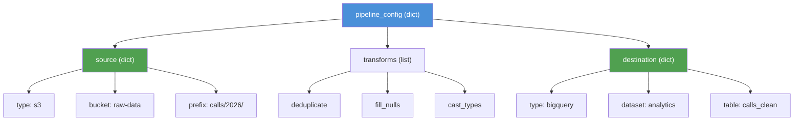

# Python Data Structures for AI and Data Engineering

**Every AI model expects data in a specific shape. Every pipeline moves data between shapes. Python's four built-in collections -- list, dict, set, tuple -- are how you shape data before it reaches a library.**

---

## The Four Core Collections

If you know Java or JavaScript, each Python collection has a direct equivalent:

| Python | Java Equivalent | JS Equivalent | Ordered? | Mutable? | Duplicates? | Lookup Speed |
|:---|:---|:---|:---|:---|:---|:---|
| `list` | `ArrayList` | `Array` | Yes | Yes | Yes | O(n) |
| `dict` | `HashMap` / `LinkedHashMap` | `Object` / `Map` | Yes (3.7+) | Yes | Keys: No | O(1) |
| `set` | `HashSet` | `Set` | No | Yes | No | O(1) |
| `tuple` | (no direct equiv) | (no direct equiv) | Yes | No | Yes | O(n) |

```python
# list -- the default sequence container
predictions = [0.92, 0.87, 0.45, 0.73, 0.98]

# dict -- key-value pairs, used everywhere in config and data
model_config = {
    "learning_rate": 0.001,
    "batch_size": 32,
    "epochs": 10
}

# set -- unique values, fast membership testing
seen_customer_ids = {"C-1001", "C-1002", "C-1003"}
"C-1001" in seen_customer_ids  # O(1) -- instant, no scanning

# tuple -- immutable, safe for dict keys and function returns
db_connection = ("prod-db.example.com", 5432, "analytics")
```

---

## When to Use Each: Decision Table

| Situation | Use | Why |
|:---|:---|:---|
| Ordered collection of items | `list` | Default choice for sequences |
| Need to look up values by key | `dict` | O(1) lookup, the workhorse of Python |
| Need to check membership ("is X in this set?") | `set` | O(1) vs O(n) for lists |
| Need to remove duplicates | `set` | `list(set(items))` is a common pattern |
| Data that should never change | `tuple` | Immutable -- safe as dict keys, function returns |
| Configuration or metadata | `dict` | Mirrors JSON, YAML, API responses |
| Batch of records | `list` of `dict` | The standard shape for tabular data in Python |
| Feature vector for ML | `list` or NumPy array | Lists for building, NumPy for computation |

---

## List Comprehensions -- The #1 Python Pattern in AI Code

You will see this in every codebase. It replaces the for-loop-with-append pattern:

```python
# What Java/JS developers write (works, but not Pythonic)
high_confidence = []
for score in predictions:
    if score > 0.8:
        high_confidence.append(score)

# What Python developers write
high_confidence = [score for score in predictions if score > 0.8]
```

The pattern: `[EXPRESSION for ITEM in ITERABLE if CONDITION]`

**AI example -- normalize feature values:**

```python
# Min-max normalization of a feature column
raw_values = [120, 45, 300, 180, 95, 420, 60, 210, 150]
min_val, max_val = min(raw_values), max(raw_values)
# Each value becomes a float between 0 and 1
normalized = [(v - min_val) / (max_val - min_val) for v in raw_values]
```

**DE example -- extract specific fields from API response:**

```python
# API returns list of dicts; extract just the IDs of active pipelines
pipelines = [
    {"id": "pipe-01", "status": "active", "owner": "alice"},
    {"id": "pipe-02", "status": "paused", "owner": "bob"},
    {"id": "pipe-03", "status": "active", "owner": "carol"},
]
active_ids = [p["id"] for p in pipelines if p["status"] == "active"]
# ["pipe-01", "pipe-03"]
```

---

## Dict Comprehensions

Same syntax as list comprehensions, but with curly braces and a key-value pair:

```python
# Build a lookup from model name to accuracy
results = [
    {"model": "random_forest", "accuracy": 0.92},
    {"model": "logistic_reg", "accuracy": 0.88},
    {"model": "gradient_boost", "accuracy": 0.95},
]
# One line to build the lookup table
accuracy_by_model = {r["model"]: r["accuracy"] for r in results}
# {"random_forest": 0.92, "logistic_reg": 0.88, "gradient_boost": 0.95}
```

**DE example -- build a column rename mapping:**

```python
# Raw column names from a source system, clean them for the warehouse
raw_columns = ["Customer ID", "First Name", "Last Name", "Phone #"]
# snake_case conversion for database compatibility
column_map = {col: col.lower().replace(" ", "_").replace("#", "num")
              for col in raw_columns}
# {"Customer ID": "customer_id", "First Name": "first_name", ...}
```

---

## Nested Structures -- How Data Actually Looks in Python

Real data is almost never a flat list. It is lists of dicts, dicts of lists, or dicts of dicts. This is the shape that JSON APIs return, that pandas DataFrames are built from, and that model predictions come in.

**AI example -- batch of predictions:**

```python
# A model returns predictions with metadata
# This is the standard shape before it becomes a DataFrame
batch_predictions = [
    {"input_id": "C-1001", "label": "escalated", "confidence": 0.94},
    {"input_id": "C-1002", "label": "resolved", "confidence": 0.87},
    {"input_id": "C-1003", "label": "resolved", "confidence": 0.72},
]
# Convert to DataFrame in one line
import pandas as pd
df = pd.DataFrame(batch_predictions)
```

**DE example -- nested configuration:**

```python
# Pipeline config mirrors a YAML/JSON file structure
pipeline_config = {
    "source": {
        "type": "s3",
        "bucket": "raw-data",
        "prefix": "calls/2026/"
    },
    "transforms": ["deduplicate", "fill_nulls", "cast_types"],
    "destination": {
        "type": "bigquery",
        "dataset": "analytics",
        "table": "calls_clean"
    }
}
# Access nested values with chained keys
bucket = pipeline_config["source"]["bucket"]  # "raw-data"
```



---

## Named Tuples and Dataclasses -- Clean Data Containers

When a dict is too loose (typos in keys, no autocompletion) and a full class is too heavy, Python gives you two lightweight options.

### Named Tuples

```python
from collections import namedtuple

# Define a typed record -- like a Java record or C# struct
ModelResult = namedtuple("ModelResult", ["model_name", "accuracy", "latency_ms"])

result = ModelResult("gradient_boost", 0.95, 12.3)
print(result.model_name)    # "gradient_boost" -- named access
print(result[1])            # 0.95 -- index access still works
# result.accuracy = 0.96    # TypeError -- immutable, just like a tuple
```

### Dataclasses (Python 3.7+, the Modern Choice)

```python
from dataclasses import dataclass

@dataclass
class PipelineRun:
    """Tracks a single pipeline execution."""
    run_id: str
    source: str
    records_in: int
    records_out: int
    status: str = "pending"  # Default value

    @property
    def drop_rate(self) -> float:
        """Percentage of records lost during processing."""
        if self.records_in == 0:
            return 0.0
        return 1 - (self.records_out / self.records_in)

run = PipelineRun("run-042", "s3://raw/calls", 10000, 9823, "success")
print(f"Drop rate: {run.drop_rate:.2%}")  # "Drop rate: 1.77%"
```

**When to use which:**

| Container | Mutable? | Methods? | Best For |
|:---|:---|:---|:---|
| `dict` | Yes | No (just keys) | Quick prototyping, JSON-like data |
| `namedtuple` | No | No | Simple immutable records, function returns |
| `@dataclass` | Yes (default) | Yes | Structured data with behavior, configs |
| `@dataclass(frozen=True)` | No | Yes | Immutable records with methods |

**AI example -- experiment tracking with dataclasses:**

```python
@dataclass
class Experiment:
    name: str
    model_type: str
    hyperparams: dict
    accuracy: float = 0.0
    trained: bool = False

# Clean, typed, with defaults -- replaces messy nested dicts
exp = Experiment("churn_v3", "random_forest", {"n_estimators": 100, "max_depth": 5})
```

---

## Feature Dictionaries -- The AI Use Case

In ML (Machine Learning) pipelines, features are often built as dictionaries before being converted to arrays or DataFrames. This pattern appears in scikit-learn's `DictVectorizer`, in feature stores, and in custom feature engineering:

```python
# Each call record becomes a feature dictionary
def extract_features(call: dict) -> dict:
    """Convert a raw call record into ML features."""
    return {
        "duration_sec": call["duration_sec"],
        "wait_sec": call["wait_sec"],
        # Derived feature: ratio of wait time to total handle time
        "wait_ratio": call["wait_sec"] / max(call["duration_sec"], 1),
        # Binary encoding of agent (could also use one-hot)
        "is_senior_agent": call["agent"] in {"Alice", "Carol"},
    }

# Process a batch
features = [extract_features(call) for call in raw_calls]
df = pd.DataFrame(features)  # Ready for sklearn
```

---

## Record Processing -- The DE Use Case

Data engineering pipelines process records one at a time or in batches. The standard shape is a list of dicts flowing through transformation functions:

```python
def validate_record(record: dict) -> dict | None:
    """Return the record if valid, None if it should be filtered out."""
    # Rule: calls with zero duration are invalid
    if record.get("duration_sec", 0) <= 0:
        return None
    # Rule: missing agent gets a placeholder
    if record.get("agent") is None:
        record["agent"] = "UNKNOWN"
    return record

# Process a batch -- filter + transform in one pass
raw_records = [
    {"call_id": "C-1001", "duration_sec": 120, "agent": "Alice"},
    {"call_id": "C-1002", "duration_sec": 0, "agent": None},
    {"call_id": "C-1003", "duration_sec": 300, "agent": None},
]
clean = [r for r in (validate_record(rec) for rec in raw_records) if r is not None]
# [{"call_id": "C-1001", ...}, {"call_id": "C-1003", "agent": "UNKNOWN", ...}]
```

---

## Common Pitfalls

### 1. Modifying a list while iterating over it

```python
# WRONG -- skips elements because the list shrinks during iteration
items = [1, 2, 3, 4, 5]
for item in items:
    if item % 2 == 0:
        items.remove(item)

# CORRECT -- build a new list with a comprehension
items = [item for item in items if item % 2 != 0]
```

### 2. Using a list when you need a set for lookups

```python
# SLOW -- O(n) lookup for each check, O(n*m) total
blocklist = ["spam", "fraud", "test"]  # list
flagged = [call for call in calls if call["tag"] in blocklist]

# FAST -- O(1) lookup for each check, O(m) total
blocklist = {"spam", "fraud", "test"}  # set
flagged = [call for call in calls if call["tag"] in blocklist]
```

### 3. KeyError on missing dict keys

```python
record = {"call_id": "C-1001", "duration": 120}

# CRASH -- KeyError if key doesn't exist
# agent = record["agent"]

# SAFE -- returns None (or a default) if key is missing
agent = record.get("agent", "UNKNOWN")
```

---

## Quick Links

| Resource | Link |
|:---|:---|
| Python for AI (notebook) | [Python for AI on Colab](https://colab.research.google.com/github/sunilmogadati/systems-in-production/blob/main/implementation/notebooks/Python_Basics.ipynb) |
| Python for DE (notebook) | [Python for DE on Colab](https://colab.research.google.com/github/sunilmogadati/systems-in-production/blob/main/implementation/notebooks/Python_NumPy_Pandas.ipynb) |
| Previous chapter | [03 -- Hello World](03_Hello_World.md) |
| Next chapter | [05 -- Control Flow, Functions, and Lambdas](05_Control_Flow_Functions.md) |

---

*Foundations -- Python (Chapter 4 of 10)*
