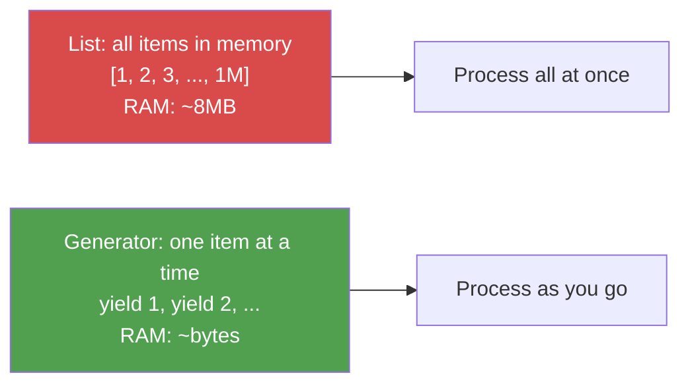

# Control Flow, Functions, and Lambdas

**Python's control flow is familiar. What is different is how Python developers use it -- enumerate instead of index loops, zip instead of parallel arrays, generators instead of loading everything into memory.**

---

**Hands-on notebook:** [](https://colab.research.google.com/github/sunilmogadati/systems-in-production/blob/main/implementation/notebooks/Python_Functions_Classes.ipynb) Functions and Classes


## Quick Reference: Control Flow

You already know these from other languages. Here is the Python syntax:

```python
# if/elif/else -- no parentheses, no braces, colon + indent
status = "escalated"
if status == "resolved":
    priority = "low"
elif status == "escalated":
    priority = "high"
else:
    priority = "medium"

# for loop -- iterates directly over elements, not indices
agents = ["Alice", "Bob", "Carol"]
for agent in agents:
    print(agent)

# while loop
retries = 3
while retries > 0:
    success = try_connection()
    if success:
        break
    retries -= 1
```

| Pattern | Java / C# | JavaScript | Python |
|:---|:---|:---|:---|
| Index loop | `for (int i = 0; i < n; i++)` | `for (let i = 0; i < n; i++)` | `for i in range(n):` |
| Element loop | `for (String s : list)` | `for (const s of list)` | `for s in list:` |
| Conditional expression | `x > 0 ? "pos" : "neg"` | `x > 0 ? "pos" : "neg"` | `"pos" if x > 0 else "neg"` |
| Null coalescing | `x != null ? x : default` | `x ?? default` | `x if x is not None else default` |

---

## The Pythonic Way: enumerate, zip, itertools

These three patterns replace index-tracking, parallel iteration, and complex looping. You will see them in every Python codebase.

### enumerate -- loop with index

```python
# NOT Pythonic -- manually tracking index
# i = 0
# for agent in agents:
#     print(f"{i}: {agent}")
#     i += 1

# Pythonic -- enumerate gives you index and value together
agents = ["Alice", "Bob", "Carol"]
for i, agent in enumerate(agents):
    print(f"{i}: {agent}")

# DE example: log each record's position during processing
for row_num, record in enumerate(records, start=1):
    if record.get("duration") is None:
        print(f"Row {row_num}: missing duration")
```

### zip -- iterate over parallel sequences

```python
# AI example: pair model names with their accuracy scores
models = ["random_forest", "logistic_reg", "gradient_boost"]
scores = [0.92, 0.88, 0.95]
latencies = [12.3, 3.1, 8.7]

for model, score, latency in zip(models, scores, latencies):
    print(f"{model}: accuracy={score:.2f}, latency={latency}ms")

# Build a dict from two parallel lists
score_by_model = dict(zip(models, scores))
# {"random_forest": 0.92, "logistic_reg": 0.88, "gradient_boost": 0.95}
```

### itertools -- advanced iteration without loading into memory

```python
from itertools import chain, islice, groupby

# chain -- combine multiple iterables into one (useful for merging data sources)
morning_calls = [{"id": 1}, {"id": 2}]
afternoon_calls = [{"id": 3}, {"id": 4}]
all_calls = chain(morning_calls, afternoon_calls)  # No new list created

# islice -- take a slice of any iterable (useful for sampling large data)
first_100 = list(islice(huge_generator, 100))

# groupby -- group sorted data (like SQL GROUP BY)
calls = sorted(call_records, key=lambda c: c["agent"])
for agent, group in groupby(calls, key=lambda c: c["agent"]):
    group_list = list(group)
    print(f"{agent}: {len(group_list)} calls")
```

---

## Functions: def, args, kwargs, type hints

### Basic function with type hints

```python
def calculate_churn_rate(total_customers: int, churned: int) -> float:
    """Return the churn rate as a decimal between 0 and 1.

    Type hints don't enforce types at runtime -- they document intent
    and enable IDE autocompletion and static analysis tools like mypy.
    """
    if total_customers == 0:
        return 0.0
    return churned / total_customers
```

### Default arguments

```python
# DE example: configurable batch processing
def process_batch(records: list[dict], batch_size: int = 1000,
                  validate: bool = True) -> list[dict]:
    """Process records in batches with optional validation."""
    results = []
    for i in range(0, len(records), batch_size):
        batch = records[i:i + batch_size]
        if validate:
            batch = [r for r in batch if r.get("call_id") is not None]
        results.extend(batch)
    return results
```

### *args and **kwargs

```python
# *args: accept any number of positional arguments as a tuple
# **kwargs: accept any number of keyword arguments as a dict
def log_metric(metric_name: str, *values, **tags):
    """Log a metric with optional tags -- pattern used by MLflow, Datadog."""
    avg = sum(values) / len(values) if values else 0
    print(f"[{metric_name}] avg={avg:.4f} tags={tags}")

log_metric("accuracy", 0.92, 0.94, 0.91, model="rf", dataset="v3")
# [accuracy] avg=0.9233 tags={"model": "rf", "dataset": "v3"}
```

### Multiple return values

```python
# Python returns multiple values as a tuple -- no wrapper class needed
def train_and_evaluate(X_train, y_train, X_test, y_test):
    """Train a model and return both the model and its score."""
    from sklearn.ensemble import RandomForestClassifier
    model = RandomForestClassifier().fit(X_train, y_train)
    score = model.score(X_test, y_test)
    return model, score  # Returns a tuple

# Unpack the return values directly
model, accuracy = train_and_evaluate(X_train, y_train, X_test, y_test)
```

---

## Lambda Functions

A lambda is a one-line anonymous function. You cannot avoid them -- pandas, PySpark, and sorting all use them:

```python
# Named function
def double(x):
    return x * 2

# Same thing as a lambda
double = lambda x: x * 2

# Where lambdas actually get used: inline in library calls
```

**AI example -- custom sort for model selection:**

```python
# Sort models by accuracy descending, then by latency ascending
results = [
    {"model": "rf", "accuracy": 0.92, "latency": 12},
    {"model": "lr", "accuracy": 0.92, "latency": 3},
    {"model": "gb", "accuracy": 0.95, "latency": 9},
]
# Lambda as a sort key -- returns a tuple for multi-criteria sorting
results.sort(key=lambda r: (-r["accuracy"], r["latency"]))
# gb (0.95, 9), lr (0.92, 3), rf (0.92, 12)
```

**DE example -- pandas apply with lambda:**

```python
import pandas as pd

df = pd.DataFrame({"duration_sec": [120, 45, 300, 180]})
# Categorize call duration -- lambda is the inline transform
df["duration_category"] = df["duration_sec"].apply(
    lambda d: "short" if d < 60 else "medium" if d < 200 else "long"
)
```

---

## Map, Filter, Reduce -- Functional Patterns

These are the functional programming equivalents of list comprehensions. You will see them in older codebases and in PySpark's RDD (Resilient Distributed Dataset) API:

```python
from functools import reduce

scores = [0.92, 0.45, 0.87, 0.33, 0.95, 0.71]

# map -- apply a function to every element
rounded = list(map(lambda s: round(s, 1), scores))

# filter -- keep elements that pass a test
passing = list(filter(lambda s: s >= 0.8, scores))

# reduce -- accumulate elements into a single value
total = reduce(lambda a, b: a + b, scores)
```

**In practice, list comprehensions replace map and filter in most Python code:**

```python
# These are equivalent -- comprehensions are preferred for readability
rounded = [round(s, 1) for s in scores]
passing = [s for s in scores if s >= 0.8]
```

**Where map/filter still appear:** PySpark RDDs and streaming pipelines where lazy evaluation matters.

---

## Generators and yield -- Processing Large Data

A generator produces values one at a time instead of building the entire collection in memory. This is critical when processing files that don't fit in RAM (Random Access Memory).



### Generator function with yield

```python
# DE example: read a large CSV file in chunks without loading it all
def read_chunks(filepath: str, chunk_size: int = 10000):
    """Yield chunks of a CSV file -- memory stays flat regardless of file size."""
    import pandas as pd
    for chunk in pd.read_csv(filepath, chunksize=chunk_size):
        # Each chunk is a DataFrame with at most chunk_size rows
        yield chunk

# Process a 10GB file using only ~10K rows of memory at a time
for chunk in read_chunks("s3://data-lake/calls_2026.csv"):
    clean = chunk.dropna(subset=["call_id"])
    clean.to_parquet(f"output/chunk_{chunk.index[0]}.parquet")
```

### Generator expression (one-liner)

```python
# Generator expression -- like a list comprehension but with parentheses
# Does NOT build the full list in memory
total_duration = sum(call["duration"] for call in million_calls)
```

### When to use generators vs lists

| Scenario | Use | Why |
|:---|:---|:---|
| Data fits in memory | `list` | Simpler, supports indexing and len() |
| Large file or streaming data | Generator | Constant memory regardless of data size |
| Need to iterate only once | Generator | No reason to store everything |
| Need random access or length | `list` | Generators don't support `len()` or `[i]` |

---

## AI Example: Custom Transform Function for Feature Engineering

```python
from typing import Callable
import pandas as pd

def apply_feature_pipeline(df: pd.DataFrame,
                           transforms: list[Callable]) -> pd.DataFrame:
    """Apply a sequence of transform functions to a DataFrame.

    Each transform takes a DataFrame and returns a DataFrame.
    This is the pattern behind sklearn Pipeline and Spark transforms.
    """
    for transform in transforms:
        df = transform(df)
    return df

# Define transforms as small, testable functions
def add_wait_ratio(df: pd.DataFrame) -> pd.DataFrame:
    df["wait_ratio"] = df["wait_sec"] / df["duration_sec"].clip(lower=1)
    return df

def add_is_long_call(df: pd.DataFrame) -> pd.DataFrame:
    df["is_long_call"] = (df["duration_sec"] > 180).astype(int)
    return df

# Chain them together
pipeline = [add_wait_ratio, add_is_long_call]
features = apply_feature_pipeline(raw_df, pipeline)
```

---

## DE Example: Generator That Reads Large Files Chunk by Chunk

```python
import json
from pathlib import Path

def stream_jsonl(filepath: str):
    """Yield one parsed record at a time from a JSON Lines file.

    JSON Lines: one JSON object per line. Common in logging systems,
    Kafka exports, and data lake raw zones. Files can be multi-GB.
    """
    with open(filepath, "r") as f:
        for line_num, line in enumerate(f, start=1):
            line = line.strip()
            if not line:
                continue
            try:
                yield json.loads(line)
            except json.JSONDecodeError:
                # Log and skip bad lines -- don't crash the pipeline
                print(f"WARNING: invalid JSON at line {line_num}")

# Process without loading the full file
valid_count = 0
for record in stream_jsonl("events.jsonl"):
    if record.get("event_type") == "call_completed":
        valid_count += 1
print(f"Processed {valid_count} completed calls")
```

---

## Quick Links

| Resource | Link |
|:---|:---|
| Python for AI (notebook) | [Python for AI on Colab](https://colab.research.google.com/github/sunilmogadati/systems-in-production/blob/main/implementation/notebooks/Python_Basics.ipynb) |
| Python for DE (notebook) | [Python for DE on Colab](https://colab.research.google.com/github/sunilmogadati/systems-in-production/blob/main/implementation/notebooks/Python_NumPy_Pandas.ipynb) |
| Previous chapter | [04 -- Data Structures](04_Data_Structures.md) |
| Next chapter | [06 -- Classes and Objects](06_Classes_Objects.md) |

---

*Foundations -- Python (Chapter 5 of 10)*
