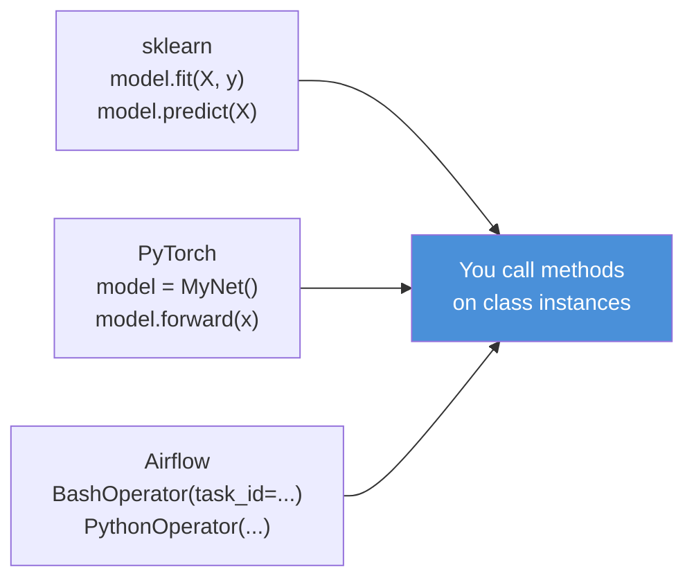
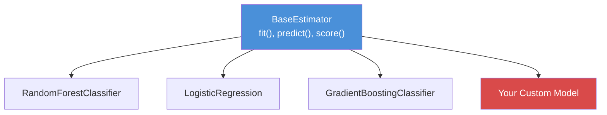
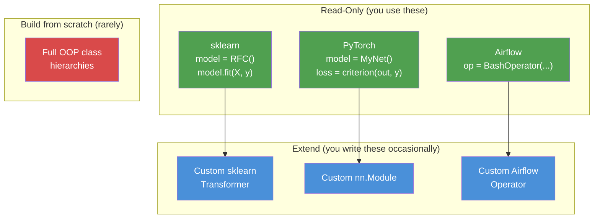

# Classes and Objects -- Just Enough for AI Libraries

**You do not need to master object-oriented programming in Python. You need to read library code. Every ML framework, every orchestration tool, and every cloud SDK is built on classes. This chapter teaches you to recognize the patterns, not to build class hierarchies.**

---

**Hands-on notebook:** [](https://colab.research.google.com/github/sunilmogadati/systems-in-production/blob/main/implementation/notebooks/Python_Functions_Classes.ipynb) Functions and Classes


## Why Classes Matter in AI/DE (Even If You Rarely Write Them)



Every time you write `model.fit(X, y)`, you are calling a method on a class instance. Understanding the class structure lets you read documentation, debug errors, and extend library behavior when needed.

---

## Classes: __init__, self, Methods, Properties

```python
class CallRecord:
    """Represents a single call center interaction.

    __init__ is the constructor -- called when you create an instance.
    self refers to the current instance (like 'this' in Java/JS).
    """

    def __init__(self, call_id: str, duration_sec: int, agent: str):
        # Instance attributes -- each CallRecord has its own copy
        self.call_id = call_id
        self.duration_sec = duration_sec
        self.agent = agent

    def is_long_call(self, threshold: int = 180) -> bool:
        """Business rule: calls over threshold seconds need review."""
        return self.duration_sec > threshold

    @property
    def duration_minutes(self) -> float:
        """Property -- accessed like an attribute, computed like a method.
        Usage: record.duration_minutes (no parentheses)."""
        return self.duration_sec / 60

# Create an instance
record = CallRecord("C-1001", 300, "Alice")
print(record.is_long_call())       # True
print(record.duration_minutes)     # 5.0 -- no () needed
```

| Concept | Java / C# | JavaScript | Python |
|:---|:---|:---|:---|
| Constructor | `public MyClass()` | `constructor()` | `def __init__(self):` |
| Instance reference | `this` (implicit) | `this` (implicit) | `self` (explicit, first param) |
| Private field | `private int x;` | `#x` (ES2022) | `_x` (convention, not enforced) |
| Property/getter | `getX()` or auto-property | `get x()` | `@property` |
| Static method | `static void foo()` | `static foo()` | `@staticmethod` |
| Class method | (no direct equiv) | (no direct equiv) | `@classmethod` |

---

## Inheritance -- Why sklearn Estimators All Have .fit() and .predict()

Inheritance is how libraries enforce a consistent interface. Every scikit-learn model has `.fit()` and `.predict()` because they all inherit from `BaseEstimator`:



```python
# You don't need to understand all of sklearn's internals.
# You need to know that ALL models follow this contract:
from sklearn.ensemble import RandomForestClassifier
from sklearn.linear_model import LogisticRegression

# Same interface, different algorithms
for ModelClass in [RandomForestClassifier, LogisticRegression]:
    model = ModelClass()
    model.fit(X_train, y_train)        # Every model has .fit()
    predictions = model.predict(X_test) # Every model has .predict()
    score = model.score(X_test, y_test) # Every model has .score()
```

---

## Dataclasses -- Modern Python Data Containers

Dataclasses eliminate the boilerplate of writing `__init__`, `__repr__`, and `__eq__` by hand. They are the Python equivalent of Java records or Kotlin data classes:

```python
from dataclasses import dataclass, field

@dataclass
class ExperimentConfig:
    """Configuration for an ML experiment run."""
    name: str
    model_type: str
    learning_rate: float = 0.001
    batch_size: int = 32
    tags: list[str] = field(default_factory=list)  # Mutable default needs field()

# Auto-generated: __init__, __repr__, __eq__
config = ExperimentConfig("churn_v3", "gradient_boost", learning_rate=0.01)
print(config)
# ExperimentConfig(name='churn_v3', model_type='gradient_boost',
#                  learning_rate=0.01, batch_size=32, tags=[])

# Frozen dataclass -- immutable, safe for caching and hashing
@dataclass(frozen=True)
class ModelVersion:
    name: str
    version: int
    accuracy: float
```

**Why dataclasses over dicts:** Type hints give you autocompletion. Typos in field names raise `AttributeError` immediately instead of silently creating a new key. Frozen dataclasses can be used as dict keys or set members.

---

## Abstract Base Classes -- Why Libraries Force You to Implement Certain Methods

When a library says "you must implement `transform()` to create a custom transformer," it is using abstract base classes (ABCs). You cannot create an instance of an abstract class without implementing all required methods:

```python
from abc import ABC, abstractmethod

class BaseTransformer(ABC):
    """Abstract base class -- cannot be instantiated directly."""

    @abstractmethod
    def transform(self, data):
        """Subclasses MUST implement this method."""
        pass

    def validate(self, data):
        """Concrete method -- shared by all subclasses."""
        if data is None:
            raise ValueError("Data cannot be None")

# This would raise TypeError: Can't instantiate abstract class
# t = BaseTransformer()

# This works because it implements all abstract methods
class NullFiller(BaseTransformer):
    def __init__(self, fill_value="UNKNOWN"):
        self.fill_value = fill_value

    def transform(self, data):
        return {k: (v if v is not None else self.fill_value)
                for k, v in data.items()}
```

---

## The Patterns You Will See

### Pattern 1: sklearn Estimator (Custom Transformer)

```python
from sklearn.base import BaseEstimator, TransformerMixin

class LogTransformer(BaseEstimator, TransformerMixin):
    """Custom sklearn transformer that applies log1p to numeric features.

    By inheriting from BaseEstimator and TransformerMixin:
    - get_params() and set_params() come for free (needed for GridSearchCV)
    - fit_transform() comes for free (calls fit then transform)
    """

    def fit(self, X, y=None):
        # Nothing to learn -- stateless transform
        return self

    def transform(self, X):
        import numpy as np
        return np.log1p(X)  # log(1 + x) -- handles zeros safely

# Fits into any sklearn Pipeline
from sklearn.pipeline import Pipeline
pipe = Pipeline([
    ("log_scale", LogTransformer()),
    ("model", RandomForestClassifier())
])
pipe.fit(X_train, y_train)
```

### Pattern 2: PyTorch nn.Module (Custom Neural Network)

```python
import torch
import torch.nn as nn

class ChurnPredictor(nn.Module):
    """A simple feedforward network for churn prediction.

    nn.Module requires:
    - __init__: define layers
    - forward: define the computation path
    PyTorch handles backpropagation automatically.
    """

    def __init__(self, input_features: int):
        super().__init__()  # Always call parent __init__
        self.layer1 = nn.Linear(input_features, 64)
        self.layer2 = nn.Linear(64, 1)
        self.activation = nn.ReLU()

    def forward(self, x):
        x = self.activation(self.layer1(x))
        return torch.sigmoid(self.layer2(x))

# Usage follows the same pattern as any PyTorch model
model = ChurnPredictor(input_features=5)
output = model(input_tensor)  # Calls forward() automatically
```

### Pattern 3: Custom Airflow Operator

```python
from airflow.models import BaseOperator

class DataQualityCheckOperator(BaseOperator):
    """Custom Airflow operator that validates data quality.

    BaseOperator requires you to implement execute().
    Everything else (scheduling, retries, logging) is inherited.
    """

    def __init__(self, table_name: str, min_row_count: int, **kwargs):
        super().__init__(**kwargs)
        self.table_name = table_name
        self.min_row_count = min_row_count

    def execute(self, context):
        """Called by Airflow when this task runs."""
        row_count = self._count_rows()
        if row_count < self.min_row_count:
            raise ValueError(
                f"Table {self.table_name} has {row_count} rows, "
                f"expected at least {self.min_row_count}"
            )
        self.log.info(f"Quality check passed: {row_count} rows")

    def _count_rows(self):
        # In production: query the database
        pass

# Used in a DAG (Directed Acyclic Graph) just like built-in operators
check = DataQualityCheckOperator(
    task_id="check_calls_table",
    table_name="calls_clean",
    min_row_count=1000
)
```

---

## Class Patterns Summary



**Your time allocation should match this chart.** Most of the time, you create instances and call methods. Sometimes, you extend a base class. You almost never design class hierarchies from scratch in AI/DE work.

---

## Dunder Methods You Should Recognize

Dunder (double underscore) methods are Python's way of enabling operator overloading and built-in behavior. You rarely write them, but you see them in library source code:

| Method | What It Does | When You See It |
|:---|:---|:---|
| `__init__` | Constructor | Every class |
| `__repr__` | Developer-friendly string | `print(model)` |
| `__str__` | User-friendly string | `str(object)` |
| `__len__` | Length | `len(dataset)` in PyTorch |
| `__getitem__` | Index access | `dataset[0]` in PyTorch |
| `__call__` | Make instance callable | `model(input)` in PyTorch |
| `__enter__`/`__exit__` | Context manager | `with open(...) as f:` |
| `__eq__` | Equality comparison | `model_a == model_b` |

---

## Quick Links

| Resource | Link |
|:---|:---|
| Python for AI (notebook) | [Python for AI on Colab](https://colab.research.google.com/github/sunilmogadati/systems-in-production/blob/main/implementation/notebooks/Python_Basics.ipynb) |
| Python for DE (notebook) | [Python for DE on Colab](https://colab.research.google.com/github/sunilmogadati/systems-in-production/blob/main/implementation/notebooks/Python_NumPy_Pandas.ipynb) |
| Previous chapter | [05 -- Control Flow, Functions, and Lambdas](05_Control_Flow_Functions.md) |
| Next chapter | [07 -- File I/O and Data Formats](07_File_IO_Data_Formats.md) |

---

*Foundations -- Python (Chapter 6 of 10)*
