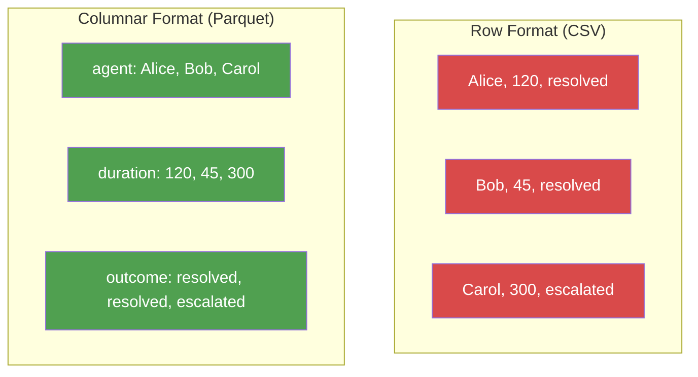

# File I/O and Data Formats

**Data enters your system as CSV, JSON, or API responses. It lives in production as Parquet. Everything in between is transformation. This chapter covers the formats, the libraries, and the patterns for moving data between them.**

---

## Format Comparison: When to Use What

| Format | Type | Read Speed | File Size | Schema? | Human Readable? | Best For |
|:---|:---|:---|:---|:---|:---|:---|
| CSV | Row-based text | Slow | Large | No | Yes | Exports, prototyping, human review |
| JSON | Text (nested) | Medium | Medium | No | Yes | APIs, configs, nested structures |
| JSON Lines | Text (streaming) | Medium | Medium | No | Yes | Logs, streaming, append-only |
| Parquet | Columnar binary | Fast | Small | Yes (typed) | No | Production pipelines, warehouses, ML training |
| Avro | Row-based binary | Fast | Small | Yes (embedded) | No | Kafka, event streaming, schema evolution |
| YAML | Text (config) | Slow | Small | No | Yes | Configuration files, Kubernetes manifests |

**The production rule:** Data enters as CSV or JSON. It gets converted to Parquet as early as possible. Every downstream step reads Parquet.


---

## Reading and Writing: CSV

```python
import pandas as pd

# Read -- handles headers, types, encoding automatically
df = pd.read_csv("calls.csv")

# Read with options (common in real data)
df = pd.read_csv(
    "calls.csv",
    dtype={"call_id": str},          # Force call_id to string (not int)
    parse_dates=["created_at"],       # Parse date columns automatically
    na_values=["", "NULL", "N/A"],    # Treat these as missing values
    encoding="utf-8"                  # Explicit encoding for safety
)

# Write -- always set index=False to avoid an extra unnamed column
df.to_csv("output.csv", index=False)
```

**CSV gotcha:** CSV has no type information. The string `"001"` becomes integer `1` unless you specify `dtype`. Dates become strings. Booleans become strings. This is why production pipelines avoid CSV for anything except initial ingestion.

---

## Reading and Writing: JSON

```python
import json

# Read a JSON file into a Python dict
with open("config.json", "r") as f:
    config = json.load(f)

# Write a dict to JSON with readable formatting
with open("output.json", "w") as f:
    json.dump(config, f, indent=2)

# Parse a JSON string (common when reading API responses)
response_text = '{"model": "rf", "accuracy": 0.92}'
data = json.loads(response_text)  # loads = load from string
```

### JSON Lines -- The Streaming Format

JSON Lines (`.jsonl`) stores one JSON object per line. This format is used in logging systems, Kafka exports, and anywhere data is appended incrementally:

```python
# Read JSON Lines with pandas
df = pd.read_json("events.jsonl", lines=True)

# Write JSON Lines
df.to_json("output.jsonl", orient="records", lines=True)

# Read JSON Lines one record at a time (memory-efficient)
import json

def stream_jsonl(filepath: str):
    """Yield parsed records one at a time -- no full file load."""
    with open(filepath, "r") as f:
        for line in f:
            if line.strip():
                yield json.loads(line)

for record in stream_jsonl("events.jsonl"):
    process(record)
```

---

## Reading and Writing: Parquet

Parquet is a columnar binary format. "Columnar" means data is stored by column, not by row. This makes it dramatically faster for analytical queries that read specific columns:



```python
import pandas as pd

# Read Parquet -- pyarrow is the engine (install: pip install pyarrow)
df = pd.read_parquet("calls.parquet")

# Read only specific columns -- Parquet skips unused columns entirely
df = pd.read_parquet("calls.parquet", columns=["call_id", "duration_sec"])

# Write Parquet with compression
df.to_parquet("output.parquet", index=False, compression="snappy")

# Write partitioned Parquet (how data lakes organize files)
df.to_parquet(
    "output/",
    index=False,
    partition_cols=["year", "month"],  # Creates year=2026/month=03/ directories
    compression="snappy"
)
```

**Why Parquet matters for AI:** Training data stored as Parquet loads 5-10x faster than CSV. Column pruning means you only read the features you need. Type preservation means no silent type coercion bugs.

**Why Parquet matters for DE:** Compression ratios of 5-10x over CSV. Predicate pushdown means queries skip irrelevant row groups. Schema enforcement means pipeline breaks early if data shape changes.

---

## Reading and Writing: YAML

YAML is the standard for configuration files in Kubernetes, Airflow, dbt, and most DevOps tools:

```python
import yaml  # pip install pyyaml

# Read YAML config
with open("pipeline_config.yaml", "r") as f:
    config = yaml.safe_load(f)  # safe_load prevents code execution attacks

# Write YAML
with open("output.yaml", "w") as f:
    yaml.dump(config, f, default_flow_style=False)
```

**Security note:** Always use `yaml.safe_load()`, never `yaml.load()`. The unsafe version can execute arbitrary Python code embedded in the YAML file.

---

## Working with APIs: The requests Library

Most data ingestion starts with an API call. The `requests` library is the standard for HTTP (Hypertext Transfer Protocol) in Python:

```python
import requests

# GET request -- fetch data
response = requests.get(
    "https://api.example.com/v1/calls",
    headers={"Authorization": "Bearer YOUR_TOKEN"},
    params={"date": "2026-04-01", "limit": 1000},
    timeout=30  # Always set a timeout in production
)

# Check for errors before processing
response.raise_for_status()  # Raises HTTPError for 4xx/5xx responses

# Parse JSON response
data = response.json()  # Returns a dict or list
calls = data["results"]

# POST request -- send data (common for model inference APIs)
prediction = requests.post(
    "https://api.example.com/v1/predict",
    json={"features": [120, 15, 0.92]},  # Automatically serializes to JSON
    timeout=10
).json()
```

**DE example -- paginated API ingestion:**

```python
def fetch_all_pages(base_url: str, token: str) -> list[dict]:
    """Fetch all pages from a paginated API endpoint."""
    all_records = []
    page = 1
    while True:
        response = requests.get(
            base_url,
            headers={"Authorization": f"Bearer {token}"},
            params={"page": page, "per_page": 100},
            timeout=30
        )
        response.raise_for_status()
        data = response.json()
        records = data.get("results", [])
        if not records:
            break  # No more pages
        all_records.extend(records)
        page += 1
    return all_records
```

---

## Reading from Cloud Storage

### AWS S3 with boto3

```python
import boto3
import pandas as pd
from io import BytesIO

s3 = boto3.client("s3")

# Read a Parquet file from S3
obj = s3.get_object(Bucket="data-lake", Key="calls/2026/calls.parquet")
df = pd.read_parquet(BytesIO(obj["Body"].read()))

# Or use pandas directly with S3 paths (requires s3fs)
df = pd.read_parquet("s3://data-lake/calls/2026/calls.parquet")

# Upload a file to S3
df.to_parquet("/tmp/output.parquet", index=False)
s3.upload_file("/tmp/output.parquet", "data-lake", "processed/calls.parquet")
```

### GCS (Google Cloud Storage) with google-cloud-storage

```python
from google.cloud import storage
import pandas as pd

client = storage.Client()
bucket = client.bucket("data-lake")

# Download and read
blob = bucket.blob("calls/2026/calls.parquet")
blob.download_to_filename("/tmp/calls.parquet")
df = pd.read_parquet("/tmp/calls.parquet")

# Or use pandas directly with GCS paths (requires gcsfs)
df = pd.read_parquet("gs://data-lake/calls/2026/calls.parquet")

# Upload
df.to_parquet("/tmp/output.parquet", index=False)
blob = bucket.blob("processed/calls.parquet")
blob.upload_from_filename("/tmp/output.parquet")
```

---

## AI Example: Load Training Data, Save Predictions

```python
import pandas as pd
from sklearn.ensemble import RandomForestClassifier

# 1. Load training data from Parquet (fast, typed, compressed)
train_df = pd.read_parquet("s3://ml-data/train/calls_features.parquet")
X_train = train_df.drop("is_escalated", axis=1)
y_train = train_df["is_escalated"]

# 2. Train model
model = RandomForestClassifier(n_estimators=100, random_state=42)
model.fit(X_train, y_train)

# 3. Load inference data and generate predictions
inference_df = pd.read_parquet("s3://ml-data/inference/new_calls.parquet")
predictions = model.predict_proba(inference_df)[:, 1]

# 4. Save predictions as Parquet (not CSV -- preserve types, compress)
results = inference_df.copy()
results["escalation_probability"] = predictions
results.to_parquet("s3://ml-data/predictions/batch_2026_04.parquet", index=False)
```

---

## DE Example: Read from API, Transform, Write to Parquet on GCS

```python
import requests
import pandas as pd

# 1. Ingest from API
response = requests.get(
    "https://api.example.com/v1/calls",
    params={"date": "2026-04-01"},
    timeout=30
)
response.raise_for_status()
raw_records = response.json()["results"]

# 2. Transform -- clean and validate
df = pd.DataFrame(raw_records)
df["duration_sec"] = pd.to_numeric(df["duration_sec"], errors="coerce")
df = df.dropna(subset=["call_id"])
df = df.drop_duplicates(subset=["call_id"])
df["ingested_at"] = pd.Timestamp.now(tz="UTC")

# 3. Write to GCS as partitioned Parquet
df.to_parquet(
    "gs://data-lake/bronze/calls/date=2026-04-01/data.parquet",
    index=False,
    compression="snappy"
)
print(f"Wrote {len(df)} records to bronze layer")
```

---

## Quick Links

| Resource | Link |
|:---|:---|
| Python for AI (notebook) | [Python for AI on Colab](https://colab.research.google.com/github/sunilmogadati/systems-in-production/blob/main/implementation/notebooks/Python_for_AI.ipynb) |
| Python for DE (notebook) | [Python for DE on Colab](https://colab.research.google.com/github/sunilmogadati/systems-in-production/blob/main/implementation/notebooks/Python_for_DE.ipynb) |
| Previous chapter | [06 -- Classes and Objects](06_Classes_Objects.md) |
| Next chapter | [08 -- NumPy and Pandas](08_NumPy_Pandas.md) |

---

*Foundations -- Python (Chapter 7 of 10)*
