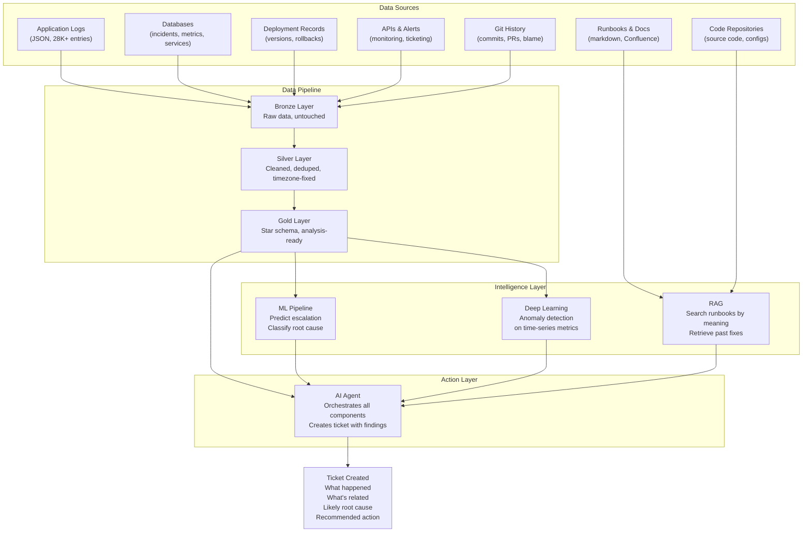
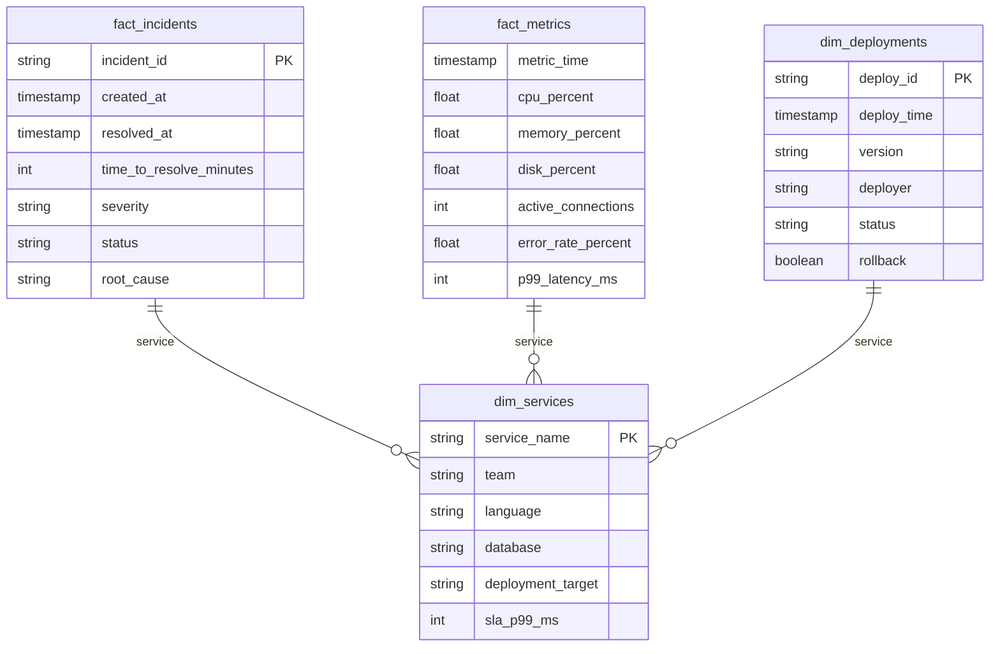

# Production Diagnostic Intelligence System

## Architecture

How to diagnose, correct, and improve production systems by collecting data from databases, logs, documents, and APIs.

---

## System Overview



---

## Components

### 1. Data Pipeline (Bronze to Silver to Gold)

Ingests data from multiple sources in different formats. Cleans, deduplicates, fixes quality issues, and structures for analysis.

| Layer | What Happens | Example |
|---|---|---|
| Bronze | Raw ingestion, no transformation | `app_logs.jsonl` as-is |
| Silver | Cleaned, deduped, timezone-fixed, typed | Missing request IDs flagged, timestamps normalized |
| Gold | Star schema, joined, analysis-ready | Incidents joined with deployments, services, metrics |

**Quality issues in the data (intentional):**
- 3% of logs missing request_id (broken distributed tracing)
- Some timestamps without timezone indicator
- Incident severity misclassification (P3 that should be P2)

---

### 2. Star Schema (Data Model)

Structures incidents, deployments, metrics, and services into fact and dimension tables for queryable analysis.



---

### 3. ML Pipeline (Prediction and Classification)

Trains models to predict incident escalation and classify root causes.

**Approach:**
- Baseline model (simple, fast)
- Regularized model (Ridge)
- Advanced model (GradientBoosting)
- Compare side-by-side via MLflow
- Explain with SHAP (which features drive predictions)

**Use cases in this system:**
- Predict which P3 incident will escalate to P1
- Classify root cause from incident description + metrics
- Identify services at risk based on metric trends

---

### 4. Deep Learning (Anomaly Detection)

Neural networks trained on historical infrastructure metrics to detect patterns that dashboards and static thresholds miss.

**Example from the dataset:**
- Search-service memory usage climbs steadily over 5 days (days 10-14)
- Static threshold (90%) only triggers on day 14 when it crashes
- A trained model detects the upward drift on day 11, three days before the crash

**Patterns detected:**
- Slow-burn resource exhaustion (memory leaks, disk fill)
- Periodic anomalies (batch job conflicts at 2-3 AM)
- Correlated failures across services

---

### 5. RAG (Knowledge Retrieval)

Retrieval-Augmented Generation searches runbooks, post-mortems, and documentation by meaning, not keywords.

**Flow:**
1. Ingest documents (runbooks, post-mortems, architecture docs)
2. Create embeddings (semantic vector representation)
3. On query, retrieve most relevant chunks
4. Generate answer using LLM with retrieved context

**Example:**
- Query: "What's the fix for order-service connection pool exhaustion?"
- RAG finds: order-service runbook, section on DB connection pool, past incident INC-1005
- Returns: "Set connection_max_lifetime=300s in database config. This was identified March 5. Temporary fix: restart pods."

---

### 6. AI Agent (Orchestrator)

The agent ties all components together. It receives an alert and executes a diagnostic workflow:

```
Alert received: "order-service error rate spike"
    |
    v
Query DB: "Any deployments in last 2 hours?"
    --> Found: DEP-777 (v2.4.1, 2 hours ago)
    |
    v
Check logs: "Error patterns in order-service?"
    --> "Failed to acquire database connection from pool" (150 occurrences)
    |
    v
Check metrics: "Connection pool and CPU trends?"
    --> Active connections: 248/250 (near exhaustion)
    --> CPU: 85% (elevated)
    |
    v
Search runbook via RAG: "order-service connection pool"
    --> "Root cause: missing connection timeout in ORM config.
         Fix: set connection_max_lifetime=300s"
    |
    v
Correlate: "Has this happened before?"
    --> INC-1005 (March 5, same root cause, classified P3, resolved in 2 hours)
    |
    v
CREATE TICKET:
    Title: "Order-service DB connection pool exhaustion (recurring)"
    Severity: P1 (escalated from pattern match)
    Root cause: connection_max_lifetime not set after v2.4.1 deploy
    Related: INC-1005 (March 5), DEP-777 (today)
    Recommended action: Set connection_max_lifetime=300s, restart pods
    Note: This is the same root cause as INC-1005.
          Previous fix was overwritten by today's deployment.
```

---

## Hidden Patterns in the Dataset

The production support dataset contains 10 intentional patterns for diagnostic practice:

| # | Pattern | Diagnostic Skill |
|---|---|---|
| 1 | Bad deployment March 8 causes order-service errors | Correlate deployments with error spikes |
| 2 | Search-service memory leak builds over 5 days, crashes day 15 | Detect slow-burn failures |
| 3 | Same DB pool root cause: P3 on day 5, then P1 on day 20 | Recognize recurring root causes |
| 4 | Payment-service errors spike daily at 2-3 AM | Identify time-based patterns |
| 5 | Auth-service runbook references old Redis config | Detect outdated documentation |
| 6 | Notification-service disk fills over days 18-21 | Resource exhaustion trends |
| 7 | 3% of logs missing request_id | Broken distributed tracing |
| 8 | Some timestamps missing timezone | Data quality issues |
| 9 | Day-4 incident misclassified as P3 | Severity triage failures |
| 10 | Day-10 memory leak classified P4, ignored until crash | Ignored warnings becoming outages |

---

## Dataset

All data is in `data/production-support/`:

| File | Records | Description |
|---|---|---|
| `services.csv` | 7 | Service registry (name, team, tech stack, SLA) |
| `incidents.csv` | 15 | Incidents over 30 days |
| `deployments.csv` | 36 | Deployment history with rollbacks |
| `infra_metrics.csv` | 60,480 | CPU, memory, disk, latency (5-min intervals) |
| `app_logs.jsonl` | 28,189 | Application logs (JSON lines) |
| `runbooks/` | 4 | Service runbooks (markdown) |
