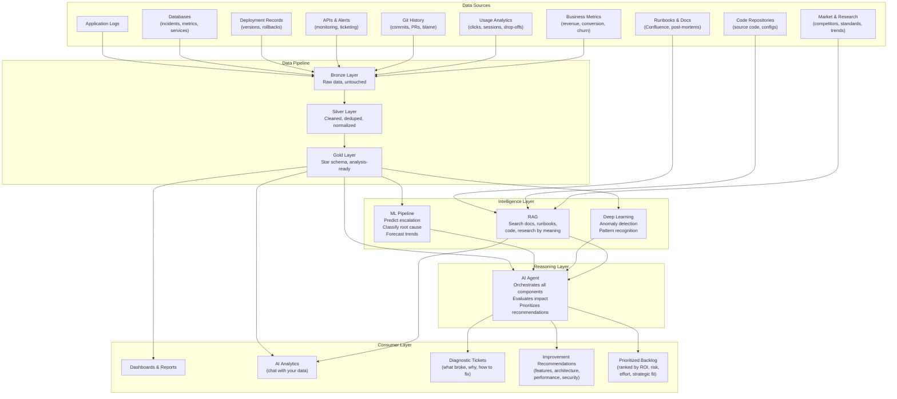
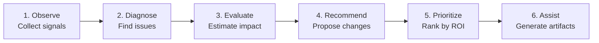
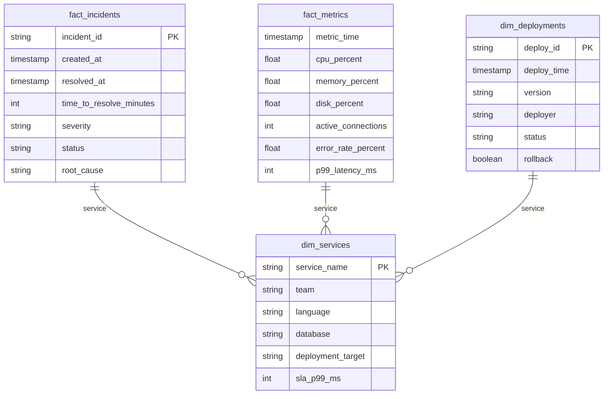
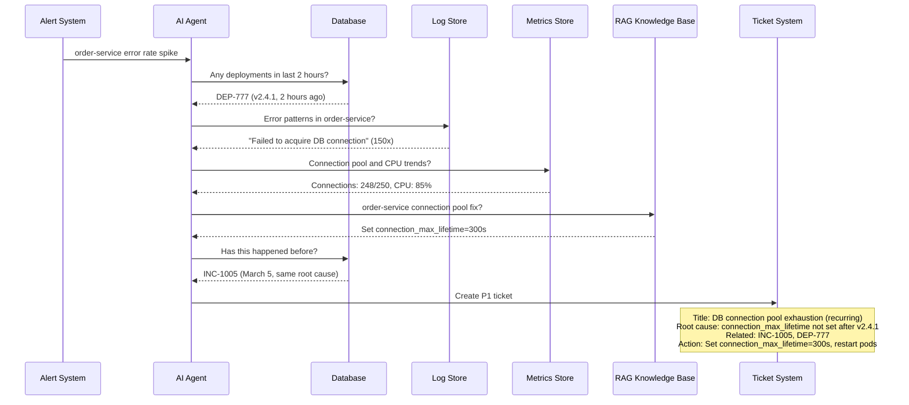
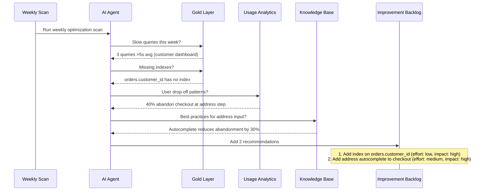

# Continuous System Intelligence (CSI)

**Continuously observe, diagnose, and improve production systems — across code, data, product, and business.**

You have CI/CD for your code. You probably have monitoring for your infrastructure. But who is continuously watching your product metrics, architecture health, user friction, and business outcomes — and recommending what to improve next?

That is what CSI does.

---

## The Five Modes

Most systems only do Mode 1 (something broke, fix it). CSI operates across all five:

| Mode | Question | Example | Who Cares |
|---|---|---|---|
| **Detect** | What is wrong right now? | Error rate spike after deploy | DevOps, SRE |
| **Predict** | What will go wrong soon? | Memory leak will crash in 3 days | DevOps, Engineering |
| **Optimize** | What works but could work better? | This query can be 10x faster with an index | Data Engineering, DBA |
| **Grow** | What could drive more business? | Users who see recommendations convert 2x | Product, Business |
| **Evolve** | What should change for the future? | Monolith should split auth into a microservice | CTO, Architecture |

---

## System Architecture



---

## The Six Processing Layers



| Layer | What It Does | Input | Output |
|---|---|---|---|
| **Observe** | Collect signals from all sources | Logs, metrics, code, usage, business data, market intel | Structured data in Bronze/Silver/Gold |
| **Diagnose** | Find issues, bottlenecks, anomalies, patterns | Gold layer + ML + DL models | Issue list with root causes |
| **Evaluate** | Estimate business impact, user friction, cost, risk | Issues + business metrics + usage analytics | Impact assessment per issue |
| **Recommend** | Propose changes: feature, workflow, UX, schema, infrastructure, security | Impact assessment + RAG (docs, research, past fixes) | Concrete recommendations |
| **Prioritize** | Rank by ROI, risk reduction, effort, strategic fit | Recommendations + business context | Prioritized improvement backlog |
| **Assist** | Generate actionable artifacts | Prioritized list | Backlog items, design notes, code suggestions, runbook updates, experiments |

---

## What the System Observes and Recommends

| Input Source | What It Watches | Example Recommendations |
|---|---|---|
| **Application logs** | Errors, slow queries, timeouts | "Order-service has 3x more timeouts since Tuesday's deploy. Investigate or rollback." |
| **Usage analytics** | Click patterns, drop-offs, session length | "40% of users abandon checkout at the address step. Simplify to one field with autocomplete." |
| **Business metrics** | Revenue, conversion, churn, CSAT | "Campaign X has 2x conversion on Tuesdays. Increase Tuesday budget." |
| **Defect history** | Recurring bugs, time to resolve | "Same payment retry bug reported 7 times in 3 months. Root cause: missing idempotency key." |
| **Database state** | Query performance, schema, index usage | "Table orders has no index on customer_id. Adding one speeds the dashboard query from 8s to 200ms." |
| **Code repository** | Complexity, test coverage, dependency age | "Auth module has 0% test coverage and hasn't been updated in 14 months. Security risk." |
| **Git history** | Change frequency, hotspots, ownership | "This file changes 3x per week and causes incidents 40% of the time. Needs refactoring." |
| **Industry research** | Standards, regulatory changes, best practices | "NIST released updated AI governance framework. Your RAG system needs an evaluation pipeline." |
| **Competitor analysis** | Features, UX patterns, pricing | "Competitor launched one-click reorder. Your reorder flow takes 6 steps." |
| **User feedback** | Support tickets, reviews, NPS comments | "15 support tickets this month mention 'can't find order history.' Consider adding it to main nav." |
| **Infrastructure metrics** | CPU, memory, cost, scaling | "Paying $2,400/month for a cluster that peaks at 30% utilization. Downsize to save $1,600." |

---

## Components

### 1. Data Pipeline (Bronze to Silver to Gold)

Ingests data from multiple sources in different formats. Cleans, deduplicates, fixes quality issues, and structures for analysis.

| Layer | What Happens | Example |
|---|---|---|
| Bronze | Raw ingestion, no transformation | `app_logs.jsonl` as-is |
| Silver | Cleaned, deduped, timezone-fixed, typed | Missing request IDs flagged, timestamps normalized |
| Gold | Star schema, joined, analysis-ready | Incidents joined with deployments, services, metrics |

**Quality issues in the data (intentional):**
- 3% of logs missing request_id (broken distributed tracing)
- Some timestamps without timezone indicator
- Incident severity misclassification (P3 that should be P2)

---

### 2. Star Schema (Data Model)

Structures incidents, deployments, metrics, and services into fact and dimension tables for queryable analysis.



---

### 3. ML Pipeline (Prediction and Classification)

Trains models to predict incident escalation, classify root causes, and forecast trends.

**Use cases across the five modes:**

| Mode | ML Use Case |
|---|---|
| Detect | Classify root cause from incident description + metrics |
| Predict | Predict which P3 incident will escalate to P1 |
| Optimize | Identify services at risk based on metric trends |
| Grow | Predict which user flows lead to conversion |
| Evolve | Forecast infrastructure capacity needs |

---

### 4. Deep Learning (Anomaly Detection and Pattern Recognition)

Neural networks trained on historical data to detect patterns that dashboards and static thresholds miss.

**Example from the dataset:**
- Search-service memory usage climbs steadily over 5 days (days 10-14)
- Static threshold (90%) only triggers on day 14 when it crashes
- A trained model detects the upward drift on day 11, three days before the crash

**Patterns detected:**
- Slow-burn resource exhaustion (memory leaks, disk fill)
- Periodic anomalies (batch job conflicts at 2-3 AM)
- Correlated failures across services
- User behavior shifts (usage pattern changes indicating product friction)

---

### 5. RAG (Knowledge Retrieval)

Retrieval-Augmented Generation searches across runbooks, post-mortems, documentation, code, and external research by meaning, not keywords.

**Sources:**
- Internal: runbooks, post-mortems, architecture docs, Confluence pages
- Code: source code, config files, deployment scripts
- External: industry standards, competitor features, research papers

**Example:**
- Query: "What's the fix for order-service connection pool exhaustion?"
- RAG finds: order-service runbook, section on DB connection pool, past incident INC-1005
- Returns: "Set connection_max_lifetime=300s in database config. This was identified March 5. Temporary fix: restart pods."

---

### 6. AI Agent (Reasoning and Orchestration)

The agent ties all components together. It can operate in any of the five modes.

**Mode 1 — Detect (reactive diagnostic):**



**Mode 3 — Optimize (proactive improvement):**



---

## Applying CSI Across Domains

The same architecture applies to any domain. Only the data sources and business context change.

| Domain | What It Observes | What It Recommends |
|---|---|---|
| **Call center / Sales** | Call scripts, conversion rates, agent performance, customer sentiment | Change scripts that correlate with low conversion. Rearrange UI. Add features that reduce friction. |
| **SaaS product** | Usage analytics, feature adoption, churn signals, support tickets | Which features to improve, which to deprecate, where users get stuck |
| **Data platform** | Pipeline health, data quality, query performance, cost | Schema changes for performance, pipeline optimizations, cost reductions |
| **Healthcare operations** | Patient flow, wait times, resource utilization, compliance gaps | Workflow improvements, staffing adjustments, compliance fixes |
| **Financial operations** | Transaction anomalies, reconciliation failures, regulatory changes | Process fixes, automation opportunities, compliance updates |
| **Engineering delivery** | Deployment frequency, lead time, failure rate, team bottlenecks | Process improvements, ownership clarity, technical debt priorities |

---

## Hidden Patterns in the Dataset

The production support dataset contains 10 intentional patterns for diagnostic practice:

| # | Pattern | Diagnostic Skill |
|---|---|---|
| 1 | Bad deployment March 8 causes order-service errors | Correlate deployments with error spikes |
| 2 | Search-service memory leak builds over 5 days, crashes day 15 | Detect slow-burn failures |
| 3 | Same DB pool root cause: P3 on day 5, then P1 on day 20 | Recognize recurring root causes |
| 4 | Payment-service errors spike daily at 2-3 AM | Identify time-based patterns |
| 5 | Auth-service runbook references old Redis config | Detect outdated documentation |
| 6 | Notification-service disk fills over days 18-21 | Resource exhaustion trends |
| 7 | 3% of logs missing request_id | Broken distributed tracing |
| 8 | Some timestamps missing timezone | Data quality issues |
| 9 | Day-4 incident misclassified as P3 | Severity triage failures |
| 10 | Day-10 memory leak classified P4, ignored until crash | Ignored warnings becoming outages |

---

## Dataset

All data is in `data/production-support/`:

| File | Records | Description |
|---|---|---|
| `services.csv` | 7 | Service registry (name, team, tech stack, SLA) |
| `incidents.csv` | 15 | Incidents over 30 days |
| `deployments.csv` | 36 | Deployment history with rollbacks |
| `infra_metrics.csv` | 60,480 | CPU, memory, disk, latency (5-min intervals) |
| `app_logs.jsonl` | 28,189 | Application logs (JSON lines) |
| `runbooks/` | 4 | Service runbooks (markdown) |

---

## The CI/CD Analogy

```
CI  = Continuous Integration    → continuously merge code
CD  = Continuous Deployment     → continuously ship code
CM  = Continuous Monitoring     → continuously watch production
CSI = Continuous System Intelligence → continuously understand, diagnose, and improve the entire system
```

CSI is the next layer. It doesn't replace CI/CD or monitoring. It sits on top and asks: given everything we can observe about this system, what should we do next?
